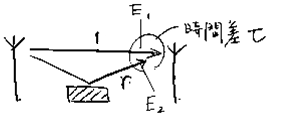
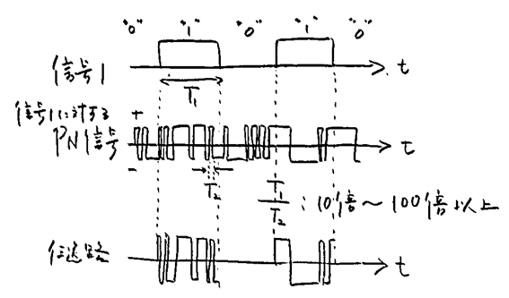

#communicationSystems 

<!-- ## 第2回 -->

教科書の9章を取り扱った。  

伝送媒体  
┣金属使用  
┃┣平衡ケーブル  
┃┗同軸ケーブル  
┗金属不使用  
　┣光ファイバ  
　┗電波伝搬  

### 金属からなる伝送回路

#### 構造と数式表現

このうち、平衡ケーブルと同軸ケーブルに触れた。  
両者の違いは、平衡ケーブルが撚ってあるのに対し、同軸ケーブルは撚っていないという点である。  
ケーブルの外部から電磁誘導が発生したとき、誘導電流が流れてしまうが、  
複数本のケーブルが撚ってある場合、発生源との平均的な距離がすべてのケーブルで一致する。  
また、同軸ケーブルの場合は、静電遮蔽されている。  

離れた地点を結ぶ伝送線路を構成する2本の平行な金属線(導線)ではL,C,Rが無視できなくなってしまう。  
これを画像化したものが  

  

である。  
キルヒホッフ第2法則(電圧の一周の総和は0)より、左下の隅から時計回りに式を立てると、  

[ア](Kirchhoffsches2nd.png) =0

キルヒホッフ第1法則(電流則)より、

[イ](Kirchhoffsches1st.png)  

が成り立つ。  
これらの式をv()やi()でまとめ、両辺をΔx(→0)で割ると、微分の式が出来上がる。  
それをやってみたものが [ウ](img/sikihenkei1.png) である。  

ここで、v(x,t)をV(x)exp(j2πft)、i(x,t)をI(x)exp(j2πft)とみなそう。  
これは、エ: <!-- hole 複素振幅をV(x)やI(x)、周波数をfとする正弦波 --> で電圧や電流をモデル化したわけである。  

これを式で表すと [オ](img/sikihenkei2.png) となる。  
実はVをIを使わず、IをVを使わずに表すことができる。　
それをやったのが [カ](img/sikihenkei3.png) である。  
分母の(G+j2πfC)(R+j2πfL)をγ^2と呼ぶことにする。  
この微分方程式の一般解(暗記でよいと思う...)は、  

[キ](img/ippankai1.png) となる。AやBはV(0)やI(0)によって決まる。  
γ(但し実部も虚部も正となるように)はク: <!-- hole 伝搬定数 --> といい、この実部はケ: <!-- hole 減衰定数α --> Np/m、虚部はコ: <!-- hole 位相定数β --> rad/mとなる。  

#### 伝搬定数

伝搬定数の実部α(＞0)が減衰定数と呼ばれ、その単位が(dB/mでなく)Np/mであること、  
虚部β(＞0)が位相定数と呼ばれ、その単位がrad/mであることを納得する方法を次に示す。  
まず、v(x,t)を求めてみよう。  

  

ここで、第1項が「正弦波×e^-(αx)」担っていることに気がついてほしい。  
この式は「x正方向に進むにつれ、e^-(αx)のおかげで正弦波の振幅が小さくなる」、そんな波である。  
それゆえネイピアの冪に従って単位長さ進むにあたり、振幅が如何程に小さくなるか示すパラメータとしてαの単位はNp/mなのである。  
さて、正弦波の式の中で、βは専らその位相を変化させている。したがって確かにrad/mでよさそうだ。  
ちなみに第2項は単位長さ進むにあたり振幅が大きくなっていって不自然に感じるかもしれない。(なんで遠くに伝わっていってるのに波が大きくなるのか。エントロピー増大に反していないのか)  
実はこれは反射波を表しているのである。位相を変化させるβにつく符号が入れ替わっていることからも、確かに反射して逆向きになった波であるということが類推できそうだ。  

#### 位相速度

さて、この進行波(反射波ではないほう)の山の部分なら山の部分、谷の部分なら谷の部分というのは、果たして如何程の速度で線路を伝わっていくのか。  
これを求めるには、  

  

で、2πft-βxをア: <!-- hole 一定とみなす --> というテクニックが有効だ。  
その上でdx/dtを求めればよい。  

それをやったものが [イ](img/sikihenkei5.png) である。

原点から距離がxだけ離れた地点での

#### 反射係数とインピーダンス

原点から距離がxだけ離れた地点での反射波と進行波の電圧振幅比は、  

  

より、r=ア: <!-- hole Be^(γx)÷Ae^(-γx) --> と求められる。  

これを反射係数という。  
反射係数を  

  

に当てはめると、   

となる。  

ところで、Z0は、r=0、つまりB=0の時のインピーダンスとなっている。(これを特性インピーダンスという)  

Z=V(x)/I(x) を求めると、ウ: <!-- hole Z0(1+r)/(1-r) --> となる。  

したがって、Z=Z0のとき、r=0となる。  

このことを利用してZ0を測定したり、邪魔となる反射波が生じないように外部インピーダンスを設けたりできる。  

#### 無歪条件

伝送によって、信号に歪みが生じない条件を求めよう。  

時間方向に一定の遅延、振幅方向に比例関係があればよい。  

受信側の波形をf2、送信側をf1、遅延時間をτ、比例定数をKとすると、

f2(t)=ア: <!-- hole K･f1(t-τ) --> と表されればよい。  

これをフーリエ逆変換で表すと、f2(t)= イ: <!-- hole K∫[-∞,∞]F1(f)exp(j2πf(t-τ))df --> となる。  

一方、f2(t)=ウ: <!-- hole f1(t)exp(-γL) --> とする見方では、フーリエ逆変換すると、  
f2(t)= エ: <!-- hole ∫[-∞,∞]F1(f)exp(j2πf(t-τ))exp(-(α+jβ)L)df --> となる。 

連立させると、オ: <!-- hole exp(-αL)=K、exp(-jβL)=exp(j2πfτ) --> である。  

したがって、無歪条件を定性的に述べると、カ: <!-- hole αが周波数に依存せず、βが周波数に比例すること --> となる。

<!-- 5月8日 -->

#### 実際の伝送線路の減衰特性

減衰特性は周波数に依存する。これを解説する。  
通常、(集中定数)回路では、Rは一定である。  
しかし実際の伝送回路ではそうはならない。  
これはまず、 ア: <!-- hole 表皮効果 --> といって、イ: <!-- hole 高周波になると、導体の表面(みかんなどの皮に例えられる)に電流が集中する --> ためである。  
そして、アのために、周波数0の状態を  

  

のようにモデル化すると、高周波では

[イ](img/skinEffect2.png) のようになり、合成抵抗値が大きくなる。

そのため、減衰定数αも周波数に依存することとなり、ウ: <!-- hole α≒D√f但しDは係数 --> のようになる。  

ウの関係をエ: <!-- hole 減衰定数の√f特性 --> という。

#### ケーブル内の漏話(クロストーク)特性

ア: <!-- hole 隣接した伝送線路に信号が漏れる --> ことを漏話という。  
漏話を説明する、通信モデル図は次の通り。  

  

P1をイ: <!-- hole 近端漏話、near-end_crosstalk、NEXT --> 、P3をウ: <!-- hole 遠端漏話、far-end_crosstalk、FEXT --> という。  
これを踏まえると、4種類の減衰量を考えることができる。 [ウ](img/crosstalk2.png)   
最後のは、受信側だけで遠端漏話減衰量を近似値で評価できるようにするためのものである。  
 

### 光ファイバ
(材料は石英。地球上にふんだんにある(低価格となる可能性も高い))

<!-- 5月15日 -->

#### 光ファイバの構造と光の伝搬

光ファイバは、ア: <!-- hole コア --> がイ: <!-- hole クラッド --> に囲まれるという構造になっている。  
イのウ: <!-- hole 絶対屈折率 --> をn2、アのウをn1とする。「n1 エ n2」である。  
エ: <!-- hole ＞ -->   
アからイへ染み出ようとする光について考えよう。入射角をθ1、屈折角をθ2とすると、オ: <!-- hole Snellの法則 --> より、  
カ: <!-- hole n1sinθ1＝n2sinθ2 --> という式が成り立つ。  
また、全反射の条件は、カの式で、キ: <!-- hole θ2＝π/2を代入してθ1 --> を求め、これをク: <!-- hole 臨界角θc --> とみることで、求められる。  
カで、キを求めたものをかくと、ケ: <!-- hole sinθ1＝n2/n1 --> という式を得る。  
このことから、コ: <!-- hole n1とn2の差を大きくす --> れば、サ: <!-- hole θcが小さ --> くなり、多くの光線を伝えられるようになる。  

#### マルチモード光ファイバ

コアの絶対屈折率n1とクラッドの絶対屈折率n2の差を大きくし、ア: <!-- hole 角度の異なる多数の光線を同時に伝搬させること --> を可能にしたものが、マルチモード光ファイバである。  
ここで、モードとは、光ファイバ内部におけるイ: <!-- hole 電磁界分布の違い --> を示す用語であり、ウ: <!-- hole 光の伝搬条件はモード毎に異なる --> 。  
当然ながら、ファイバ内を直進する光と、全反射を繰り返す光では前者のほうが早く伝搬する。これを エ: <!-- hole モード分散 --> という。   
エのために、2つ送った信号が1つにくっついて受信されてしまうなどの問題が起こりうるため、高速の伝送速度を実現できなくなってしまう。  
(言い換えるなら、エが光ファイバの帯域を決定づけているのである)  
この問題を軽減する方法として、オ: <!-- hole グレーデッドインデックス型 --> の構造が考案された。  

   

のように、外側ほど屈折率を徐々にカ: <!-- hole 小さ --> くする。  
これによって、光線が徐々にキ: <!-- hole 光ファイバに対してまっすぐ --> になる。  

#### シングルモード光ファイバ

コアとクラッドの屈折率差をア: <!-- hole 小さ --> くし、コア径も小さくしていくと、モード数は次第に減少し、ついには1つのモードのみが伝搬するようになる。  
イ: <!-- hole 目的とする波長のモードのみが伝わるように設計した光ファイバ --> をシングルモード光ファイバという。  
(設計した波長より、ウ: <!-- hole 長 --> い波長のみにしか使えない。)  
直進する光線のみを伝搬できる。  
シングルモード光ファイバの、マルチモード光ファイバと比べたメリットは、エ: <!-- hole 高速、大容量 --> などが挙げられる。  

シングルモード光ファイバにおける、損失の要因としては、オ: <!-- hole 吸収 --> とカ: <!-- hole 散乱 --> が主になる。  
オは、材料となる石英の分子振動だったり、屈折率を調整するための添加物などのイオン(キ: <!-- hole P,Ge,Br --> )振動のエネルギーに使われてしまう。  
カは、屈折率の微小揺らぎであり、細かく見るとどうしても均一にならないわけである。  
波長と損失の関係を表したのが、次の図である。  

   

レイリー散乱というのは、ク: <!-- hole 空が青い --> のと同じ現象であり、ケ: <!-- 波長が短いほど、散乱しやすい --> という傾向のことである。  

また、伝送速度も一定にならない(分散)。これを説明する。  
半導体レーザーを使うと波長が鮮明になる。波長と光強度の特性を表すと、光強度が0でない(と十分言える)幅は、コ: <!-- hole (伝搬速度)÷(10[MHz]) --> となる。  
しかし変調によってこの幅は広がってしまう。すると、屈折率cがサ: <!-- hole 波長に依存する(c0/n) --> せいで、一定にならなくなってしまう。これをシ: <!-- hole 材料分散 --> という。  
もう一つ、ス: <!-- hole 構造分散 --> というものがあり、これはセ: <!-- hole 光ファイバのコアとクラッドにおける光の強度分布が波長によって異なる --> ために生じるものである。
シもセも、原理は全く異なるが、ソ: <!-- hole 波長によって屈折率が異なるために伝搬速度が異なる --> という点で共通である。  

タ: <!-- hole 材料 --> 分散をいじることはできないが、チ: <!-- hole 構造 --> 分散をいじることはできる。  
損失が最小となる波長1.55μm付近において波長分散(＝ツ: <!-- hole 材料分散(最小となるのは波長1.3μm)と構造分散の和が0 --> )になるようにチ分散を調整することで、損失、分散共に最適化させることができる。  
このようにしたものをテ: <!-- hole 分散シフト光ファイバ --> という。  

コアの断面形状が真円でなくなるために、光の伝搬速度がト: <!-- hole 偏波(偏光のを抽象的に電磁波版で言った名前) --> によって異なってしまうのをト分散という。

<!-- 5月22日 -->

### 電波伝搬

電波を媒体とした無線通信には、通信ケーブルを媒体とした有線通信とは異なり、ア: <!-- hole 媒体に対して空間的な制約が少ない --> という特徴がある。  
逆に、電波は開放された空間に広がるため、そこでの影響を受けやすく、イ: <!-- hole 不安定 --> な媒体である。  
またウ: <!-- hole 機密性や妨害・干渉 --> の問題を有している。  

エ: <!-- hole 周波数 --> を割り振ることで、混在しても干渉しないようにすることができるし、  
オ: <!-- hole 電力 --> を割り振ることで、そもそも遠くへ届かないから混在しないようにすることができる。  

#### 周波数の割り当て  
 
電波では、ITUにてア: <!-- hole 周波数3THz以下の電磁波 --> と定義されている。  
また、妨害や干渉を防ぐため、法律で規制を設け、どの周波数帯域がどのような用途で使われるべきか決められている。  
  
需要により、通信帯域はどんどんイ: <!-- hole 高 --> い領域へと拡大している。  
電波は、周波数がイくなるにしたがって、回析の効果がウ: <!-- hole 小さ --> くなっていき、直進性がエ: <!-- hole 増し --> 、大気中を伝搬する際に、気象の影響を受けオ: <!-- hole やす --> くなる。  

#### 信号の伝送

送信機からの電気信号は、送信側のアンテナによって電波として空間に送出される。  
その電波は受信側でアンテナによって再度電気信号に変換される。  
したがって、送信側の信号電力Ptと受信側の信号電力Prは、ア: <!-- hole 送信／受信アンテナの特性および空間を伝搬する電波のふるまい --> によって決まることとなる。  
送信側の信号電力Ptが全方位へ均一に放射されるときの距離dの地点に置ける単位面積当たりの電力Poは、イ: <!-- hole Ptを半径dの球の表面積で割ること --> で求められるから、  
Po＝ウ: <!-- hole Po／(4πd^2) --> ［エ: <!-- hole W／(m^2) --> ］ である。  
同じ信号電力Ptをアンテナで放射したとき、オ: <!-- hole ある方向で測定した単位面積当たりの電力 --> をPaとすると、Ga＝Pa／Poは、カ: <!-- hole (受信アンテナ、送信アンテナどちらに対しても言える) --> 信アンテナの利得という。  

キ: <!-- hole 特定の方向に電力を集中して放射する --> ように設計されたアンテナを指向性アンテナといい、その方向ではGa＞1となる。  
そうでないアンテナは無指向性アンテナ。  

  

この図は、antennaの放射特性を示す。  

OAの長さやOBの長さは、その方向における、ク: <!-- hole ある距離での単位面積当たりの電力 --> を意味する。  

今、単位面積あたりの電力がPaである波長λの電波を無指向性アンテナで受信すると、  
受信電力はケ: <!-- hole (λ^2)Pa／(4π) -->  になることが知られている。  
送信アンテナの利得をG倍すれば、ケのG倍の電力を受信できる。  
この関係を公式で表したものをフリスの伝達公式といい、  
[コ](img/friis.png)  
という式で表される。  

#### フェージング

一般に、複数の波動が合成されると相互に干渉を引き起こす。  
同位相で干渉しあうと互いに強め合い、逆位相なら弱めあう、(光の干渉を思い出せ)  
電波でも当然同じことが言える。干渉によって信号レベルが低下することをア: <!-- hole フェージング --> という。  
送信アンテナから放射された電波の一部は、イ: <!-- hole 環境中の物体で反射してから受信アンテナ --> へ届く。  
こういったものでアが生じる。  
反射波の強度や位相は、受信地点の位置だけでなく、移動などによっても変化するから、受信信号レベルは、位置だけでなく時間によっても変動する。  

次の図は、直接波の他に1つだけ反射波があって、両者が同じ振幅を持っている場合のものである。  

  

このグラフについて解説しよう。  

  

のように、r、E1、E2を定める。  

E2をE1の式で表すと、ア: <!-- hole E2＝E1･r･exp(-j2π(cτ／λ)) 但しcτは遅れた距離 -->  
つまり、ウ: <!-- hole E1･r･exp(-j2πfτ) --> となる。  
ここからエ: <!-- hole |E1|(1-r)≦|E1+E2|≦|E1|(1+r) --> となる。

### 電力の表示

次のことは覚えよ。  
単純比ア: <!-- hole 10 -->はデシベル比 アである。  
単純比5はデシベル比イ: <!-- hole 7 --> である。  
単純比2はデシベル比ウ: <!-- hole 3 --> である。  
単純比エ: <!-- hole 1 --> はデシベル比0である。  
単純比nがデシベル比Nのとき、単純比1/nはデシベル比オ: <!-- hole －N --> である。

(dBmについては宿題3.docx)

<!-- 5月29～6/5 -->

### アンテナの指向性  
単一のアンテナ素子からの送出電力がPであるとき、距離rだけ離れた地点での単位面積当たりの受信電力は、  
ア: <!-- hole P/(4πr^2) --> である。  
このことを考慮して電界を求めると、  

### ダイバーシティ技術  

## 多重化

ア: <!-- hole 対向した送信部と受信部の間に複数の通信チャネルがあるとき、それらを束ねて一体のシステムとして扱う技術 --> を多重化という。  
多重化の種類には、イ: <!-- 時分割多重 --> 、ウ: <!-- hole 周波数分割多重 --> 、エ: <!-- hole 波長分割多重 --> 、オ: <!-- hole 空間分割多重 --> 、カ: <!-- hole 符号分割多重 --> などがある。

### 時分割多重

#### 多重化とハイアラーキ

ハイアラーキ、ヒエラルキー、階梯(かいてい)  

仕組みを示すと [ア](img/hierarchy.png) のようになっている。  

アからわかるように、イ: <!-- hole 多重化が階層的に行われている --> 

a,b,cは自由に決めてよいのではなく、国際的な基準がある。ウ: <!-- hole 156Mbit/s --> 以上のものはエ: <!-- hole Synchronous　Digital Hierarchy --> と特に呼ばれる。  

#### フレーム構成

デジタル信号通信の技術はア: <!-- hole 電話をデジタル化しよう --> というものから始まった。  
ハイアラーキの国際基準の最小のもの64kb/sも音声通信を基準に決められた。  
標本間隔はイ: <!-- hole 125μs --> で統一されており、どの伝送速度でも同じである。  
これを8bitで符号化すると、確かに64kb/sとなるわけだ。  
サンプリング定理より、標本間隔(標本化周期)は、ウ: <!-- hole 1/(2×帯域幅) --> であるため、  
1チャネルの帯域幅はエ: <!-- hole 4kHz --> となる。  
要は、イに1回の間隔で、エの情報を取り出し、これを64kb/sの速度で送るわけだ。  
エの情報を1個だけ取り出したなら、これを1オ: <!-- hole チャネル --> といったりする。  
例えば24オなどがよく使われるが、これはエの情報を24個取り出して、一気に伝えてしまうというもの。  
このまとまりをカ: <!-- hole フレーム --> という。nオでは、1カは(8×n)+m bitとなる。  
m bitを加えたのはキ: <!-- hole フレーム同期信号 --> の分である。  
伝送効率をよくするためには当然mは小さいほうがいいが、小さくすればク: <!-- hole フレーム中の他の位置にフレーム信号と同じパターンが現れる確率 --> が大きくなるので、  
ケ: <!-- hole 同期の確立に時間を要する --> ようになってしまう。  

#### SDH

SDHでは、複数(n個)チャネルの低速信号n種類ををア: <!-- hole 1チャネルの高速信号 --> に変換する。  
イ: <!-- hole チャネルごとに分割する --> ので、ウ: <!-- hole 各フレームが同期されていなくても逐次分割できる --> というメリットがある。  
1チャネルの低速信号フレームは、高速信号フレーム内でエ: <!-- hole 複数のブロックに分散して「ペイロード」へ配置される --> 。  
多重化が多段に繰り返されるため、この過程をわかりやすく表現できると便利である。  
この手法がオ <!-- hole フレームの2次元表現 --> である。  
オされたフレームの中で、デジタル信号を領域別にカ: <!-- hole ユニット化 --> して取り扱う。これをキ: <!-- hole バーチャルコンテナ --> という。  
また多重化される信号のフレーム間のタイミング差に柔軟に対応するため、ク: <!-- hole ポインタ --> が利用される。  
またネットワークの保守運用情報が「オーバヘッド」であり、このための時間が確保されている。  
多重化される信号間の同期が崩れた場合、ケ: <!-- hole スタッフ処理 --> といって、情報の欠落を防ぐ工夫がなされている。  
SDHでのデジタルハイアラーキはSTM-N(Nは数字)と呼ばれ、Nが大きいほど伝送速度は大きくなる。  
STM-1は、オおよび時間軸に沿った表現では、次のように表現される。  
<!-- 画像後回し [コ]() -->  
具体的な体系は次の通り。  
<!-- 画像後回し [サ]() -->  
ここから分かる通り、クは基本的にシ: <!-- hole 最初 --> を意味するものと思ってよさそうである。  
また、ペイロードにも「オーバヘッド」が存在し、これは「パス・オーバヘッド」と呼ばれる。  
また、<!-- 画像後回し [シ]() -->  は、信号の同期がとれない(特定の信号だけ遅かったり早かったり)の場合に行われるケを表すものである。  

### 周波数分割多重

#### 多重化と変調

周波数分割多重(FDM)とは、ア: <!-- hole 異なった周波数を持つ複数の搬送波 --> を個別に低速デジタル信号によって変調し、それらを合成して単一の高速デジタル信号を取り出す技術である。  
アの周波数間隔はイ: <!-- hole スペクトルを求めたときに側波帯が重ならない --> ように決められている。  
多重化後の高速デジタル信号は  
[ウ](img/fdm.png)  
のように表される。  

#### 周波数分割多重で用いられるいろいろな方式

大きく分けてア: <!-- hole インターリーブ方式 --> と イ: <!-- hole OFDM --> に分けられる。  
アは、ウ: <!-- hole 接近して配置された無線通信システム間での信号の干渉 --> を低減するために、エ: <!-- hole 互いの周波数配置を相対的にずらす --> というものである。  
これを図に表すと　<!-- 画像後回し[エ]() --> のようになる。  
オ: <!-- hole 主信号の電力密度の大きいところでは干渉信号の電力密度が小さくなる --> ようになっているため、干渉の度合いが小さくなる。  

一方イは、複数の搬送波をカ: <!-- hole 相互に直交した正弦波 --> とするものである。  
カであるから、キ: <!-- hole 周波数間隔を設けて側波帯が重ならないようにする --> 必要がなくなり、そのためにク: <!-- hole 占有帯域幅 --> を狭くできる。  

### 波長分割多重  

光ファイバ通信においてはア: <!-- hole チャネルごとに異なった波長 --> を割りあてて、それらをイ: <!-- hole 1本の光ファイバに通して伝送する --> という技術が使われる。これを波長分割多重(WDM)という。  
公式c=fλより、本質的にはウ: <!-- hole 周波数 --> 分割多重(の一種)であるわけだが、両者の違いはエ: <!-- hole 光信号に対してか、電気信号に対してか、で呼び分けている --> といったところである。  
石英光ファイバでは波長1.3μm周辺及びオ: <!-- hole 1.5～1.6μm --> 付近の波長で損失が0.2dB／km以下となるため、このあたりがよく使われる。  
この領域をさらに細かく分けると、Eバンド、Sバンド･･･という風に呼称が付けられている。これを表したのが <!-- 画像後回し [カ]() --> である。  
国際標準で定められている波長配置では、チャネル番号をnとしたとき、キ: <!-- hole 周波数を((1900+n)÷10)THz --> として、ここからc=fλにより波長が求められるとなっている。  
キの式からでは(式から分かる通り)周波数間隔がク: <!-- 1/10THz=100GHz --> となっている。実際には50GHzとする場合(ITUグリット)などもある。

### 空間分割多重  

複数の伝送システムが存在するとき、ア: <!-- hole 伝送線路を束上にして一括して扱う手法 --> を空間分割多重(SDM)という。  
一般的にこの方法によるコスト当たりの低減効果は小さい。  
光ファイバは細いので、イ: <!-- hole 複数の光ファイバをグルーピングしても断面は大きくならない --> ため、SDMに適した伝送線路といえよう。  
この場合の図が <!-- 画像後回し[ウ]() --> である。  
その他、光ファイバにおけるSDMの手法としてエ: <!-- hole 1本の光ファイバの中に複数のコアを設けるマルチコアファイバ --> の実用化も進められている。

<!-- 6/5 

P146～P155 -->

<!-- 6/12 -->

### 符号分割多重

符号を利用した多重化は、ア: <!-- hole 互いに直交 --> した符号パターン (イ: <!-- hole 異なるもの同士の積を一定時間にわたって積分する --> とその値が0となる )を準備し、  
ウ: <!-- hole チャネルごとに異なった符号パターンを割り当てる --> ことでチャネルの区別をする技術である。  
したがって、他の多重化技術でチャネル別に用いられる時間や周波数、媒体はエ: <!-- hole 共有 --> することができる。  
ウのパターンをオ: <!-- hole PN(疑似ランダム雑音)系列 --> という。  
  
のように信号 and オ を計算したものを伝送路に流す。  
オは疑似的かつ: <!-- hole 広帯域 --> な雑音とみなせるので、(元の信号 and オ)にオを足したものは基本的にはカ: <!-- hole LPF --> に通すと、レベル0の信号が得られる(つまり信号は無)。  
しかし、キ: <!-- hole 同パターンのPN系列 --> を足した場合に限っては、カに通すとレベル(元の信号) の信号が得られる。つまり、元の信号が取り出せる。  

### その他の多重化技術

(略)  

## 媒体共有型ネットワークと多元アクセス

媒体共有型ネットワークとは、ア: <!-- hole 1つの伝送媒体を共有 --> して多数の端末が相互に通信を行うネットワークを指す。  
この種のネットワークではイ: <!-- hole 経路切替のための装置 --> がないため、1つの端末から送出された信号は伝送媒体を経てウ: <!-- hole すべての端末に伝わってしまう --> 。  
そのため、エ: <!-- hole 届いたメッセージが自分宛か確認する --> 方法、 オ: <!-- hole 信号の衝突を回避する --> 方法 について考える必要がある。  

媒体共有型ネットワークはカ: <!-- hole ランダムアクセス --> 型、キ: <!-- hole トークン・パッシング --> 型、ク: <!-- hole ボーリング --> 型  

カ型のものが一番多い。カ型では、ケ: <!-- hole 各端末が他の端末との調整をすることなく -->、それぞれの判断で信号を送出する。  
出来る限り衝突を減らすため、コ: <!-- hole 送出の前と後に伝送媒体をモニターする --> 。  
キ型では、端末間で サ: <!-- hole 信号送出権 --> を巡回させる。  
そのためにシ: <!-- hole 特殊な制御信号トークンを用い、これを受信した端末 --> ) が信号を送出する。  
ク型では、サを与える役割を担う制御局をネットワーク内に設ける。  

### ALOHA  
ALOHAは1960年代後半、Hawaii大学で開発され、ア: <!-- hole 衛星通信を使ったネットワーク --> に適用されたプロトコルである。  
媒体共有型ネットワークでは、最初の通信プロトコルとして位置づけられる。  
送信すべき信号を持つ端末は、イ: <!-- hole 媒体中へ一方的に信号を送出する --> 。  
送出された信号が受け取られなかったことが、ウ: <!-- hole 受信側の端末の反応 --> から分かった場合は、エ: <!-- hole ランダムな時間を空けて --> 再度その信号を送出する。  

#### ポアソン分布
多数の端末が接続されたネットワークでは、信号はランダムに発生しているとみなすことができる。単位時間あたりに平均λ回発生するランダムな事象があるとき、  
時間tの間にk回発生する確率はポアソン分布と呼ばれる式  
P(t,k)＝ [ア]() <!-- 画像略 --> で表される。  
これを図示すると、 [イ]() <!-- 画像略 --> となる。  
この事象を媒体共有型ネットワークに置き換えると、アの式はパケットが単位時間当たり平均λ個送信されるようなネットワークで、時間tの間にk個送信される確率であると考えることができる。  
アの式を導いてみよう。  
単位時間をn個に分割した微小時間をΔt＝(t/n)とすると、  
微小時間Δtの間の平均発生回数はイ: <!-- hole λΔt --> となる。  
微小時間における平均発生回数はウ: <!-- hole 発生確率と等しい --> ので、  
n個のΔtのうちk個において発生する確率は、反復試行も従うエ: <!-- hole 二項分布 --> の式で表される。  
つまり、オ: <!-- hole nCk(λΔt)^k(1－λΔt)^(n－k) -->  
n→∞とすると、  
オ＝ [カ]() <!-- 画像略 -->  
したがって、得られる。  

#### トラヒックとスループットの関係
ネットワークを流れる信号の量を表す指標にア: <!-- hole トラヒック --> とイ: <!-- hole スループット --> がある。  
アは「 (単位時間内にウ: <!-- hole ネットワークへ流入した信号が占める延べ時間 --> ) ÷ (単位時間) 」であり、  
エ: <!-- hole ネットワークに毎秒送出される信号のbit数 --> ÷ オ: <!-- hole ネットワークが毎秒伝送できるbit数 --> に一致する。  

またイは「 (単位時間内にカ: <!-- hole ネットワークを通過し宛先へ届いた信号の合計時間 --> ) ÷ (単位時間) 」であり、  
キ: <!-- hole 宛先に毎秒伝達される信号のbit数 --> ÷ オ に一致する。  

次の図を見よ  
 <!-- 画像略 -->  

この図をもとにアとイを求めよう。  
ア＝カ: <!-- hole 13T／10T＝1.3 -->  
イ＝キ: <!-- hole 3T／10T＝0.3 -->  

パケット発生回数がポアソン分布に従うネットワークにおいて、単位時間当たりの平均パケット発生回数をλ、パケット持続時間をTとすると、  
アgはク: <!-- hole λT --> である。  
このとき、ポアソン分布は  
[ケ]() <!--  画像略 -->  
と表すことができる。  
あるパケットが衝突を免れるためには、コ: <!-- hole そのパケットの送信開始時刻前後の時間幅2Tの間に、他のパケットの送信開始 --> が無ければよい。  
その確率はケにサ: <!-- hole t＝2T、k＝0 --> を代入すれば求められるから、  
シ: <!-- hole P＝exp(－2g) --> となる。  
アのうちネットワークを無事通過した成功パケットに相当する部分がイであるから、イsはs＝ス: <!-- hole g×P --> で求められる。  

以上のALOHAプロトコルでは、任意の時刻に送信が開始されるが、セ:<!-- ネットワークに周期Tのスロットをあらかじめ設けておき、それにパケットを入れ --> て送信するというslotted-ALOHAもある。  
その場合、ケの式にはt＝Tを代入する。  

### CSMA
ALOHAはスループットが悪いので、改善してCSMAというものが作られた。  
このプロトコルでは、パケットを送出する前にネットワークの状況を把握(＝ア: <!-- hole キャリアセンス --> )し、  
もし他のパケットがあったら送出をやめる。  
CSMAにはイ: <!-- hole 非固執型CSMA --> と、 ウ: <!-- hole 固執型CSMA --> がある。  
イでは、他のパケットがあったとき、エ: <!-- hole ランダムな時間 --> を空け、再試行する。  
ウでは、他のパケットがあったとき、オ: <!-- hole そのパケットが終わったら直ちに --> 送出する。  
イでは、ネットワークに何らかのパケットが存在する時間帯(TBとする)と、  
パケットが存在しない時間帯(TIとする)が交互に繰り返される。  
TBの中でも、単一パケットのみが存在することがあり、そのような時間をTUとしよう。  
このときスループットはカ: <!-- hole TU÷(TB+TI) --> と表される。  

さて、パケットの長さを1、ネットワーク内の伝送遅延時間をaとする。アをして送信されたパケットが成功するためには、  
キ: <!-- hole パケットの先頭から時間幅aの間に他のパケットが送信されなけ --> ればよい。  
したがって、パケット成功率は、  
 <!-- 画像略、前の見出しのケと同じ画像 -->  
にク: <!-- hole k=0、t=a、T=1 --> を代入して、  
ケ: <!-- hole p＝exp(－ag) --> と表される。  
ケは、コ: <!-- hole TU --> に一致する。  
ほぼ同様に、時刻0～tの間にパケットが送信されない確率が、  
p(t)＝サ: <!-- hole exp(－tg) --> と求められる。  
次に、時刻0～tの間にパケットが送信されず、t～t+dtの間に送信される確率を考えよう。  
時刻0～tの間にパケットが送信されないのはp(t)  
時刻0～t+dtの間にパケットが送信されないのはp(t+dt)  
時刻t～t+dtの間に送信される確率dpは、シ: <!-- hole p(t)が起こるがp(t+dt)が起こらない確率 --> なので、  
ベン図を描けばすぐにわかる通り、ス: <!-- hole p(t)－p(t+dt) --> である。  
スは、導関数の定義式と比較してセ: <!-- hole －(dp(t)／dt)dt --> と書くことも出来る。  
TIはソ: <!-- hole 時刻0を起点として、最初のパケットが送信されるまでの平均時間 --> とみなせるから、  
タ: <!-- hole ∫［t=0～∞］(tdp) --> と表され、これを計算するとチ: <!-- hole 1÷g --> となるそうだ。  
次に、次のようなパケットの衝突モデルを考える。  
 <!-- 画像略 -->  
最後のパケットの先頭部が時刻y以前にある確率pyは、ツ: <!-- hole 時間幅a-yの間にパケットが送信されない --> 確率に等しいから、  
テ: <!-- hole k=0、t=a－y、T=1 --> としてト: <!-- hole exp(g･(y-a)) --> と求められる。  
最後のパケットの先頭部がyとy+dyの間に送信される確率dpyはシ同様に考えると求められる。  
これにより、uの平均値TDは、ナ: <!-- hole ∫［y=0～a］(ydpy) --> ＝ ニ: <!-- hole a－((1－exp(－ag))÷g) -->  
よって、衝突したパケットの長さは1+TDとなるが、衝突も考慮した「ネットワークの使われている時間TB」をいうとTB＝1+TD+aである。  
以上のことをスループットの式s＝TU÷(TB＋TI)に入れると、  
s＝ヌ: <!-- hole g×exp(－ag)÷(g×(1+2a)+exp(－ag)) --> を得る。  
CSMAを改良したものにCSMA／CDやCSMA／CAがある。  
前者は、ネ: <!-- hole 送信後に衝突をチェックし、衝突していたら送信を直ちに中止する --> というもので、アの機能が低下したときそれを補うことができる。  
イーサネットで使われている。  
後者は、ノ: <!-- hole キャリアセンスにて他のパケットの存在を確認した場合、競合端末との間での衝突を避けるため、一定の規則に従って再送時間にばらつきを与える --> というもので、無線LANで用いられている。   

