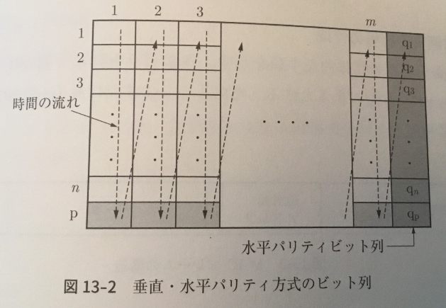

## 定期テスト対策  

### 優先度2

#### 6
帯域幅Bの信号に対する標本化周期  

標本化周波数はア: <!-- hole 2B --> となるから、  
その逆数をとればよい。答えはイ: <!-- hole 1／(2B) --> 

#### 13

平衡ケーブルが複数の導体を撚って造られている理由を、電磁気学的な観点から詳しく説明  

ア: <!-- hole ケーブルの外部から電磁誘導が発生した --> とき、イ: <!-- hole 誘導電流が流れてしまう --> が、  
複数本のケーブルが撚ってある場合、ウ: <!-- hole 発生源との平均的な距離がすべてのケーブルで一致する --> がためにエ: <!-- hole 電磁誘導の影響も均等にうける --> ことになる。  
したがって、オ: <!-- hole 信号受信単(の電位差)への影響を抑圧 --> することができるのだ。  

#### 15

伝送線路上の正弦波信号「の複素振幅」は複素表現を用いて次式で表される。ただし、xは伝送線路上の距離、A、Bは定数である。  
  
  
このとき、αはア: <!-- hole 減衰定数 --> であり、単位はイ: <!-- hole Np／m --> である。  
βはウ: <!-- hole 位相定数 --> であり、単位はエ: <!-- hole rad／m --> である。  
γ＝α+jβはオ: <!-- hole 伝搬定数 --> である。  
Z0は特性カ: <!-- hole インピーダンス --> であり、2本の伝送路をキ: <!-- hole 抵抗(R÷2)Δxとコイル(L÷2)Δxの直列つなぎ --> とみなし、その間にク: <!-- hole ジーメンスGΔx、コンデンサCΔxの並列つなぎ --> がつながれているとみなしたときのカである。  
Z0の式はク: <!-- hole √((R+jωL)／(G+jωC)) --> であり、オの式はケ: <!-- hole √((R+jωL)(G+jωC)) --> である。  
αとβは [コ](img/15_2.png) で求められる。  
反射係数rとはサ: <!-- hole V(x)の第2項÷第1項 --> であり、意味はシ: <!-- hole 原点から距離がxだけ離れた地点での反射波と進行波の電圧振幅比 --> である。  
電圧は実際にはV(x)exp(jωt)であり、それを当てはめ、各項の「進行方向」を確認すれば、確かにサはス: <!-- hole 逆流する方向の電圧÷普通の方向に進む電圧 --> になっている。  
ちなみに、rを使ってV(x)やI(x)を表すと、 [セ](img/15_3.png) となる。
伝送路の一端にインピーダンスZを接続してみよう。  
こういうインピーダンスZを「外部インピーダンス」という。  
Z＝ソ: <!-- hole V(x)exp(jωt)÷I(x)exp(jωt)＝V(x)÷I(x) --> であり、  
これをセに代入すれば、r＝タ: <!-- hole (Z－Z0)÷(Z＋Z0) --> となる。  

#### 19

光ファイバは、ア: <!-- hole コア --> がイ: <!-- hole クラッド --> に囲まれるという構造になっている。  
イのウ: <!-- hole 絶対屈折率 --> をn2、アのウをn1とする。「n1 エ n2」である。  
エ: <!-- hole ＞ -->   
アからイへ染み出ようとする光について考えよう。入射角をθ1、屈折角をθ2とすると、オ: <!-- hole Snellの法則 --> より、  
カ: <!-- hole n1sinθ1＝n2sinθ2 --> という式が成り立つ。  
また、全反射の条件は、カの式で、キ: <!-- hole θ2＝π/2を代入してθ1 --> を求め、これをク: <!-- hole 臨界角θc --> とみることで、求められる。  
カで、キを求めたものをかくと、ケ: <!-- hole sinθ1＝n2/n1 --> という式を得る。  
このことから、コ: <!-- hole n1とn2の差を大きくす --> れば、サ: <!-- hole θcが小さ --> くなり、多くの光線を伝えられるようになる。  

#### 20

一般に、複数の波動が合成されると相互に干渉を引き起こす。  
同位相で干渉しあうと互いに強め合い、逆位相なら弱めあう、(光の干渉を思い出せ)  
電波でも当然同じことが言える。ア: <!-- hole 干渉によって信号レベルが低下すること --> をフェージングという。  
送信アンテナから放射された電波の一部は、イ: <!-- hole 環境中の物体で反射してから受信アンテナ --> へ届く。  
こういったものでフェージングが生じる。  
反射波の強度や位相は、受信地点の位置だけでなく、移動などによっても変化するから、受信信号レベルは、位置だけでなく時間によっても変動する。  

次の図は、直接波の他に1つだけ反射波があって、両者が同じ振幅を持っている場合のものである。  

  

このグラフについて解説しよう。  

  

のように、r、E1、E2を定める。  

E2をE1の式で表すと、ア: <!-- hole E2＝E1･r･exp(-j2π(cτ／λ)) 但しcτは遅れた距離 -->  
つまり、ウ: <!-- hole E1･r･exp(-j2πfτ) --> となる。  
ここからエ: <!-- hole |E1|(1-r)≦|E1+E2|≦|E1|(1+r) --> となる。

#### 21～23

電力 AとBは［dB］＝ ア: <!-- hole 10 --> log10 B÷A で変換できる。  
電イ: <!-- hole 圧・流 --> AとBは［dB］＝ ウ: <!-- hole 20 --> log10 B÷A で変換できる。  

電力については、単純比10、2、1、およびそれらの逆数がそれぞれエ: <!-- hole 10、3、0およびそれらのマイナス1倍 --> dBで表されるのを覚えたい。  
デシベル比は、電力の相対値(比)だけではなく、オ: <!-- hole 基準を決め --> れば絶対値を表すことも可能である。  
そのもっとも頻繁な例が、オることについて、カ: <!-- hole A＝1m --> Wとすることで、  
10mW、2mW、1mW及びそれらの逆数がそれぞれエ  キ: <!-- hole dBm --> となるというものである。  
問題：2.5dBmより4.2dB低い電力は？  
→2.5dBmというのは絶対値で、4.2dBというのはク: <!-- hole 相対値 -->である。(∵高い、低いを扱っているから)  
クということは、ケ: <!-- hole 単位は関係ない --> ので、コ: <!-- hole そのまま引き算 --> してよい。  
よって答えはサ: <!-- hole 2.5－4.2＝－1.7 --> dBm

電力を3dB加算するとは、すなわちシ: <!-- hole 2倍すること --> が如し。  
電イを3dB加算するてゃ、すなわちス: <!-- hole √2 倍すること --> が如し。  

#### 24
わかんない

#### 25
多重化の種類  
時、周波数、波長、空間、符号、パケット、セル  

#### 26

ハイアラーキ、ヒエラルキー、階梯(かいてい)  

仕組みを示すと [ア](img/hierarchy.png) のようになっている。  

アからわかるように、イ: <!-- hole 多重化が階層的に行われている -->   

イの構造をデジタルハイアラーキという。  

a,b,cは自由に決めてよいのではなく、国際的な基準がある。ウ: <!-- hole 156Mbit/s --> 以上のものはエ: <!-- hole Synchronous　Digital Hierarchy --> と特に呼ばれる。  

#### 27

デジタル信号通信の技術はア: <!-- hole 電話をデジタル化しよう --> というものから始まった。  
ハイアラーキの国際基準の最小のもの64kb/sも音声通信を基準に決められた。  
標本間隔はイ: <!-- hole 125μs --> で統一されており、どの伝送速度でも同じである。  
これを8bitで符号化すると、確かに64kb/sとなるわけだ。  
サンプリング定理より、標本間隔(標本化周期)は、ウ: <!-- hole 1/(2×帯域幅) --> であるため、  
1チャネルの帯域幅はエ: <!-- hole 4kHz --> となる。  
要は、イに1回の間隔で、エの情報を取り出し、これを64kb/sの速度で送るわけだ。  
エの情報を1個だけ取り出したなら、これを1オ: <!-- hole チャネル --> といったりする。  
例えば24オなどがよく使われるが、これはエの情報を24個取り出して、一気に伝えてしまうというもの。  
このまとまりをカ: <!-- hole フレーム --> という。nオでは、1カは(8×n)+m bitとなる。  
m bitを加えたのはキ: <!-- hole フレーム同期信号 --> の分である。  
これがイに1度だから、伝送速度は(8×n)+m ÷ イ bit／s である。
伝送効率をよくするためには当然mは小さいほうがいいが、小さくすればク: <!-- hole フレーム中の他の位置にフレーム信号と同じパターンが現れる確率 --> が大きくなるので、  
ケ: <!-- hole 同期の確立に時間を要する --> ようになってしまう。  

#### 30

コアとクラッドの屈折率差をア: <!-- hole 小さ --> くし、コア径も小さくしていくと、モード数は次第に減少し、ついには1つのモードのみが伝搬するようになる。  
イ: <!-- hole 目的とする波長のモードのみが伝わるように設計した光ファイバ --> をシングルモード光ファイバという。  
(設計した波長より、ウ: <!-- hole 長 --> い波長のみにしか使えない。)  
直進する光線のみを伝搬できる。  
シングルモード光ファイバの、マルチモード光ファイバと比べたメリットは、エ: <!-- hole 高速、大容量 --> などが挙げられる。  

シングルモード光ファイバにおける、損失の要因としては、オ: <!-- hole 吸収 --> とカ: <!-- hole 散乱 --> が主になる。  
オは、材料となる石英の分子振動だったり、屈折率を調整するための添加物などのイオン(キ: <!-- hole P,Ge,Br --> )振動のエネルギーに使われてしまう。  
カは、屈折率の微小揺らぎであり、細かく見るとどうしても均一にならないわけである。  
波長と損失の関係を表したのが、次の図である。  

   

レイリー散乱というのは、ク: <!-- hole 空が青い --> のと同じ現象であり、ケ: <!-- 波長が短いほど、散乱しやすい --> という傾向のことである。  

また、伝送速度も一定にならない(分散)。これを説明する。  
半導体レーザーを使うと波長が鮮明になる。波長と光強度の特性を表すと、光強度が0でない(と十分言える)幅は、コ: <!-- hole (伝搬速度)÷(10[MHz]) --> となる。  
しかし変調によってこの幅は広がってしまう。すると、屈折率cがサ: <!-- hole 波長に依存する(c0/n) --> せいで、一定にならなくなってしまう。これをシ: <!-- hole 材料分散 --> という。  
もう一つ、ス: <!-- hole 構造分散 --> というものがあり、これはセ: <!-- hole 光ファイバのコアとクラッドにおける光の強度分布が波長によって異なる --> ために生じるものである。
シもセも、原理は全く異なるが、ソ: <!-- hole 波長によって屈折率が異なるために伝搬速度が異なる --> という点で共通である。  

タ: <!-- hole 材料 --> 分散をいじることはできないが、チ: <!-- hole 構造 --> 分散をいじることはできる。  
損失が最小となる波長1.55μm付近において波長分散(＝ツ: <!-- hole 材料分散(最小となるのは波長1.3μm)と構造分散の和が0 --> )になるようにチ分散を調整することで、損失、分散共に最適化させることができる。  
このようにしたものをテ: <!-- hole 分散シフト光ファイバ --> という。  

コアの断面形状が真円でなくなるために、光の伝搬速度がト: <!-- hole 偏波(偏光のを抽象的に電磁波版で言った名前) --> によって異なってしまうのをト分散という。

#### 31 

符号を利用した多重化「符号分割多重」は、ア: <!-- hole 互いに直交 --> した符号パターン (イ: <!-- hole 異なるもの同士の積を一定時間にわたって積分する --> とその値が0となる )を準備し、  
ウ: <!-- hole チャネルごとに異なった符号パターンを割り当てる --> ことでチャネルの区別をする技術である。  
したがって、他の多重化技術でチャネル別に用いられる時間や周波数、媒体はエ: <!-- hole 共有 --> することができる。  
ウのパターンをオ: <!-- hole PN(疑似ランダム雑音)系列 --> という。  
  
のように信号 and オ を計算したものを伝送路に流す。  
オは疑似的かつ: <!-- hole 広帯域 --> な雑音とみなせるので、(元の信号 and オ)にオを足したものは基本的にはカ: <!-- hole LPF --> に通すと、レベル0の信号が得られる(つまり信号は無)。  
しかし、キ: <!-- hole 同パターンのPN系列 --> を足した場合に限っては、カに通すとレベル(元の信号) の信号が得られる。つまり、元の信号が取り出せる。  

#### 35

ネットワークを流れる信号の量を表す指標にア: <!-- hole トラヒック --> とイ: <!-- hole スループット --> がある。  
アは「 (単位時間内にウ: <!-- hole ネットワークへ流入した信号が占める延べ時間 --> ) ÷ (単位時間) 」であり、  
エ: <!-- hole ネットワークに毎秒送出される信号のbit数 --> ÷ オ: <!-- hole ネットワークが毎秒伝送できるbit数 --> に一致する。  

またイは「 (単位時間内にカ: <!-- hole ネットワークを通過し宛先へ届いた信号の合計時間 --> ) ÷ (単位時間) 」であり、  
キ: <!-- hole 宛先に毎秒伝達される信号のbit数 --> ÷ オ に一致する。  

次の図を見よ   
  
   

この図をもとにアとイを求めよう。  
ア＝カ: <!-- hole 13T／10T＝1.3 -->  
イ＝キ: <!-- hole 3T／10T＝0.3 -->  

パケット発生回数がポアソン分布に従うネットワークにおいて、単位時間当たりの平均パケット発生回数をλ、パケット持続時間をTとすると、  
アgはク: <!-- hole λT --> である。  
このとき、ポアソン分布は  
[ケ](img/35_2.png)  
と表すことができる。  
あるパケットが衝突を免れるためには、コ: <!-- hole そのパケットの送信開始時刻前後の時間幅2Tの間に、他のパケットの送信開始 --> が無ければよい。  
その確率はケにサ: <!-- hole t＝2T、k＝0 --> を代入すれば求められるから、  
シ: <!-- hole P＝exp(－2g) --> となる。  
アのうちネットワークを無事通過した成功パケットに相当する部分がイであるから、イsはs＝ス: <!-- hole g×P --> で求められる。  

以上のALOHAプロトコルでは、任意の時刻に送信が開始されるが、セ:<!-- ネットワークに周期Tのスロットをあらかじめ設けておき、それにパケットを入れ --> て送信するというslotted-ALOHAもある。  
その場合、ケの式にはt＝Tを代入する。  

#### 36
ALOHAはスループットが悪いので、改善してCSMAというものが作られた。  
このプロトコルでは、パケットを送出する前にネットワークの状況を把握(＝ア: <!-- hole キャリアセンス --> )し、  
もし他のパケットがあったら送出をやめる。  
CSMAにはイ: <!-- hole 非固執型CSMA --> と、 ウ: <!-- hole 固執型CSMA --> がある。  
イでは、他のパケットがあったとき、エ: <!-- hole ランダムな時間 --> を空け、再試行する。  
ウでは、他のパケットがあったとき、オ: <!-- hole そのパケットが終わったら直ちに --> 送出する。  
イでは、ネットワークに何らかのパケットが存在する時間帯(TBとする)と、  
パケットが存在しない時間帯(TIとする)が交互に繰り返される。  
TBの中でも、単一パケットのみが存在することがあり、そのような時間をTUとしよう。  
このときスループットはカ: <!-- hole TU÷(TB+TI) --> と表される。  

さて、パケットの長さを1、ネットワーク内の伝送遅延時間をaとする。アをして送信されたパケットが成功するためには、  
キ: <!-- hole パケットの先頭から時間幅aの間に他のパケットが送信されなけ --> ればよい。  
したがって、パケット成功率は、  
   
にク: <!-- hole k=0、t=a、T=1 --> を代入して、  
ケ: <!-- hole p＝exp(－ag) --> と表される。  
ケは、コ: <!-- hole TU --> に一致する。  
ほぼ同様に、時刻0～tの間にパケットが送信されない確率が、  
p(t)＝サ: <!-- hole exp(－tg) --> と求められる。  
次に、時刻0～tの間にパケットが送信されず、t～t+dtの間に送信される確率を考えよう。  
時刻0～tの間にパケットが送信されないのはp(t)  
時刻0～t+dtの間にパケットが送信されないのはp(t+dt)  
時刻t～t+dtの間に送信される確率dpは、シ: <!-- hole p(t)が起こるがp(t+dt)が起こらない確率 --> なので、  
ベン図を描けばすぐにわかる通り、ス: <!-- hole p(t)－p(t+dt) --> である。  
スは、導関数の定義式と比較してセ: <!-- hole －(dp(t)／dt)dt --> と書くことも出来る。  
TIはソ: <!-- hole 時刻0を起点として、最初のパケットが送信されるまでの平均時間 --> とみなせるから、  
タ: <!-- hole ∫［t=0～∞］(tdp) --> と表され、これを計算するとチ: <!-- hole 1÷g --> となるそうだ。  
次に、次のようなパケットの衝突モデルを考える。  
   
最後のパケットの先頭部が時刻y以前にある確率pyは、ツ: <!-- hole 時間幅a-yの間にパケットが送信されない --> 確率に等しいから、  
テ: <!-- hole k=0、t=a－y、T=1 --> としてト: <!-- hole exp(g･(y-a)) --> と求められる。  
最後のパケットの先頭部がyとy+dyの間に送信される確率dpyはシ同様に考えると求められる。  
これにより、uの平均値TDは、ナ: <!-- hole ∫［y=0～a］(ydpy) --> ＝ ニ: <!-- hole a－((1－exp(－ag))÷g) -->  
よって、衝突したパケットの長さは1+TDとなるが、衝突も考慮した「ネットワークの使われている時間TB」をいうとTB＝1+TD+aである。  
以上のことをスループットの式s＝TU÷(TB＋TI)に入れると、  
s＝ヌ: <!-- hole g×exp(－ag)÷(g×(1+2a)+exp(－ag)) --> を得る。  
CSMAを改良したものにCSMA／CDやCSMA／CAがある。  
前者は、ネ: <!-- hole 送信後に衝突をチェックし、衝突していたら送信を直ちに中止する --> というもので、アの機能が低下したときそれを補うことができる。  
イーサネットで使われている。  
後者は、ノ: <!-- hole キャリアセンスにて他のパケットの存在を確認した場合、競合端末との間での衝突を避けるため、一定の規則に従って再送時間にばらつきを与える --> というもので、無線LANで用いられている。   

#### 39

ア: <!-- hole 伝送路上を信号として伝わる符号 --> を伝送符号という。  
次に示すような条件を満たすことが望まれる。  
①イ: <!-- hole 直流成分、低周波成分 --> が少ない  
ウ: <!-- hole 外部からの電磁誘導を防いだり回路設計を容易にする --> ため、受信器はイを遮断する場合が多いからだ。  
②エ: <!-- hole タイミング成分 --> が多い  
③オ: <!-- hole 占有帯域幅が狭い -->   
④カ: <!-- hole パルス密度 --> の変動が小さい  
これは②のためである。  
⑤符号誤り率の監視ができる  

単純にパルスの有無(マーク、スペース)で1、0を識別するものをキ: <!-- hole ユニポーラ符号 --> という。  
ク: <!-- hole パルス幅がタイムスロット(周期) --> に等しいものをNRZ符号というし、クより小さいものをRZ符号という。  

どちらもキであり、条件ケ: <!-- hole ② --> を満たす。  

キについて、コ: <!-- hole マークの正負が交互に反転する --> ようにしたものを、サ: <!-- hole バイポーラ符号 --> という。  

例えば、101011001をNRZ符号(キ)、RZ符号(キ)、RZ符号(サ)の3通りで表現したものは、  

[シ](img/39.png) となる。  

#### 40

BnZS符号は、ア: <!-- hole 0が連続した時に直流にならないようにする --> 目的で使われる。  

n=6の例では、イ: <!-- hole バイ --> ポーラ符号の中にウ: <!-- hole ＋000000 --> が現れたとき、  
これをエ: <!-- hole ＋0＋－0－＋ --> に変換する。ウの＋－逆 が現れたとき、これをエの＋－逆に変換する。  
よく考えれば、これらのパターンは、<!-- -->イ<!-- -->　ポーラ符号のルールに反しているのだが、これにより判別できる。  

B6ZS符号で110000001は、  
－ オ: <!-- hole エ --> －   
あるいは  
＋ カ: <!-- hole エの＋－逆 --> ＋  
と表される。

#### 42

CRC符号とは、ア: <!-- hole 誤り検出 --> のために送出される符号である。  
例えば8bitのbit列10010101を送信する場合を考えよう。  
まず、イ: <!-- hole 生成多項式 --> というものを予め決めておく。  
ここではイG(X)＝X^6＋X^4＋X^2＋1としよう。  
bit列10010101をP(X)＝ウ: <!-- hole 1X^7＋0X^6＋0X^5＋1X^4＋0X^3＋1X^2＋0X^1＋1X^0 --> とみなす(多項式化と呼ぶことにする)。  
これを整理すると、X^7＋X^4＋X^2＋1  
G(X)のエ: <!-- hole 最高次数 --> である6を次数とするX^6をP(X)にかけた、  
X^6・P(X)をかんがえる。  
これをG(X)でオ: <!-- hole 整式の除算 --> する。  
但し、引き算はmodulo 2とかいってるけど結局はカ: <!-- hole XOR --> をとる。  
これをやったものが [キ](img/42.png) である。  
つまり、余りはX^5＋X^4と求められたのだ。  
多項式ク: <!-- holeX^6・P(X)＋余り --> をbit列に変換すると、  
ケ: <!-- hole 10010101110000 --> となる。  
これを送信する。  
全く同じように受信された場合、受信されたものを多項式化し、それをコ: <!-- hole 生成多項式で割ったもの --> は必ず サ: <!-- hole 余りが0になる --> はずだし、  
ランダム誤りやバースト誤り(シ: <!-- hole 連続して誤るもの --> )が発生した場合、サが成り立たない。  
このようにして符号誤りが検出されるのだ。  

#### 43

2つのbit列を比較した時、ア: <!-- hole 値が異なる桁の個数 --> をハミング距離という。  
bit列「bi1 bi2 bi3 ... bin」と「bj1 bj2 bj3 ... bjn」のハミング距離dijは [イ](img/43.png) という式で求められる。  
ハミング距離をあたかも空間的な距離として考えたい場合、ウ: <!-- hole ビット長 --> 次元空間 を考え、各ビットを ウ次元空間上のエ: <!-- hole 点 --> とみなし、任意の軸に平行な方向に移動を制限した時の距離を考えればよい。  
例えば、110と101はオ: <!-- hole 3次元空間上の点(1,1,0)と点(1,0,1) --> に対応し、カ: <!-- hole y方向に1、z方向に1移動 --> すれば重なるわけだからハミング距離はカ: <!-- hole 2 -->   
3個以上のbit列が与えられたとき、その中から2つを選び、全ての場合についてそれぞれハミング距離を求め、その最小値を求めたものを最小ハミング距離dminという。  
bitのs桁に符号誤りが生じた場合、キ: <!-- hole s＜＝dmin－1 --> だったなら誤りを検出できるそう。  
また、dmin＞3のとき、ク: <!-- hole s＜＝(dmin－1)÷2 --> であれば誤り訂正ができる。  
例えば、4bitのbit列をやり取りするとき、1bitの誤り検出ができるためには、キを解いてdminがケ: <!-- hole 2 --> 以上ならよく、  
0000、ケ: <!-- hole 1100、1010、0110、1001、0101、0011、1111 --> のみを用いるようにすればよい。  
一方、4bitのbit列をやり取りするとき、1bitだけ誤り訂正可能にしたい場合は、クを解いてdminをコ: <!-- hole 3あるいは4 --> とすればよい。  

### 優先度1  

#### 12
13と 19 と 30 に取り組めばOK  

#### 14

15 のキ、クに取り組めばOK  

#### 16
伝送線路の減衰定数がア: <!-- hole √周波数 --> の定数倍になるのを、ア特性という。  
ア特性は15 のキ、クにおける、Gのイ: <!-- hole 周波数依存性 --> やRのウ: <!-- hole 表皮効果 --> が主な原因。  

#### 17
ケーブル内の漏話特性のモデルは [ア](img/crossTalk.png) のように表され、  
漏話に起因する減衰量は、 [イ](img/crossTalk2.png) のように表される。  

#### 18
光ファイバの帯域を決める4要因は、ア: <!-- hole モード --> 分散、イ: <!-- hole 波長 --> 分散、ウ: <!-- hole 偏波 --> 分散、そしてエ: <!-- hole 光ファイバのタイプ(マルチかシングルか) --> である。  

<strong>ア分散：</strong>  
コアの絶対屈折率n1とクラッドの絶対屈折率n2の差を大きくし、オ: <!-- hole 角度の異なる多数の光線を同時に伝搬させること --> を可能にしたものが、マルチモード光ファイバである。  
ここで、アとは、光ファイバ内部におけるカ: <!-- hole 電磁界分布の違い --> を示す用語であり、キ: <!-- hole 光の伝搬条件はア毎に異なる --> 。  
当然ながら、ファイバ内を直進する光と、全反射を繰り返す光では前者のほうが早く伝搬する。これを ア分散 という。   
これのために、2つ送った信号が1つにくっついて受信されてしまうなどの問題が起こりうるため、高速の伝送速度を実現できなくなってしまう。  
(言い換えるなら、エが光ファイバの帯域を決定づけているのである)  
この問題を軽減する方法として、ク: <!-- hole グレーデッドインデックス型 --> の構造が考案された。  

   

<strong>イ分散とウ分散</strong>  
30をやればOK。  

#### 28
27をやればOK

#### 29

SDHでは、複数(n個)チャネルの低速信号n種類ををア: <!-- hole 1チャネルの高速信号 --> に変換する。  
イ: <!-- hole チャネルごとに分割する --> ので、ウ: <!-- hole 各フレームが同期されていなくても逐次分割できる --> というメリットがある。  
1チャネルの低速信号フレームは、高速信号フレーム内でエ: <!-- hole 複数のブロックに分散して「ペイロード」へ配置される --> 。  
多重化が多段に繰り返されるため、この過程をわかりやすく表現できると便利である。  
この手法がオ <!-- hole フレームの2次元表現 --> である。  
オされたフレームの中で、デジタル信号を領域別にカ: <!-- hole ユニット化 --> して取り扱う。これをキ: <!-- hole バーチャルコンテナ --> という。  
また多重化される信号のフレーム間のタイミング差に柔軟に対応するため、ク: <!-- hole ポインタ --> が利用される。  
またネットワークの保守運用情報が「オーバヘッド」であり、このための時間が確保されている。  
多重化される信号間の同期が崩れた場合、ケ: <!-- hole スタッフ処理 --> といって、情報の欠落を防ぐ工夫がなされている。  
SDHでのデジタルハイアラーキはSTM-N(Nは数字)と呼ばれ、Nが大きいほど伝送速度は大きくなる。  
STM-1は、オおよび時間軸に沿った表現では、次のように表現される。  
[コ](img/29.png)  
具体的な体系は次の通り。  
[サ](img/29_2.png)  
ここから分かる通り、クは基本的にシ: <!-- hole 最初 --> を意味するものと思ってよさそうである。  
また、ペイロードにも「オーバヘッド」が存在し、これは「パス・オーバヘッド」と呼ばれる。  
また、 [シ](img/29_3.png)  は、信号の同期がとれない(特定の信号だけ遅かったり早かったり)の場合に行われるケを表すものである。  

#### 32

媒体共有型ネットワークとは、ア: <!-- hole 1つの伝送媒体を共有 --> して多数の端末が相互に通信を行うネットワークを指す。  
この種のネットワークではイ: <!-- hole 経路切替のための装置 --> がないため、1つの端末から送出された信号は伝送媒体を経てウ: <!-- hole すべての端末に伝わってしまう --> 。  
そのため、エ: <!-- hole 届いたメッセージが自分宛か確認する --> 方法、 オ: <!-- hole 信号の衝突を回避する --> 方法 について考える必要がある。  

媒体共有型ネットワークはカ: <!-- hole ランダムアクセス --> 型、キ: <!-- hole トークン・パッシング --> 型、ク: <!-- hole ボーリング --> 型  

カ型のものが一番多い。カ型では、ケ: <!-- hole 各端末が他の端末との調整をすることなく -->、それぞれの判断で信号を送出する。  
出来る限り衝突を減らすため、コ: <!-- hole 送出の前と後に伝送媒体をモニターする --> 。  
キ型では、端末間で サ: <!-- hole 信号送出権 --> を巡回させる。  
そのためにシ: <!-- hole 特殊な制御信号トークンを用い、これを受信した端末 --> ) が信号を送出する。  
ク型では、サを与える役割を担う制御局をネットワーク内に設ける。  

#### 33

35をやればOK

#### 34
ALOHAの通信手順はア: <!-- hole 媒体中へ一方的に信号を送出し、受信側の様子からうまく遅れていないと分かった場合はランダムな時間を空けて再試行する --> というもの。  

#### 37

39をやればOK  

#### 38

39をやればOK  

#### 41

パケットは結局有限な長さのbit列である。  
したがって、一番右にア: <!-- hole 1の個数が奇数(または偶数) --> のときに0、そうでないときに1となるイ: <!-- hole パリティビット --> を付与すれば、  
受信側では、イも含めたbit列中のウ: <!-- hole 1の個数の偶奇 --> によって誤りの検出ができる。  
こういうのをエ: <!-- hole 垂直パリティ方式 --> という。  
但しこれだとオ: <!-- hole 誤りが偶数個発生した時に検出できない --> という問題がある。  
これを改良したのがカ: <!-- hole 垂直・水平パリティ方式 --> である。  
まず、キ: <!-- hole イの方向が下になるよう列を縦長にみて、bit列を右に並べていく --> ことで、ビットを2次元に配置する。  
そして、一番ク: <!-- hole 右 --> にケ: <!-- hole 垂直パリティビット列 --> といって、まるごとイなbit列を用意する。  
すると、コ: <!-- hole ビット列長以下のバースト --> 誤りなら検出だけだができるし、  
サ: <!-- hole 1bitだけの --> 誤りならシ: <!-- hole 垂直、水平の組み合わせにより、位置が特定できる --> ので、訂正も可能だ。  

  

#### 44
誤り制御を行うための信号処理を行う電子回路はできるだけ小規模にしたいものだ。  
そのような要求に沿う符号の一つにア: <!-- hole たたみ込み --> 符号がある。  
ア符号は、イ: <!-- hole 元のbit列に、それと過去のbit列を組み合わせて作った新たなbit列 --> を送信するというものである。  
その例が [ウ](img/44.png) である。  
これを受け取った受信器では、元の信号に戻さなければいけない。  
その代表的なアルゴリズムがエ: <!-- hole ビタビ復号アルゴリズム --> である。  
エや、ウのア符号化は、オ: <!-- hole トレリス線図 --> といって、カ: <!-- hole 状態遷移を時系列的に書いた図 --> を用いて説明される。  
ウをオで説明すると、 [キ](img/44_2.png) である。  
例えば元のbit列が00111だったとするなら、状態遷移はA→ク: <!-- hole B→D→G→I→K --> となる。(入力に注目しながらノードを選べ)  
入力に対応する出力を順にならべればケ: <!-- hole 0000111010 --> となる。これが受信器へ送信される。  
誤り訂正はコ: <!-- hole なるべく受信通りの状態遷移を試み --> ながら(キで、出力に注目しながらノードを選ぶ)、サ: <!-- hole どの状態遷移図でも矛盾がでる --> 場合には、シ: <!-- 累積ハミング距離が最小 --> になるように選択する。ス: <!-- hole このようにして得られたbit列を、受信したbit列と比較 --> することで、誤りを発見できる。  
復号に関しては、セ: <!-- hole キで、出力に注目しながらノードをノードを選び、入力を求めてそれを順に並べればよい --> 