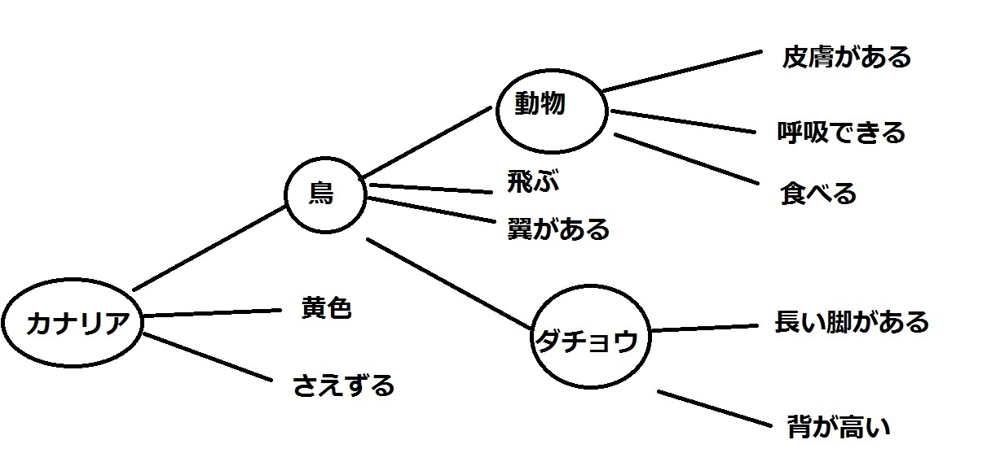

# congnitivePsychology

## 認知心理学とは

### 心理学とは

約120年前、ア: <!-- hole 物理 --> 学・ イ: <!-- hole 哲 --> 学から分離  
ア学はモノの構造と運動を扱うが、心理学はウ: <!-- hole ココロ --> の構造と運動を扱う。  

### 認知とは

内観が無理なので行動を見る。「ロボットに心はあるか」、「チューリングテスト」

## 物理的刺激と心理的刺激

・人が物を見る仕組み「目の中にこびとがいて、こびとがみたものを脳に伝える」という説はア: <!-- hole ホモンクルス --> 説という。  
・両手に軽いものを持って、どちらのほうがより軽いか当てるのは簡単。  
しかし、両手に重いものを持って同じことをした場合はそうはいかない。  
これを式に表したものがイ: <!-- hole ΔW=kW --> である。両辺を変数分離法で積分するとウ: <!-- hole γ∝logR --> となる。  
感覚の大きさγ、刺激の強度R。  

## 人間の知覚系が持つ特徴

### ゲシュタルト性

個々の刺激を足し合わせても全体にはならない(ア: <!-- hole 全体は部分の総和ではない --> )  

プレグナンツの法則(イ: <!-- hole まとまりをもって知覚される傾向 --> )  

輪郭と主観的輪郭

遮蔽によってウ: <!-- hole 非固有輪郭 --> が生じる。  
遮蔽物によるエ: <!-- hole グルーピングと補間 -->  

### 恒常性

遠近法で書かれた対象は網膜像の大きさが異なっても同じものと認識される。(これを逆に利用した錯視画が存在する)  
オ: <!-- hole サッカード(眼球飛越運動) --> はほとんど意識されない。  

### 時空間的な相互作用

・同化と対比  
  
↑上がア: <!-- hole 同化 --> 、下がイ: <!-- hole 対比 -->   
同化と対比はウ: <!-- hole マッハバンド --> でも確認することができる。 　
・順応とエ: <!-- hole 残効 -->   
暗い所に入るとなれるのに時間がかかるのはオ: <!-- hole 暗順応 -->   
その逆は時間がかからないのはカ: <!-- hole 明順応 -->   
エの例はキ: <!-- hole 滝を見続けた後上への運動が知覚されること、タイヤの内側が逆に回って見えること --> など。

### その他

人間は光や音の流れから安定した情報を取り出す。

### 逆問題

網膜像は同じ大きさでも違う大きさに知覚されるのはなぜか。  
何をア: <!-- hole 奥行き --> の手がかりとしているのか  

#### 奥行き視が成立するための制約条件 

イ: <!-- hole 輻輳(ふくそう) --> 、調節・・・(眼球の変化)  
きめ(ウ: <!-- hole 肌理 --> )の勾配、エ: <!-- hole 遮蔽 --> 関係、オ: <!-- hole 両眼視 --> 差、陰影、運動勾配、カ: <!-- hole 運動視 --> 差・・・(刺激の変化)  

#### 両眼視差による立体視

片目では指と指を合わせることができない。  
無限遠を見つめながら特殊な模様を近づけると立体的にパターンが浮かび上がるのはキ: <!-- hole ランダムドット・ステレオグラム --> とよばれるものである。  
両眼視差を利用したものにク: <!-- hole 3Dディスプレイ --> がある。  
原理(＝科学的知見)は一つだが、それを実現する方法はさまざまで、しかも進歩する(工学、技術)。  
クの原理はケ: <!-- hole 右目用の映像を右目だけに、左目用の映像を左目だけに届ける --> というもの。  
方法は、コ: <!-- hole アナフリフ方式、フレームシーケンシャル方式 --> など。

#### 運動視差

ク: <!-- hole エイムス --> の部屋

## ここ(小テストの範囲)までのまとめ

知覚は ア: <!-- hole 問題解決過程 --> である。  
イ: <!-- hole ニューラルネットワーク --> が視覚系というウ: <!-- hole モジュール --> を実現している。

<!-- 5/15 -->

## 表象とは

ア: <!-- hole あるものを代わりに表している表現、表記 --> などのこと。  

人間の中で情報がどのような形をしているか  

遠刺激(実物)→近刺激(網膜像)→イ: <!-- hole 心的表象 --> (意味付け)  

## 表象の性質

## 命題表象

命題表象が行われていることの証拠→ア: <!-- hole 長期的に保持されている情報は表面的な変化をしても命題の変化はない -->  
これは、次の4文で説明できる。  

彼はイタリアの有名な科学者であるガリレオに手紙を送った  

彼はその手紙をイタリアの有名な科学者であるガリレオに送った  

ガリレオはイタリアの有名な科学者である彼に手紙を送った  

ガリレオはその手紙をイタリアの有名な科学者である彼に送った  

第1文を、言っておく。大分時間がたってから、この4文の内、どれだったかをクイズとして聞いてみる。  

すると、イ: <!-- hole 正解(第1文と答える)するか第2文と間違えるのが多いが、第3文、第4文と間違えることは少ない -->  

つまり、語順が変わっても、意味が通るものを選べるのである。  

命題単位で再生が行われ、読みの時間もかかる。  

命題表現の方法  
ウ: <!-- hole ノード・リンク --> によるネットワーク表現  
E.g. Collins&Quillianの エ: <!-- hole 階層的な意味表現 --> ネットワーク  

エ ネットワークとは、  のようなものである。  
(http://minecraftdepsycho.blog.fc2.com/blog-entry-18.html から引用)  
ノードは隣接するノードあるいは直接する属性の通りの特徴を持っている。  
この方法で機械に推論させようという取り組みは失敗。

## イメージ表象 

イメージ表象とは、具体的、視覚的、連続的な表象、心的イメージである。

イメージは表象にとって本質的か。それとも情報処理上の付帯物に過ぎないか。これをア: <!-- hole イメージ論争 --> という。  
絵の伝言ゲームの例から分かる通り、ビットマップとしての認識ではなく、オブジェクトとして認識されている。つまり、図であっても命題的に計算されているとわかる。

回転体が一致するかの判定にかかる時間は、イ: <!-- hole 回転角の一次関数 --> となる。

「イメージ表象の伝言ゲーム」をすると、「大事な特徴は残る」、「猫のしっぽの向き、等は変わるときに一気に変わる」

## 人工知能が持つべき知識とその性質

推論にはア: <!-- hole 背景となる知識 --> が必要。  
フレーム問題はイ: <!-- hole 関係する知識を予め枠で囲えるか --> という問題。  
ロボットの場合はフレーム問題に悩む。不要な知識を無視するためにはウ: <!-- hole 明示的に表象 --> しなければならない。  
それに対し、人間はエ: <!-- hole 不要な知識は思いつきもしない --> 。

<!-- 5月22日 -->

## 分散表現

ニューロンを模したネットワーク(ア～ウ: <!-- hole ノード、リンク、ノード間のリンクの重みづけ --> )  
表象対象はエ: <!-- hole 構文論 --> 的な性質を持たず、オ: <!-- hole 活性化のパタン --> が対象を示す。  

意識的に行うわけではないカ: <!-- hole 直観的な推論 --> 、キ: <!-- hole 筋肉運動の制御 -->、ク: <!-- hole 中国語の部屋 -->  
(クについて。全体的に見れば高度に知的な作業をしているものであっても、ケ: <!-- hole その心的表現が構文論的な表象であるとは限らない --> )  
特定のノードが特定の対象物を表彰するのではなく、コ: <!-- hole 複数のノードの活性化の重なり合いで多くの対象が表象される --> 。  
このことはサ: <!-- hole おばあさん --> 細胞はあり得ないということを意味する。  
「サ細胞仮説」とは、サを表象(認識)するときだけ、一人だけ活性化される細胞のことで、要は、一つの表彰を一つの細胞が担うのかという話。  
「優雅な退行」・・・シ: <!-- hole 大きなノイズがのっても(制限された中で)柔軟に対応 --> すること  

## ニューラルネットワークの工学的応用
・家電などにおけるア: <!-- hole 曖昧な対象の制御 -->  
・工学的な実装(イ: <!-- hole バックプロパゲーション --> (誤差逆伝搬法)による重みづけの決定、)  
・ファジィ関数(ファジィとはウ: <!-- hole 曖昧さ --> の意味)  
・隠れ層のないエ: <!-- hole パーセプトロン --> はオ: <!-- hole 線形分離不可能な関係を表現できない -->  
・隠れ層を作り、重みを学習させると、カ: <!-- hole 教師信号との差分 --> を小さくしようと重みづけがなされる。カは出力層から順次前へ伝搬される。これが誤差逆伝搬だ。  

## 表象(ひとまずまとめ)  
表象とはア: <!-- hole あるものの表現、特に心的に保持された情報の表現 -->  
イ: <!-- hole 命題 -->  
ウ: <!-- hole イメージ -->  
エ: <!-- hole ノードの活性値 -->  
そして、保持するメカニズムをオ: <!-- hole 記憶 --> という。  
知覚・選択された情報は、カ: <!-- 意味づけられ --> て心的に表現される。これが表象。 　
2重符号化説:長期記憶の保存形式についての理論。キ: <!-- hole 言語的システムと、イメージなどの非言語的システムからなる --> とするもの。
メンタルローテーション: ク: <!-- hole 物体を心的に回転させる -->  

## 記憶
記憶の定義: ア: <!-- hole 過去の経験を保持 --> し、後の事態で何らかの方法でそれをイ: <!-- hole 再現する過程あるいは機能 -->  
一般に、イ: <!-- hole 記銘(符号化) -->、ウ: <!-- hole 保持(貯蔵) -->、エ: <!-- hole 想起(検索) --> の段落を考える。  
自身で思い出すことをエ: <!-- hole 再生 --> といい、オ: <!-- hole 記憶した対象か否かを判断する --> のをカ: <!-- hole 再認 --> という。  
記憶にはさまざまなタイプがある。宣言的記憶(カ: <!-- hole エピソード記憶 -->、キ: <!-- hole 意味記憶 -->)／手続き的記憶  
これらの分類の根拠はク: <!-- hole 二重乖離の症例 --> だそう。  

## 記憶の二過程説  
短期記憶と長期記憶の二過程。あと一つ加えるとしたら、ア: <!-- hole 感覚記憶 -->  
短期記憶: イ: <!-- hole 一時的に７±２程度の情報を貯蔵する -->  
長期記憶: ウ: <!-- hole 半永久的・無尽蔵的な情報の貯蓄 -->  
ア: エ: <!-- hole 生の情報の一時的なバッファ -->  

## 感覚記憶
生の形の情報をア: <!-- hole 2秒間 --> 程度。  
更新される。  
イ: <!-- hole 感覚モダリティ --> ごとに存在。視覚ならウ: <!-- hole アイコニックメモリ --> だし聴覚ならエ: <!-- hole エコイックメモリ --> 。  
存在の証拠: オ: <!-- hole 部分報告法実験 --> 。  
報告している間に忘れてしまう。カ: <!-- hole 直後に報告個所を指示すると、成績が上がる -->  

## 短期記憶  
感覚記憶の内、注意を向けられて一時的に保持された記憶。  
ア: <!-- hole 直接記憶範囲 --> (直後再生)によって測定される。  
対象に関わらずイ: <!-- hole 7±2チャンク -->   
イ: <!-- hole 数秒から数十秒 --> の間保持。  
存在の証拠はウ: <!-- hole ブラウン・ピーターソンパラダイム --> 実験。  

## 短期記憶から作業記憶へ
単に一時的に記憶するだけではなく、全体のコントロールまでを含む動的なシステム  

検証はア: <!-- hole 二重課題法 --> によって行われる。  
イ: <!-- hole 中央実行系 --> にも負荷がかかると難しいが、  
ウ: <!-- hole 視空間スケッチパッド --> に負荷がかかっても干渉がない。  

## 長期記憶  
ほぼ無限の容量を持つ永続的な記憶  
短期記憶の情報がア: <!-- hole リハーサル --> などを通して固定。  
言語情報であれば、イ: <!-- hole 形態、音韻、意味 --> の順で深くなり、深いほど保持せ積が上がる。  
再生や再認の失敗を「忘却」という。  
脳への物理的な刺激によって「忘れていた」記憶が再生されることがある。  
情報依存性の例、ウ: <!-- hole ダイバーは海中で覚えたものは海中のほうが思い出しやすい -->  
順行抑制とはエ: <!-- hole 前覚えたもののせいで、今のを覚えにくい --> ことで、  
逆行抑制とはオ: <!-- hole 今覚えたもののせいで、前のものを忘れる --> ことである。  
順行抑制からの解放  

## 長期記憶とスキーマ  
長期記憶中の知識はア: <!-- hole 構造 --> を持っている。  
体制化 イ: <!-- hole 再生時に特に指示が無くても同じカテゴリが連続する --> 。  
スキーマ・スクリプトやフレーム  
変数を持つ。埋め込み構造。様々な抽象度、デフォルト値  
ウ: <!-- hole スキーマ --> を通して人間は外界を認識する。  
新しい知識の獲得はウを調節したり付け加え(同化という)をしたりする。  
ウに基づく認知・記憶の変容  
・みれどもみえず  
・ラベリングの効果(ステレオタイプ？)  
・目撃者証言による悟道情報効果「偽りの記憶」  

## 何が長期記憶にエントリされているか
顕在記憶と潜在記憶  
潜在記憶: ア: <!-- hole 自分で記憶していることを意識していないのに学んでいる -->  
意識せずとも、一度見るとイ: <!-- hole 再認 --> 成績が上がるのをウ: <!-- hole 直接プライミング効果 --> という。  
メタ記憶  
記憶についての記憶。  
どこで記憶したか(エ: <!-- hole ソース・モニタリング --> )、  
みたことがあるかどうか(偽りの記憶、既視感)、  
思い出せそうかどうか(のどまで出かかる、ＴＯＴ現象)  

## チューリングマシン  
アラン・チューリングによる仮想的な計算機。  
ア: <!-- hole 計算可能な関数はすべて計算可能 -->  
イ: <!-- hole 無限の長さのテープ、読み書き用ヘッド、ヘッド移動機構、有限の内部状態 --> のみを持つ  
命令セットを読み込めるようにしたもの、つまり、プログラムが可変のものが、万能チューリングマシン。  
無限の長さのテープ→ＨＤＤ→長期記憶  
有限の内部状態→メインメモリ→作業記憶  

## 記憶と言語
記憶に対する言語化の影響  
言語＝記号＝ア: <!-- hole シンボル化(コード化) -->である。  
処理のイ: <!-- hole 効率化・抽象化 -->  
言語はウ: <!-- hole 思考 --> のためのツール  
言語の知覚では、エ: <!-- hole 物理的には大きくても意味の差を生じない違いは認識されない --> (範疇的知覚)  
意味に敏感である。(オ: <!-- hole 音素復元効果 --> )  
但し、その切り取り方はカ: <!-- hole 恣意 --> 的である。(言語のカ性)  
言語(特に母語)が施行に影響するというキ: <!-- hole 言語相対性仮説 --> も存在する。  

3人囚問題  

## 推論
推論とは、ア: <!-- hole 既知の前提から新しい結論を導き出す思考の機能・過程・結論 --> である。  
演繹的推論と帰納的推論に2分される。  
演繹的推論: イ: <!-- hole 一般的法則から個別の事例に関する推論を行う -->  
帰納的推論: ウ: <!-- hole 個別事例から一般的法則を導く推論 -->  

## Wason課題
オリジナルバージョンのWason課題に正解する人は1割ほどしかいないが、  
ア: <!-- hole カバーストーリーを変えると、正解率が劇的に上がる -->  
このことから、イ: <!-- hole 人間は形式論理に必ずしも従っているわけではない --> ということがわかる。  

## Wason課題の解釈

ア: <!-- hole 双条件的解釈 --> 問題を「pならば」的に、そしてそれだけで解釈してしまう。  
推論のバイアス(イ: <!-- hole 確証バイアス --> やウ: <!-- hole マッチングバイアス --> )

## メンタルモデル

メンタルモデル: 推論に用いられる、ア: <!-- hole 知覚物に対応付けられた心的な実体 --> を構成要素とする表象。  
イ: <!-- hole 命題表象とイメージ表象の中間 --> 的な具象性を持つ。  
推論は ウ: <!-- hole メンタルモデルを使ってとりあえず問題文を解釈し、それから反例を探す --> という形で行われる。  
したがって、推論の間違いはメンタルモデルの構成間違いか、反例がみあたらなかったせい  
また、複雑な機械を操作するとき、エ: <!-- hole 動作原理 --> について、自分なりのメンタルモデルを持つ。  
誤ったメンタルモデルが重大な事故につながる(JCO臨界事故など)

## 実用論的推論スキーマ  

ア: <!-- hole 条件 --> 推理の際に用いられる、より具体的なスキーマ  
許可、義務、因果など

## 帰納的推論のプロセス

ア: <!-- hole 事例の獲得 -->  
利用可能性(イ: <!-- hole ヒューリスティックス --> )による誤り  
イ: <!-- hole 仮説の生成 -->  
＝ ウ: <!-- hole 共通性の抽出(共変動の検出)における様々な実用論的制約 -->  
仮説の検証  
確証バイアス、代表性イによる誤り  

フィードバックや新事例の獲得により、修正しながらこれらのサイクルが起こる  

## アブダクション(仮説生成)  
「pならばq」で、「q」から「p」を導く。論理的には誤りだが、日常から科学的理論の発見まで広く用いられている。  

## 概念についてのモデル
古典的概念観  
必要十分な定義的属性  
人工的な概念  
では、すべての概念が古典的概念か  
ア: <!-- hole 醜いアヒルの子の定理 -->  
白鳥の雛とアヒルの雛の違いは一目瞭然だが、イ: <!-- hole 論理的にどう違うのかといわれれば難しい --> 。  
一目瞭然な理由は、我々がどこを見ればよいのかをウ: <!-- hole 先に決めてかかっているから -->  
自然概念は古典的な構造をしているわけはない。  
しかし、人間がそう感じないのはエ: <!-- hole 特定の次元が重視されるような知識が用いられているから -->  

## 概念の凝縮性  
ア: <!-- hole アドホックカテゴリ -->  
特定の目的、視点によってカテゴリは凝集・生成され得る  
イ: <!-- hole 理論ベースの概念モデル -->  
＝ あるカテゴリの背後にあるのが、ウ: <!-- hole 暗黙の理論 -->  
属性間の相関・共変動を支える。  
特定の属性に重要性を与える  

## 素朴理論と思考の領域固有性  

### 素朴物理学  

ア: <!-- hole 延長 --> を持つ者と持たないもの  
イ: <!-- hole 空間の中に位置を占めているものはまとまりを持って動く --> という信念は4か月児にも存在する  

### 素朴生物学
生物と非生物は異なった原理で動いていると認識する  

### 素朴心理学としての心の理論  
ア: <!-- hole 他人には自分とは違う他人の心がある --> という信念  
3歳児では難しいが、5歳児ではかなりできるようになる(イ: <!-- hole 標準誤信念課題 --> )  

## クワインのパラドクス  
ギャバガイ問題  
ある言葉が指示する対象は論理的にはア: <!-- hole 無限にある --> のに、  
なぜ人間はイ: <!-- hole その対象全体、しかもそのカテゴリ --> を指すと考えるのか  
→ ウ: <!-- hole 暗黙のうちに使われている知識 --> がある。  
言語学習のエ: <!-- hole 制約 -->  
オ: <!-- hole 事物全体原理、事物カテゴリ原理、相互排他性制約、形態バイアス -->  

## 機械学習  
ア: <!-- hole 分類関数と教師信号との差 --> が小さくなるように、分類関数を繰り返し学習し、イ: <!-- hole 未知のデータの分類成績を上げる --> というもの。  

## 深層学習  
教師有りなら事故強化による学習を多層にわたって行う  
教師なしなら、特徴量をあたえず、プログラムが自律的に学習する  

## ベイズの定理  
P(B|A)＝ア: <!-- hole P(A|B)P(B)／P(A) -->  
P(A)はAの、P(B)はBの事前確率  
P(B|A)はイ: <!-- hole Aが起きた後でのBの条件付確率 -->  
P(A|B)はウ: <!-- hole 尤度(もっともらしさ) -->  

トランプから抜いたカードがハートである確率P(H)＝1／4  
奇数であるP(D)＝7／13  
ハートの奇数であるP(H)P(D|H)＝7／52 (同時確率)
トランプから抜いたカードが奇数であるとき、それがハートであるP(H|D)＝1／4 (条件付き確率)  
P(H|D)＝エ: <!-- hole P(D|H) ハートだったとき、奇数が得られる確率つまり尤度 --> ×P(H)÷P(D)  
データが増えるごとに、オ: <!-- hole 仮説が成り立つかが変化 --> する。  

## タクシー問題とベイズの定理
ある町では、タクシーは緑85％と青15％しかない。  
この町でひき逃げ事件。  
目撃者「青だった」b  
信頼度を80％とする場合、本当に青が犯人の確率は？  

→犯人が青の場合、  
P(B)＝0.15  
証言「青」ア: <!-- hole P(B)P(b|B)＝0.15×0.80＝0.12 -->  
証言「緑」イ: <!-- hole P(B)P(g|B)＝0.15×0.20＝0.03 -->  
→犯人が緑の場合、  
P(G)＝0.85  
証言「青」ウ: <!-- hole P(G)P(b|G)＝0.85×0.20＝0.17 -->  
証言「緑」エ: <!-- hole P(G)P(g|G)＝0.85×0.80＝0.68 -->  

いま問われているのは、証言が青の時、犯人が青の確率であるから、  
オ: <!-- hole P(B|b) --> である。  
ベイズの定理よりこれは  
カ: <!-- hole P(b|B)P(B)／P(b) --> に等しく、  
キ: <!-- hole P(b|B)P(B)／(P(B)P(b|B)＋P(G)P(b|G)) -->  
ク: <!-- hole 0.12／(0.12＋0.17) -->  
となり、41.4％未満である

直観と反することに注意が必要

## ベイズ分類器  
P(C|F1～Fn)＝P(F1～Fn|C)P(C)／P(F1～Fn)  
スパムメールの分類にも

## 類推(アナロジー)と創造的問題解決  

人間はア: <!-- hole 領域固有 --> の知識体系を持つ  

科学史上の類推の例：イ: <!-- hole ケクレのベンゼン環発見、ケプラー法則を支えた推論、領域を超えて知識を用いる推論 -->  

何が正しい推論を支えるのか考える必要がある。  

## 類推とは  
ア: <!-- hole 2つ事象間の類似性 --> に基づく推論  
ベース領域(既知)、ターゲット領域(未知)、写像  

イ: <!-- hole 構造写像理論 --> というものがあり、2つの領域で、ウ: <!-- hole それぞれの要素属性は写像されず、属性間の関係が対応付けられ、なるべく高次の関係が写像される -->  

## 類推の過程と学習の転移  

類推のプロセス: ア: <!-- hole ターゲット問題の表象→ベースの検索→写像→正当化 -->  
転移: イ: <!-- hole 学習していない対象に、学習済みの別の対象に関する知識を適用 --> すること。ウ: <!-- hole システム性の原理 --> に基づいて写像され、これによって新しい知識が生み出される。  

## 科学的理論と類推  
ア: <!-- hole 対象の持つ構造と同型の構造 --> が写像される類推は有効  
仮説を生み出す力として有効  
イ: <!-- hole Finkeのジェネプロアモデル --> は生成的過程と探索的過程に分かれる。  

## 今日のまとめ  

心的辞書:ア: <!-- hole 長期記憶における単語の表象 -->  
ロゴジェンモデル:イ : <!-- hole 単語認識のモデル -->  
読字障害:ウ: <!-- hole 単語のまとまりから1つの単語を識別したり、1つの単語の中の構成要素（音素）を識別したりすることが困難な、特殊な読みの障害 -->  
深層難読:非単語が読めず、意味性錯読を起こす  
表層難読:非単語や低頻度後が読めないが、意味の誤りはない  
純粋失読  
プライミング効果:エ: <!-- hole 先行する情報に判断が影響を受ける現象 -->  
活性化拡散:オ: <!-- hole 意味の近さが処理時間に影響する -->  
言語の立ち上げ問題、拡張遷移ネットワーク、句構造文法、生成文法、書き換え規則、表層構造と深層構造、原理とパラメータのアプローチ、Lisp  

## まとめ  
前件肯定式、後件否定式、家族的類似

  
