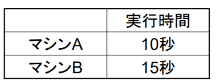

# computerArchitecture(コンピュータアーキテクチャ)  

## 第3回

### 整数の計算

(オーバフローフラグの設計は省略)  

4bit加減算器で、符号なしで12-10を計算しよう。  
bit表示すると、ア: <!-- hole 1100-1010 --> = イ: <!-- hole 0010 -->となる。  
キャリーフラグCAは ウ: <!-- hole 立たない(0) --> し、 オーバフローフラグOVは エ: <!-- hole 0 -->  
この演算は正しい。  
4bit加減算器で、符号なしで12+13を計算しよう。  
bit表示すると、オ: <!-- hole 1100+1101 --> = カ: <!-- hole 1001 -->となる。  
CA= キ: <!-- hole 1 --> 、 OV= ク: <!-- hole 0 -->  
この演算は誤り。  
4bit加減算器で、符号付きで-4+(-3)を計算しよう。  
bit表示すると、オ = カとなる。  
CA= キ 、 OV= ク  
この演算は正しい。  
(他にも宿題があるので、それをすべてまとめる。非公開情報)


(どんな計算の時、どのフラグによって、計算が正しいと判断できるかまとめるべき)  

### 小数点の計算

#### 固有小数点数

例えば 10.75は ア: <!-- hole 1010.1100 --> と表される。  
.1100=.1+.01+.000+.0000= イ: <!-- hole 0.5*1+0.25*1+0.125*0+0.0625*0 -->  
ということである。  

整数の場合でも同じことが言えるのであるが、  
2進数 `1xxx` が 符号なしでnを意味するとき、符号ありでは ウ: <!-- hole -(10000-n) --> を意味する。  
2進数 `0xxx` が 符号なしでnを意味するとき、符号ありでは エ: <!-- hole n --> を意味する。  

(演習問題もやる。非公開情報)  

#### 浮動小数点  

##### 浮動小数点とは

固有小数点で表現すると、すぐ溢れてしまい、特に科学技術計算などで困る。  
例えば光の秒速mは0.3×10^9であるが、これを表すのに何bit必要だろうか。  
概算したいときは、 ア: <!-- hole 2^10=1024≒1000=10^3 --> という関係を使う。  
0.3×10^9は300×10^6であるが、(精度無視)  
これはイ: <!-- hole 512×10^3×10^3 --> より小さく、しかし近い。  
イ≒ウ: <!-- hole 2^9×2^10×2^10=2^29 --> である。  
したがって、エ: <!-- hole 29 --> bit必要であるとわかるのである。  
これではもったいないので、「浮動小数点」という、別の表現方法が開発され、IEEEで標準化されている。  
IEEE Standard 754では 単精度32bitの他、倍精度64bitや半精度16bitを用意している。  
これらのbitを符号ビット、オ: <!-- hole 指数ビット --> 、 カ: <!-- hole 仮数ビット --> に分けて使う。  
符号ビットは当然1だけ。なので、オのビット数さえわかれば、単精度なら32-1-(オのビット数)がカのビット数となり、カのビット数は計算で求められる。  
単精度のオ･･･キ: <!-- hole 8 --> bit  
倍精度のオ･･･ク: <!-- hole 11 --> bit  
半精度のオ･･･ケ: <!-- hole 5 --> bit  
である。  

##### 浮動小数点の作り方  

10進数228 を単精度で表現しよう。  
まず2進数に変換すると、11100100である。  
そして、ア: <!-- hole (仮数の)先頭は絶対1(何bitで表すとかではなくて) --> なんだから、先頭の1を省略してしまう。  
すると、イ: <!-- hole 1100100 --> となる。  

これを仮数部23bitにする。足りない分は、ウ: <!-- hole 右に0を補う -->  
エ: <!-- hole 110_0100_0000_0000_0000_0000 --> となる。  

指数部は8bitであり、これが表現できる整数は-127～128  

ここで、10進数228は、1.1100100×2^7で表されるから、  
指数部は7=0000_0111となりそうだが、なぜか オ: <!-- hole (2^(指数部bit数))-1=127 -->だけ足すというルールがあって、  
カ: <!-- hole 127+7=134 --> =0100_0011を指数部とする。  


##### 浮動小数点から数値の求め方

(32ページもまとめる)  

##### IEEE 754 浮動小数点における特殊表現

そもそも浮動小数点では、「仮数部の先頭は必ず1」をフルに応用してしまったため、 ア: <!-- hole 0を表現することができなくなってしまった --> 。  
これをごまかすために、「例外的な表現」を用意した。  
これを特殊表現という。  
ついでに±∞や「非正規化数」だったり、NaNもここで決めている。  
それを表にまとめたのが [イ](img/ieee754_1.png) である。  
非正規化数とは、 ウ: <!-- hole 「仮数部の先頭は必ず1」を使わないで表した数 --> のことである。  
正規化数や非正規化数は、 [エ](img/ieee754_2.png) で表される。  
Sは符号(ビット)、Mは仮数、Mは指数ビット  
非正規化数の2^-126は、単に オ: <!-- hole E=1 --> とみるのではだめなのだろうか。  

##### IEEE 754 浮動小数点の範囲

単精度:最大値は、ア(bit表記せよ): <!-- hole 0_11111110_11111111111111111111111 --> ＝イ(数値でいえ): <!-- hole 1.11...1×2^127 --> であるから、  
およそ2×2^127である。  
＝(1+1)(2^10)^12 × 2^7  
≒2×10^36×100

## 第4回

(レポートの内容と同じものをまずやった。以下は、その他のものの復習である)  

### 二つのエンディアン

バイトのメモリに保存される順番には2通りある。  
例えばshort int 0xc350と0x1234を配置するとき、   
[ア](img/endian.png)  
のようになる。  

ビッグエンディアンが、「並び方そのまま」で、リトルエンディアンが「並び方が捻くれてる」ので、「小(リトル)心者ほど捻くれる」と覚えればいい。  

### Von Neumann architecture(ノイマン型)

コンピュータにおいて、プログラムの保管場所や処理される方式には種類がある。  
大きくノイマン型と非ノイマン型に大別されるが、ここでは前者のみを扱う。  

プログラムをア: <!-- hole 内部メモリ --> に記憶していることをイ: <!-- hole プログラム可変内蔵方式 --> という。  
これのメリットは、ウ: <!-- hole 可搬性が高く、プログラムの入力や変更が簡単になること --> である。  
アに記憶したプログラムをエ: <!-- hole 実行順に逐次読みだして実行していく --> ことを オ: <!-- hole 逐次処理方式 --> という。  
プログラムと同じ場所にカ: <!-- hole データが格納 --> されていて、  
キ: <!-- hole 高速だが小容量のメモリ「レジスタ」 --> があり、  
ク: <!-- hole キャッシュメモリやメインメモリ --> もあり、  
キと他のメモリ間のデータ転送をプログラムで指示するものを  
ケ: <!-- hole 単一メモリ方式 --> あるいはコ: <!-- hole ロードストアアーキテクチャ --> という。  

### レジスタ
＄0から＄ア: <!-- hole 31 --> のア+1個。  
レジスタ長はすべてイ: <!-- hole 32 --> bit  

＄0はウ: <!-- hole 何を書き込もうとしても書き込めず、定数0となる --> 定数レジスタである。  
必要のなくなったデータの書き込み先などとして有用。  

＄1から＄アはエ: <!-- 汎用レジスタ --> といい、自由に値を書き込める。


### 命令

命令はア: <!-- hole オプコード --> とイ: <!-- hole オペランド -->  で構成される。  
アは実行する命令の種類を明示し、イは操作の対象である。  
命令フォーマットは、一般的にウ: <!-- hole オプコード|オペランド1|オペランド2|... --> のようになっている。  

#### 算術演算命令

足し算は「ア: <!-- hole add --> イ: <!-- hole ＄1,＄2,＄3 -->」 と命令する。  

この命令の意味は、ウ: <!-- hole ＄2と＄3を足し算し、＄1へ格納せよ --> である。  

引き算の場合は「エ: <!-- hole sub --> イ」  
となる。  

＄1のことをオ: <!-- hole ディスティネーションオペランド --> といい、  
＄2、＄3のことをカ: <!-- hole 第1あるいは第2ソースオペランド --> という。  

オペランドはオ: <!-- hole レジスタのみ --> であることに注意  

#### データ転送命令

「ア: <!-- hole lw --> ＄1,100(＄2)」  
はイ: <!-- hole ＄2の値に10進数100を加算した番地 --> からウ: <!-- hole 4バイト のデータを読み出し、  
＄1へ格納する -->   
「ウ: <!-- hole sw --> ＄1,100(＄2)」  
はイにエ: <!-- hole ＄1の値を格納する -->  

100の部分をオ: <!-- hole ディスプレースメント --> といったりする。  

オペランドは(メモリ、レジスタ)の組のみ。

#### 機械語命令フォーマット(R形式)

ア: <!-- hole op(6bit)|rs(5bit)|rt(5bit)|rd(5bit)|shamt(5bit)|funct(6bit) -->  
である。  
opは命令操作(定数0)、  
rsはイ: <!-- hole 第1ソースオペランドのレジスタ番号 -->  
rtはウ: <!-- hole 第2ソースオペランドのレジスタ番号 -->  
rdはエ: <!-- hole ディスティネーションオペランドのレジスタ番号 -->  
shamtはオ: <!-- hole shift_amountつまりシフト量 -->  
functはカ: <!-- hole 機能 -->  
  
追記:キ～シは取り組む必要なし  

functがキ: <!-- hole 100000 --> ならオプコードはadd  
ク: <!-- hole 100010 --> ならsub  
ケ: <!-- hole 100100 --> ならand  
コ: <!-- hole 100101 --> ならor  
サ: <!-- hole 101010 --> ならslt  
シ: <!-- hole 001000 --> ならjr  
となる。  
sltは、ス: <!-- hole 第1ソースオペランドより第2ソースオペランドのほうが大きいとき --> 、ディスティネーションオペランドを1、そうでないとき0とする。  
jrは、セ: <!-- hole ディスティネーションオペランドに指定されたレジスタの保持するアドレスへ分岐 --> するという動作をする。  


#### 機械語命令フォーマット(I形式)

ア: <!-- hole op(6bit)|rs(5bit)|address(16bit) -->  
である。  
opは命令操作、  
rsはイ: <!-- hole ソースオペランドのレジスタ番号 -->  
rtはウ: <!-- hole ディスティネーションオペランドのレジスタ番号 -->  
addressはエ: <!-- hole ディスプレースメント値(符号付き16bit2進整数) -->
  
追記:カ～コは取り組む必要なし  
  
opがオ: <!-- hole 100011 --> ならオプコードはlw  
カ: <!-- hole 101011 --> ならsw  
キ: <!-- hole 000100 --> ならbeq(条件分岐(1のとき))  
ク: <!-- hole 000101 --> ならbne(条件分岐(0のとき))  
ケ: <!-- hole 001000 --> ならaddi(定数加算)  
コ: <!-- hole 001010 --> ならslti(定数比較)  

beq,bneは条件分岐である。この場合、addressはエでなく、  
サ: <!-- hole 次の命令から飛び先命令までの命令数 --> となる。  

beq ＄1,＄2,L1  

L1: add ＄5,＄6,＄7  

のとき、コは0で、  

L1: beq ＄1,＄2,L1  

のときはコは-1  

addiは 「addi シ: <!-- hole ＄1,＄2,定数(16bit) --> 」のように使う。  
意味は、ス: <!-- hole ＄2に定数を加えたものを＄1に格納せよ --> である。  

sltiは 「slti シ」のように使う。  
意味は、セ: <!-- hole 定数が＄2より大きければ＄1に1を、そうでなければ0を格納せよ --> である。  


#### 機械語命令フォーマット(J形式)

ア: <!-- hole op(6bit)|address(26bit) -->  
である。  
opがイ: <!-- hole 000010 --> ならj(無条件分岐)  
ウ: <!-- hole 000011 --> ならjal(サブルーチン呼び出し)  

j(無条件分岐)の場合、32bitのアドレスに飛ぶわけである。  
まず、エ: <!-- hole address(26bit)の末尾に00をつけ --> て28bitにする。  
次に、オ: <!-- hole PCの上位4bitを先頭に付け --> て32bitにして、このアドレスに飛ぶ。  

jal(サブルーチン呼び出し)は、カ: <!-- hole 分岐先アドレスに無条件ジャンプするが、その際に戻り番地を＄31に保存 --> するという動作をする。  
つまり、jalが動作してからは、キ: <!-- 分岐先(サブルーチン)で＄31を変更 --> しない限り、＄31にはク: <!-- hole jalの直を意味するアドレス --> が入る。  

注意:jrはJ形式ではなく、ク: <!-- hole R --> 形式である。  
これはおそらく、ケ: <!-- hole オペランドがレジスタとなる --> からではなかろうかと思う。  

### オペランドの数によるアーキテクチャの分類

#### オペランド0個

命令にア: <!-- hole 明示的 --> なオペランドがない。  
これがみられるのは、イ: <!-- スタック -->  
である。  

メモリ内の変数Xに7を加える例を考えよう。  

push X  
push 7  
add  
pop X  

確かにadd自体にはオペランドが(0個しか)ない。  

ハードウェア イ というものがある。チップ内に独立実装される。  
ウ: <!-- hole 主記憶装置 --> 上に実現。  
どこにプッシュし、どこからポップするのかはエ: <!-- hole スタックポインタ --> が記憶する。  
これは、オ: <!-- hole プロセッサ内の専用レジスタ --> が担う。  


#### オペランド1個  

ア: <!-- hole 電卓の操作 --> をイメージすればよい。  

イ: <!-- hole アキュムレータ --> を使用する。(重要)  

イとは、アでいうと、ウ: <!-- hole 現在の結果を保持しているもの --> のことである。  
唯一のオペランドは、演算命令のエ: <!-- hole 二つ目 --> の引数である。  
  
メモリ内の変数Xに7を加える例を考えよう。  

load X  
add 7  
store X  

確かに、addのオペランドは1つである。  

#### オペランド2個

ア: <!-- hole 命令ごとに明示的に --> 2つのオペランド  

結果はイ: <!-- hole デスティネーションオペランド --> へウ: <!-- hole 上書き --> 。  

メモリ内の変数Xに7を加える例を考えよう。   

add 7,X  
と書けばよいとき、
add X,7 エ: <!-- hole と書いたらダメ(c言語でいう左辺地と右辺値を考えよ) -->  

#### オペランド3個

命令ごとに明示的に3つのオペランド  

結果はデスティネーションオペランドへ上書き。  

メモリ内の変数Xに7を加える例を考えよう。  

add X,7,X  

最初のオペランドがデスティネーションオペランドの場合、 ア: <!-- hole add X,X,7 --> に同じ。  

### オペランドの種類  

ソースオペランドでは、定数だったりレジスタの中身だったりメモリの中身だったりする。  
定数はア: <!-- hole 即値(immediate値) --> といったりして、イ: <!-- hole 命令内に直接埋め込まれる --> 。  

デスティネーションオペランドは、  
レジスタだったり、ア: <!-- hole メモリ位置 --> だったり、ったにないがイ: <!-- hole レジスタを組み合わせたもの --> である。  

### 命令の効率的な実行 

メモリにある変数XとYの値を加え、メモリ上の変数Zに格納する例を考えよう。  

X～ZのアドレスをAdrX～AdrZとしよう。  
角カッコでメモリの中身を表すことにしよう。  
［AdrX］は、ア: <!-- hole 変数Xの値 --> となる。  

Reg1～Reg3を3つのレジスタとしよう。  

メモリの値を加算する命令は、  
直接メモリの値を加算する場合、イ: <!-- hole add ［AdrZ］,［AdrX］,［AdrY］ --> であるが、ウ: <!-- hole メモリは動作が遅いため、すごく時間がかかる。 --> 
  
全てレジスタに読み込んでから加算する命令の場合、  

load Reg1,［AdRX］  
load Reg2,［AdrY］  
load Reg3,［AdrZ］  
add Reg3 Reg1, Reg2  
エ: <!-- hole store Reg3,［AdrZ］ --> 
となる。  

この場合、オ: <!-- hole 時間はかからない --> 。  
こういう風に、オペランドにできるだけレジスタを使用することで <!-- hole フォンノイマンボトルネック --> が回避される。  

## 第5回

### オペランドのトレードオフ 

最適なオペランドの使い方は存在しない。  

以下のことを考慮して自分で考える必要がある。  

ア: <!-- hole プログラミングのしやすさ -->  
イ: <!-- hole 命令数はできるだけ少なく -->  
ウ: <!-- hole 命令の長さはできるだけ短く -->  
エ: <!-- hole できるだけ大きな数の即値を扱えるように --> 
オ: <!-- hole オペランドの読み出しをできるだけ高速に(即値＜レジスタ＜＜メモリ) -->  
カ: <!-- hole ハードウェア規模は小さく -->  

### メモリ内のオペランドの指定方法

直接参照: ア: <!-- hole オペランドが直接メモリのアドレスを持つ -->  
間接参照: イ: <!-- hole オペランドの値(レジスタまたはメモリ)は、それが格納されているメモリアドレスを持つ -->  

### 即値、直接参照と間接参照の例

即値: ア: <!-- hole オペランドに値を直接指示 -->   
レジスタ直接参照  
レジスタ間接参照  
メモリ直接参照  
メモリ間接参照  


### 命令長

固定長命令と可変長命令がある。  
前者はア: <!-- hole ハードウェアが簡単(次の命令がわかる)、高速動作 --> 、後者はイ: <!-- hole メモリを効率よく利用できる --> という特長がある。  

### 2種類の命令セット  

略  

### パイプライン処理  

[ア](img/pipeline.png) のような「処理の流れ」を考えよう。  

この例では、一つの命令を実行するのにイ: <!-- hole 5 --> クロック必要。  

[イ](img/pipeline2.png) のようにして、並列処理により高速化するのをパイプラインという。  

デメリットもある。  

```
add Reg3, Reg1, Reg2
sub Reg5, Reg3, Reg4
```

では、ウ: <!-- hole Reg3が誤動作しうる --> 。


### 性能評価

応答時間: 仕事の開始から完了までの時間  

スループット: ア: <!-- hole 単位時間になされる仕事の量 -->  

問題:  
次の表を見よ  
  
解釈1  
AがBより50%速い（5秒は10秒の50%だから）
解釈2  
AがBより33%速い（5秒は15秒の33%だから）
どちらの解釈を採用すべきか？  

答え:実はどちらの解釈も存在する。  

性能の定義をしよう。  

性能＝ア: <!-- hole 実行時間の逆数 -->  
  
問題:Amdahl’s Lawを言え  

[答え](img/amdahl.png)  

問題:あるコンピュータに、実行速度を10倍にする回路を取り付けるとする。  
ただし、この回路が有効に働くのは、全実行時間の40%である。  
この回路を取り付けることによる速度向上比をいえ  
  
[答え](img/amdahl2.png)  

あるコンピュータのプロセッサを5倍速いものに取り替える。  
このプロセッサの価格は元のプロセッサの5倍である。  
プロセッサは全実行時間の50％の時間使われ、残りの時間は入出力などの待ち時間である。  
もとのコンピュータではプロセッサの価格が全体の価格の1/3を占めているとしたとき、  
5倍の価格のプロセッサを買って高速化することは、コストパフォーマンス（コスト対性能比）  
の観点から見て賢いだろうか？

[答え](img/amdahl3.png)  
まあ、「賢いか」という質問なので、「人による」が最適な答えかもしれない。  

### CPU

CPU時間の定義はイ: <!-- hole あるプログラムを実行するために、CPUが費やした時間 --> である。  
ウ: <!-- hole 入出力待ち時間は含まない。 -->  

CPU時間の内訳は、エ: <!-- hole ユーザCPU時間＋システムCPU時間 --> である。  

プログラマの努力で何とかなるのは前者のみ。  

あるプログラムのCPU時間＝オ: <!-- hole (そのプログラムの実行に必要な総クロックサイクル数)÷クロック周波数 --> で求められる。  

問題:クロック周波数100MHzのコンピュータAは、  
あるプログラムをCPU時間10秒で実行する。  
クロック周波数を上げることにより、  
このプログラムをCPU時間６秒で実行するコンピュータBを開発したい。  
しかし、単純にクロック周波数だけを上げることはできず、  
クロック周波数を上げる代償として、このプログラムを  
実行するのに必要な総クロックサイクル数は  
コンピュータAの1.2倍に増えてしまう。  
コンピュータBのクロック周波数はどこまで上げれば良いか。  

答え: カ: <!-- hole 総クロック数 --> をΣとして、式を2つ立てる。  
キ: <!-- hole Σ÷100×(10^6) = 10 -->  
ク: <!-- hole 1.2Σ÷？=6 -->  
キとクを連立して、？について解けばよい。  


CPIとは、ケ: <!-- hole 1命令当たりの平均クロック数 --> をいう。  
当然コ: <!-- hole 総クロックサイクル数÷総命令数 -->  

問題:あるコンピュータの命令を、実行に必要なクロックサイクル数で分類したところ、  
A類：1クロックサイクル、  
B類：2クロックサイクル、  
に分類できた。このコンピュータにあるプログラムを実行させたところ、  
A類の命令が60%、  
B類の命令が40%  
の割合で実行された。このプログラムを実行したときのCPIを求めよ。  
  
答え:ケを求めればよいわけだ。  
サ: <!-- hole 100個命令があった --> と仮定すれば話が簡単。  
A類が60個、B類が40個だから、  
サイクルは全部で140クロック。  
サので、1.4倍。  

CPU時間を短縮するには、  
総命令数を減らす(具体的には シ: <!-- hole 命令セットやコンパイラの改善 --> など)  
CPIを減らす( ス: <!-- hole CPUアーキテクチャの改善 --> )  
クロック周波数をあげる( セ: <!-- hole 半導体の性能改善 --> )  
が考えられる。  

問題:同じ命令セットを持つ2台のコンピュータA、Bがある。  
Aはクロック周波数が400MHzで、あるプログラムを実行したときのCPIが2.0であった。  
Bはクロック周波数が200MHzで、同じプログラムを実行したときのCPIが1.2であった。  
このプログラムの実行において、どちらのコンピュータがどれだけ速いか。

答え: ソ:<!-- hole 総命令数をIとし、A,Bの総実行サイクル数をそれぞれΣA,ΣBとして計算する。 -->  
ΣA=2.0I  
ΣA=1.2I  
CPU時間(A)=ΣA÷(400×10^6)=(8.0×10^-8)I  
CPU時間(B)=ΣB÷(200×10^6)=(9.6×10^-8)I  
よって、AがBより9.6÷8.0=1.2倍速い。  

### CPU以外の性能尺度  
MIPSは実行命令数÷(実行時間×10^6)  
実行プログラムによって依存するし、  
高速なのに実行命令数のせいで評価が小さくなったりなど、問題多すぎ。  

MFLOPS(メガフロップス)  
１秒間に実行される浮動小数点演算数（単位：１００万）  
問題点  
?浮動小数点演算を行わないプログラムに対しては使えない  
?浮動小数点演算の種類により値が変化  
（例）浮動小数点演算の種類が  
加算ばかりのプログラム：MFLOPS値大  
除算ばかりのプログラム：MFLOPS値小  

### メモリ

問題:低速大容量なメモリを下に、高速小容量なメモリを上にして、  
またメモリ間を接続するものも示したモデルをかけ  
[答え](img/memory.png)  

#### 物理メモリと物理アドレス  

メインメモリは、通常Rア: <!-- hole A --> Mである。  
したがって、電源が落ちたとき、イ: <!-- hole 消える -->  

二種類のメモリがあって、SRAMとDRAMという。  

#### SRAM
SRAMを図にすると、[ア](img/sram.png)  
基本的にイ: <!-- hole フリップフロップ --> で構成されている。  
ウ: <!-- hole 高 --> 速、ウ熱、ウ電力消費、ウ価。  

#### DRAM
DRAMを図にすると、[ア](img/dram.png)  
基本的にイ: <!-- hole コンデンサ --> で構成されていて、構造がウ: <!-- hole 単純 --> 。  
それゆえ、 エ: <!-- hole 高集積化 --> が可能。  
しかし、オ: <!-- hole 電荷が少しずつ逃げていく --> とか言う問題があるため、  
リフレッシュ回路が必要。  

#### Cache and Caching  

主記憶装置では通常、ア: <!-- hole D --> RAMが 使われる。大容量かつ安価だからだ。  
しかし、低速。そのせいでイ: <!-- hole プロセッサが待たされる --> ことになる。  

たいていのプログラムはウ: <!-- hole 参照の局所性 --> を持つ。  
時間的なウはエ: <!-- hole ループ命令や繰り返し用の変数 --> 等が例。  
空間的なウはオ: <!-- hole 逐次実行命令や配列 --> が例。  
ここで役立つのがキャッシュメモリだ。  
キャッシュとは本来カ: <!-- hole モノを隠したり貯蔵したりするのに安全な場所 --> である。  
キャッシュメモリは、ウを活かして、最近使われたメモリやその近辺を一次的にためておく。高速にアクセス可。  

#### キャッシュコントローラ

構造を示すと [ア](img/cc.png)  

#### キャッシュメモリに関する用語  

ヒット: ア: <!-- hole アクセスしたい番地の内容がキャッシュ内に存在 -->  
ミス: イ: <!-- hole アでない -->  

ウ: <!-- hole ヒット時間 --> :キャッシュへアクセスするのにかかる時間  

エ: <!-- hole ミスペナルティ --> :ミス時、主記憶からブロックをキャッシュに転送する時間  

平均メモリアクセス時間はオ: <!-- hole ヒット時間＋(ミス率×ミスペナルティ) --> で求められる。  

ブロックサイズとミスペナルティあるいはミス率の特性図をだいたい示すと、 [オ](img/pp.png) のようになる。  

平均アクセス時間とブロックサイズの関係は、  
ブロックサイズが大きくなるとカ: <!-- hole 局所性によるヒット率の増加はあるが、キャッシュに格納できるブロックが減ってミス率が高くなる -->   
[キ](img/pp2.png)  

プロセッサから見た主記憶、キャッシュから見た主記憶をそれぞれ図にすると、  
[ク](img/memory.png) のようになる。  

(問題1省略)  

問題2:メモリアドレス987780AF（16進）のブロック番号とオフセットアドレスを16進数で答えよ．ブロックサイズは8バイトとする．  

下位3bitがオフセットアドレス  

２の(オフセットアドレスビット数)乗が、ブロックサイズ  

ライトスルーはリードが早い  

ライトストールとは、ライトの待ち時間  

問題12の答えはA  

マルチキャッシュは、数値を使った問題は出ない！！


  
