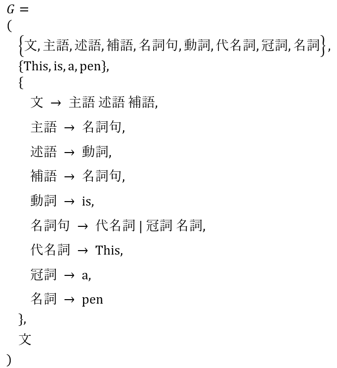
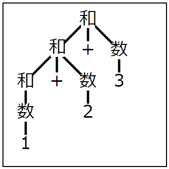

# detaStructureAndAlgorithm

## 第3回

### 決定性オートマトンとプログラム  

非決定性オートマトンは ア: <!-- hole イプシロン遷移 --> といって、何もしなくても複数通りに進みうるなど、次の状態への遷移が曖昧である。  
これに対して、決定性オートマトンは次の状態への遷移が曖昧でない。  
したがって、プログラムに変換することができる。  

[イ](http://edu.net.c.dendai.ac.jp/ad2/2019/3/daaabc.png) の決定性オートマトンをプログラムに直すと、  
次のようになる。  


```
            final Reader r = new InputStreamReader(System.in);
            State s=State.STATE1;

	    while(cをrから1文字順番にとってきて、それが終了していない){
		switch(s){
		case STATE1:
		    if(c=='A'){ s=State.STATE2; }
		    else if(c=='C'){ s=State.STATE3; }
		    else{ throw new IllegalStateException(); }
		    break;
		case STATE2:
		    if(c=='A'){ s=State.STATE2; }
		    else if(c=='B'){ s=State.STATE3; }
		    else{ throw new IllegalStateException(); }
		    break;
		case STATE3:
		    if(c=='B'){ s=State.STATE1; }
		    else{ throw new IllegalStateException(); }
		    break;
		}
	    }
            受理したか=(s==State.STATE3);
```


自然数を受理する決定性オートマトンを作ると、 [ウ](img/automatonN1.png) のようになる。  

### 決定性オートマトンと非決定性オートマトンとの等価性 

  
は、状態1のときにaが入力されたとき、1にいくのか2にいくのかわからないので非決定性オートマトンである。  

「,」を「または」と読み替えて考えれば、このオートマトンでは次の表の通りの状態遷移が起こる。  

[ア](img/stateList1.png)  

この「～または～」自体を状態と考えてしまえば、次のような決定性オートマトンに変換できる。  

[イ](http://edu.net.c.dendai.ac.jp/ad2/2019/3/da.png)  


### オートマトンの出力 
文字列から、「正規表現にマッチする部分列」を抽出することを考えよう。  
抽出したい部分を ア:<!-- hole ()で括る --> のが一般的である。  
例えば自然数を取り出したいときは、 イ: <!-- hole .*([1-9][0-9]*) --> のように表現する。  
イのようにして、文字列「a12345b」から文字列を抽出したい場合、 ウ: <!-- hole 最長一致 --> となる 12345が抽出されることが多い。  
このようなオートマトンは [エ](http://edu.net.c.dendai.ac.jp/ad2/2019/3/1023.png) のように表される。  

javaで正規表現を扱うオートマトンは、 オ: <!-- hole java.util.regex --> ライブラリに用意されている。  

javaで「キーボード入力から自然数を取り出す」プログラムを作ると、次のようになる。  

```

import java.util.*;
import java.util.regex.*;
import java.io.*;
class Rei2 {
    public static void main(String arg[]) throws IOException {
	final BufferedReader br = new BufferedReader(
                                    new InputStreamReader(System.in));
	String buf;
	final Pattern p = Pattern.compile("[1-9][0-9]*");
	Matcher m;
	while((カ)){
	    (キ);
	    while((ク)){
		(ケ);
	    }	
	}
    }
}

```

カ: <!-- hole (buf=br.readLine())!=null -->  
キ: <!-- hole m= p.matcher(buf) -->  
ク: <!-- hole m.find() -->  
ケ: <!-- hole System.out.println(m.group()) -->  


### 正規表現の限界

ア: <!-- hole 「(」と「)」 --> をアルファベットとし、ルールを イ: <!-- hole かっこが過不足なく閉じている --> とする言語をカッコ言語という。  

正規表現は、つまり決定性オートマトンはカッコ言語を受理しない。これを証明しよう。  
カッコ言語を受理する決定性オートマトンが存在すると仮定して、矛盾を導こう。  
決定性オートマトンMの状態数がnであるとする。  
開きカッコがn+1個続き、その後閉じカッコがn+1個続くカッコの列sを考えよう。  
仮定によりsをMは受理する。  
状態数nよりも多い個数n+1だけ開きカッコがあるわけで、  
ということは、ウ: <!-- hole 1つの状態が2回以上現れる --> ということが必ず起こる。  
この状態をqとする。  
qが出現するのがi番目とj番目の開きカッコを入力した後であるとしよう。  
i＜j  
ここで、エ: <!-- hole i番目のあとにj+1番目の入力 --> を与えてみよう。  
(このような文字列をs'と呼ぼう)  
オ: <!-- hole「j+1番目の文字」は「状態qの次の入力」に等しい --> ため、 カ: <!-- hole i+1番目以降をj+1番目以降で置き換えて --> も、  
sを受理する決定性オートマトンは必ずs'を受理してしまう。  
しかしs'はi回開きカッコを繰り返した後、  
カ <!-- hole n+1-j --> 回開きカッコを繰り返し、  
キ <!-- hole n+1 --> 回閉じカッコを繰り返すというものになっているため、  
ク <!-- hole 開きカッコと閉じカッコの個数が一致しない --> 。  
それなのに受理してしまった。  
このようにして、カッコ言語を決定性オートマトンで表現することは不可能であるということが導かれる。  

### P=NP問題
P=NP問題とは、ア <!-- hole 決定性オートマトンで多項式回の状態遷移で計算できる問題の集合をA、非決定性〃をBとするとき、A=Bであるか否か --> という問題である。  

## 第4回

### 文脈自由文法

正規文法で取り扱えない言語を取り扱える強力な文法の一つに、ア: <!-- hole 文脈自由文法 --> というものがある。  
アでは、イ: <!-- hole 文が特定の品詞の組み合わせでできている --> ような文法表示を取り扱うことができる。  
このような表現による文法表現はウ: <!-- hole プログラミング言語や通信プロトコルの仕様の記述 --> にも利用されるなど、利用価値が高い。  

### バッカス・ナウア記法

#### 文法の定義

バッカス・ナウア記法は文脈自由文法の一種である。  
ア: <!-- hole 非終端記号 --> イ: <!-- hole の集合 --> V_N  
ウ: <!-- hole 終端記号 --> イ V_T  
エ: <!-- hole ルール --> P  
オ: <!-- hole 開始記号 --> S(カ: <!-- hole ∈V_N --> )  
ここで、ウとはキ: <!-- hole アルファベット --> のことであり、  
キ以外の記号をアという。  
エはク: <!-- hole (非終端記号)→(非終端記号と終端記号の列) --> のように表す。  
但し、「→」の代わりに「::＝」とかくこともあるそう。  
最後に、アの一つをオとして選ぶ。  
ちなみに、文脈自由文法とは、ケ: <!-- hole 左辺に1つだけ非終端記号がある文法 --> のことを意味する。  

#### 記号列の生成

以上のような定義の文法において、次の手順で記号列を生成する。  
1. ア: <!-- hole 開始記号を左辺に含む --> ルールを一つ選ぶ  
2. 開始記号をイ: <!-- hole そのルールの右辺に置き換える -->  
3. ウ: <!-- hole すべてが終端記号 --> なら終了、そうでなければ4へ。  
4. 2で置き換えたものの中からウ: <!-- hole 非終端記号 --> を選び、1へ戻る。(開始記号と書いてあるところは、ウと読み替える)  

プログラミング言語っぽくいうと、次の通り。

```
注目する非終端記号=開始記号;
do
{

  注目するルール=注目する非終端記号を左辺に含む任意のルール;
  文=置き換え(注目する非終端記号, 注目するルール, 文);
  注目する非終端記号=(文に非終端記号が含まれる) ? (その中のどれか) : false;
}while(注目する非終端記号!==false);
```

#### 文法の例

問題、G＝(V_N, V_T, P, 文)を  

  

のようにするとき、This is a penという記号列を導くことができる。  

過程を述べよ。また、他に導くことのできる記号列を1つ挙げよ。  

[答え1](img/CFG2.png)  
答え2: <!-- hole ☆の部分で、対称性があるから、 a pen is This なども導かれる。-->   

また、終端記号(アルファベット)といっても、一文字とは限らず、意味のあるひとまとまりの語句(ア: <!-- hole トークン --> )を一つの終端記号とみることが多い。  


#### 括弧の処理

問題:  
正規文法では取り扱えなかった括弧であるが、バックスナウア記法では簡単に扱える。  
非終端記号をSとするとき(つまり、須らくして開始記号はS)、カッコ言語のルールを列挙せよ。  
但し、終端記号に関しては自分で考えよ。  

答え: <!-- hole S→ε、S→SS、S→(S) -->  

問題:  
カッコ言語では()が使える。[]も使えるようにこれを拡張した言語Gを表せ  

[答え](img/CFG3.png)  

#### 正規文法との関係

バッカスナウア記法において、ア: <!-- hole 指定できるルールを「非終端記号→終端記号」、「非終端記号→終端記号_非終端記号」だけに制限した文法 --> を正規文法という。  

このことを証明(途中まで)しよう。  
まず、アで、イ: <!-- hole 非決定性オートマトン --> が構成できることを示そう。  
各非終端記号をそれぞれウ: <!-- hole オートマトンの状態 --> とする。  
つまり、開始状態はエ: <!-- hole 開始記号 --> で例えられる。  
オ: <!-- hole 非終端記号A→終端記号b_非終端記号C --> はカ: <!-- hole 状態Aから入力bで状態Cへ遷移すること --> に例えられる。  
一方、キ: <!-- hole 非終端記号A→終端記号b --> はク: <!-- hole 状態Aから入力bで終了状態へ遷移すること --> に例えられる。  
以上により、アでイが構成できることが確認できた。  
あとは、イがアに変換可能であると示せれば、等価性を示せるわけだが、これは省略する。  

問題:整数を、バッカスナウア記法による正規文法で表現せよ。  

[答え](img/BN.png)  

### 構文解析木

バッカスナウア記法(正規文法に限定しない)による記号列の生成は、木の構造で表すことができる。  
この木を構文解析木という。  

問題:G＝(V_N, V_T, P, 文)を  

  

のようにするとき、This is a penという記号列を導くことができる。  

その様子を構文解析木で表せ  

[答え](img/Thisisapen.png)  

Time flies like an arrow.のように、解釈が複数通り考えられるものを、  
「構文解析木」という言葉を用いて説明すると、「複数の構文解析木を持つ」ということができる。このような状態を、曖昧であるという。  

問題:構文解析木を、書きながら、引き算のバッカスナウア記法  
({差},{数, -}, {差→差-差, 差→数}, 差)が曖昧で、(1)  
({差},{数, -}, {差→差-数, 差→数}, 差)が曖昧でない(2)ことを確認せよ。

[答え（1）](img/SDT.png)  

[答え（2）](img/SDT2.png)  

引き算のバッカスナウア記法で、かっこに対応するものを作ってみよう。  
例えば、4-(3-2)-1に対応する引き算を考える。  
従来では 差-数←差、数←差 がルールだった。  
また当然、(差)←差 が成り立つ。  
とりあえずこの3つをルールとしてみよう。  
解析していくと、 [ア](img/SDT3.png) のようになる。  
つまり、イ: <!-- hole 差-差 --> となってしまう。  
これを解決するためには、ウ: <!-- hole (差)←数 --> とみなすルールにすればよい。

### 文法を解釈するプログラム  

構文解析のことをparse、構文解析プログラムをparserという。  

バッカスナウア記法の解析法として、次のようなものがある。  
まず、 ア: <!-- hole すべての非終端記号に対して関数を作る --> 。  
左辺の非終端記号をイ: <!-- hole 関数呼び出し --> とし、右辺はウ: <!-- hole 関数の内部処理 --> とする。  
ウで、終端記号に対してはエ: <!-- hole 文字の認識 --> とし、非終端記号に関してはオ: <!-- hole 対応した関数を(再帰的に)呼び出す -->  

問題: A→bCDのとき、上記の方法で解析したい。  
関数Aを作れ

```
private boolean A()
{
    if(カ)
    //kigouはグローバル変数
    {
        kigou=(キ);
        if(ク)
        {
            return true;
        }
    }
    return false;
}
```

(カ): <!-- hole kigou=='b'  
(キ): <!-- hole (次の記号) -->  
(ク): <!-- hole C() && D() -->  

しかしこれだけでは、問題が発生する。  
例えばケ: <!-- hole S→A|B\nA→ab\nB→ac --> のようなルールがあったとき、  
状態Sで終端記号aを読み込んだ後、AとBどちらを導出するか決められない。  
この問題を解決する簡単な方法は、ルールのどれかを適当に選び、途中で失敗したら別の導出規則を選ぶというものである。  
これをコ: <!-- hole バックトラック --> という。  

問題: ケのようなルールをコで解析するjavaプログラムを作れ  

```
サ;//Readerやその継承クラスBufferedReader( extends Reader)を利用可能に
class Parser
{
    public Parser(Reader r)
    {
        reader = new BufferedReader(r);
    }
    final private BufferedReader reader;
    public シ throws IOException{ス}
    //関数内でエラーがあったときに例外を投げる
        private セ throws IOException
        {
            ソ;
            if(タ)
            {
                return true;
            }
            ツ;
            return false;
        }
        private ナ throws IOException
        {
            //セの中身と同じことなので省略
        }
}
class Rei
{
    public static void main(String[] arg) ニ
    {
        Parser parser = ヌ;  
        if(ノ)
        {
            System.out.println("受理されました");  
        }
        else
        {
            System.out.println("拒否されました");
        }
    }

```

(サ): <!-- hole import java.io.* -->  
(シ): <!-- hole boolean S() -->  
(ス): <!-- hole return (A() || B()); -->  
(セ): <!-- hole boolean A() -->  
(ソ): <!-- hole reader.mark(2) -->  
(解説は後程(テ)と一緒に行う)  
(タ): <!-- hole reader.read()=='a' && reader.read()=='b' -->  
解説: reader.チ: <!-- hole read() --> は単一の文字を読み込む。  
ツ: <!-- hole java.io.BufferedReader --> クラスで  
public int チ throws IOExceptionが定義されているわけだ。  
(参考:https://docs.oracle.com/javase/jp/8/docs/api/java/io/BufferedReader.html)  
読み込んだら、ポインタのようなものを次の文字のところへ自動で移しているのだと思う。  
(テ): <!-- hole reader.reset(); -->  
解説:  
これもツ クラスで定義されている。ストリームをト: <!-- hole リセット --> する。  
ストリームをトするというのは、ソで「ストリームの現在位置マークを付けた」場合、そこに戻すわけ。  
ソの引数2はreadAheadLimitといって、マークを保持しながら読み込むことができる文字数の上限。  
(参考:https://docs.oracle.com/javase/jp/8/docs/api/java/io/BufferedReader.html)  
(ナ): <!-- hole B() -->
(ニ): <!-- hole throws IOException -->  
解説: 関数内部で呼び出したものが例外を投げうるとき、自分も同じ例外を投げうるようにしなければならない。  
(ヌ): <!-- hole new Parser(new InputStreamReader(System.in))  
解説:InputStreamReaderクラスは、正式にはjava.io.InputStreamReaderクラスであり、  
Readerクラスを継承している。  
ネ: <!-- hole バイトを読み込み、(指定されたcharsetで)文字にデコード --> する役目を持つそう。  
(ノ): <!-- hole parser.S() -->  

### バックトラックを避ける  

ア: <!-- hole 次に読み込む終端記号から必ず導出規則が一つ決定できる --> ような文法が与えられたとする。  

そのような文法では文字を読み込みながらイ: <!-- hole if文でどちらの導出規則かを選択できる --> ので、  
バックトラックを行わずに済む。このようにウ: <!-- hole 1終端記号後まで読めば、導出規則が一意に定まる(＝構文解析木が1通りに決まる) --> 文法をエ: <!-- hole LL(1)文法 --> という。  
1以外のすべての0以上の整数kについて、同様の言い方をする(「LL(k)文法」という)。  
(参考: https://ist.ksc.kwansei.ac.jp/~ishiura/cpl/n8.pdf )

### LL(k)文法

問題:次の文法がLL(1)文法であるか判断せよ。  
({差},{数, -}, {差→差-数, 差→数}, 差)  

答え:  
オ: <!-- hole いくつかの(受理する)入力列の例を用意し --> ながら考えるとわかりやすい。  
例えば4、4-3、4-3-2、4-3-2-1などでよいだろう。
開始記号が「差」であるため、  
ルールより、「差-数」あるいは「数」のいずれかになる。  
この時点でLL(オ: <!-- hole 0 --> )文法ではない(カ: <!-- hole 0終端記号後まで読んでも、導出規則は一意に定まらない(＝構文解析木が1通りに決まらない) --> )。  
ここでキ: <!-- hole 1終端記号読み込んでしまおう -->  
4となる。  
この4はク: <!-- hole 差と解釈することもできる(a)し、数と解釈することもできる(b) --> 。  
(a)だけなら、ケ: <!-- hole 差→「差」-数の、「差」が4である --> と解釈出来て、  
(b)だけなら、コ: <!-- hole 差→「数」の、「数」が4である --> と解釈出来る。  
しかし、両方だというのだから、結局わからない。  
したがって、LL(サ: <!-- hole 1 --> )文法ではない(シ: <!-- hole 1終端記号後まで読み込んでも、導出規則は一位に定まらない(＝構文解析木が1通りに決まらない) --> )。  

問題:先ほどの文法がそもそもLL文法(LL(k)文法のこと)であるか判断せよ。  

答え:
LL(1)文法では無かったのだから、2終端記号後まで読み込む。  
「4(終)」あるいは「4-」となる。  
「4(終)」となった場合はそれでいい(入力列は｢4｣であり、これは差→数＝4と解釈できる)が、「4-」となった場合は、先ほどと全く同じ問題が発生する(※)。  
最悪の場合、10000000000000000-9999999999999999-999999999999998-...-1なんてものを解析させられた場合、  
LL(k)のkはとてつもなく大きくなってしまう。この問題は限りなく続く。  
したがって、そもそもLL文法ではない。(k→∞でも、つまり永遠に、解析しきれないのだ)  

では、引き算がLL文法ではないのは何故だろう。  
この文法の特徴を「非終端記号」、「終端記号」という言葉を使って説明してみると、  
ス: <!-- hole 左辺と同じ非終端記号が右辺の先頭に来ている --> といえるだろう。  
このようなことが起こると、入力列をセ: <!-- hole 左から順 --> に読もうとしたとき、入力列次第で永遠に終わらなくなってしまう。  
これをソ: <!-- hole 左再帰性 --> という。  
確かに「※」の部分が再帰する。  

### 左再帰性の除去

左再帰性のあるルールを一つ挙げると、ア: <!-- hole A→(AB)|C\n但しCはAで始まらない --> などである。  
これは正規表現で表すならイ: <!-- hole CB* --> を意味する。  
(確かに、CのあとにBが続く限り永遠に構文解析が終わらない)  
これは、ウ: <!-- hole A→CA',A'→(BA')|ε --> のように書くと、左再帰性がなくなるという。  

引き算({差},{数, -}, {差→差-数, 差→数}, 差)  
には左再帰性があったが、
ルールをエ: <!-- hole 差→数差', 差'→-数差', 差'→ε --> に変更すると、左再帰性がなくなるという。  

確認してみよう。  

いくつかの(受理する)入力列の例を用意しながら考えるとわかりやすい。  
例えば4、4-3、4-3-2、4-3-2-1などでよいだろう。
開始記号が「差」であるため、  
ルールより、「数差'」になる。  
また、差'は「-数差'」あるいは「ε」になるわけだが、どちらになるかわからない。  
この時点でLL(0)文法ではない。  
ここで1終端記号読み込んでしまおう。  
4となる。  
この4は差とは解釈できない。(∵数差'と解釈できない)  
この時点でLL(1)文法ではない。  
※差→数(差'→ε)はダメ。オ: <!-- hole 4の次が空文字である証拠はまだない --> からだ。  
もう１終端記号を読み込むと、  
「4(終)」あるいは「4-」となる。  
前者ならカ: <!-- hole 差→数(差'→ε) --> と解釈出来て、  
後者ならキ: <!-- hole 差→数(差'→-数差') -->と解釈できる。  
したがって、LL(2)文法である。  

### 再帰的下向き構文解析法 

非終端記号Aに対して、Director(A,α)をア: <!-- hole A→αで一番左に導出されうる終端記号の集合 --> とする。  


ク: <!-- hole 差と解釈することもできる(a)し、数と解釈することもできる(b) --> 。  
(a)だけなら、ケ: <!-- hole 差→「差」-数の、「差」が4である --> と解釈出来て、  
(b)だけなら、コ: <!-- hole 差→「数」の、「数」が4である --> と解釈出来る。  
しかし、両方だというのだから、結局わからない。  
したがって、LL(サ: <!-- hole 1 --> )文法ではない(シ: <!-- hole 1終端記号後まで読み込んでも、導出規則は一意に定まらない(＝構文解析木が1通りに決まらない) --> )。  
また、ルールをA→α1,A→α2,...とする。  
任意のAや2つのαを選んだとき必ず(αiとαjとする)、  
ス: <!-- hole Director(A,αi)∩Director(A,αj)＝φ --> が成り立てば、  
必ずLL(1)文法となる。  

このような場合、次のようなプログラムで解析ができる。  

```
private boolean A()
{
    if(セ)
    {
        return α();
    }
    else
    if(ソ)
    {
        return β();
    }
    ...
    return タ;
}

```

(セ): <!-- hole 文字∈Director(A,α) -->  
(ソ): <!-- hole 文字∈Director(A,β) -->  
補足: αやβは、Aの右辺(任意)  
(タ): false

以上のような書き方ができるのは、スの性質のおかげである。  
利点はα()やβ()がfalseを返しても、チ: <!-- hole バックトラックの必要がない --> ことである。  

### Director集合の求め方

αを非終端記号、終端記号からなる列とする。  
Aを非終端記号とする。  
A→αとする。  
First(α)をア: <!-- hole αから導出可能な列の先頭になり得る終端記号の集合 --> としよう。  
εは、αからεが導出可能な場合のみ含む。  
Follow(A)をイ: <!-- hole 開始記号から導出していった時、Aの直後になりうる終端記号の集合 --> としよう。  
A→αに対して、Director(A,α)はウ: <!-- hole 基本的にFirst(a)と同じになるが、αからεが導出可能ならFollow(A)も含む --> となる。  

### 構文解析プログラムの構造  

次のコードのように、「ループの冒頭で文字を読み、終了条件を判定し、ループの中で出力作業を行う」というものでは、ア: <!-- hole 複数の関数で共通のストリームから文字を読む --> という処理ができない。  

```
public static void main(String[] arg)
{
    前処理;
    while(文字を読みつづける) // 読み込みは一ヶ所
    {
        文字列の組み立て処理;
        文字列が完成したら出力;
    }
    後処理;
}

```

そこで、次のような書き方をする。  

```
class Parser 
{ 
    private boolean 非終端記号1(){(ア)}
    private boolean 非終端記号2(){...}
    ...
}
/*
  α や β の処理中で文字を読み、終了判定も考慮される。
*/

class Rei
{
    public static void main(String[] arg)
    {
        if(イ)
        {
            System.out.println("受理");
        }
        else
        {
            System.out.println("拒否");
        }
    }
}

```

(ア):次の通り。  

```
終端記号=次の終端記号;
if(終端記号∈Director(非終端記号1,α))
{
    return α の処理;
}
else
if(終端記号∈Director(非終端記号1,β))
{
   return β の処理;
}...
return false;

```

(イ):<!-- hole 開始記号() -->  

ここで問題になってくるのは、ウ: <!-- hole 終端記号を構成する文字の終端をどう判定するか --> ということだったり、  
エ: <!-- hole ファイルの終端の処理をどうするか --> ということである。  

ウはややこしいが、1234+5678とあり、終端文字が1から始まることだけわかっている場合、オ: <!-- hole 終端文字は1なのか(終端は1)、12なのか(終端は2)、123なのか(終端は3)... --> ということである。  
カ: <!-- hole 最長一致 --> で考える場合、ウはエ: <!-- hole 終端記号に含まれない文字を読み込んだ時、その一つ前 --> と判定することになる。  
しかし、ここでキ: <!-- hole 終端記号に含まれない文字 --> は次の終端記号に含まれる可能性がある。(...というか、基本的にそうではないのだろうか？)  
したがって、ク: <!-- hole 文字を一つ戻す --> という処理をしないと、キを読み飛ばして誤作動してしまう。  

エについては、ファイルの終端に来たとき、ケ: <!-- hole とりあえず今の関数は終端記号を返却していいけど、次回の呼び出しのタイミングで、返却不可能と示す --> ことで解決される。  

### 構文解析木の作製

足し算文法
({始,和,和'},{数, +, =}, {始→和= ,和→数和', 和'→+数和', 和'→ε}, 和)  
を考える。  


これをプログラムっぽく表現すると、  

```
private static boolean 始()
{
    if(ア1)
    {
        if(イ1)
        {
            if(ウ1)
            {
                return true;
            }
        }
   }
   return false;
}
    private static boolean 和()
    {
        if(ア1)
        {
            エ1;
            if(オ1)
            {
                return true;
            }
        }
        return false;
    }
    private static boolean 和'()
    {
        if(ウ1)
        {
            return true;
        }
        else
        if(カ1)
        {
            エ1;
            if(ア1)
            {
                エ1;
                if(オ1)
                {
                    return true;
                }
            }
        }
        return false;
    }  
    public static void main(String[] arg)
    {
        エ1;
        if(キ1)
        {
            System.out.println("Ok");
        }
        else
        {
            System.out.println("NG");
        }
    }

```

これをjavaのプログラムで表すと、次のようになる。

```
import java.io.*;
class Parser
{
    final private Reader reader;
    public Parser(Reader r) throws IOException
    {
	reader = r;
	c = reader.read();
    }
    private int c;
    public boolean s() throws IOException
    {
        System.err.println("called s.");
        if(ア2)
        {
	    if(イ2)
            {
		if(ウ2)
                {
		    エ2;
		    return true;
		}
	    }
	}
	return false;
    }
    private boolean wa1() throws IOException{
	System.err.println("called wa1.");
	if(Character.isDigit(c)){
	    エ2;
	    if(オ2)
            {
		return true;
	    }
	}
	return false;
    }
    private boolean wa2() throws IOException
    {
	System.err.println("called wa2.");
	if(ウ2)
        {
	    return true;
	}
	if(カ2)
        {
            エ2;
	    if(ア2)
            {
		// (足し算の処理をここに追加)
		エ2;
		if(オ2)
                {
		    return true;
		}
	    }
	}
	return false;
    }
}
class Rei
{
    public static void main(String[] arg) throws IOException
    {
	final Reader r = new InputStreamReader(System.in);
	final Parser parser = new Parser(r);
	if(キ2)
        {
	    System.out.println("accept");
	}
        else
        {
	    System.out.println("reject");
	}
    }
}
```

(ア1): <!-- hole 次 == 数 つまり Directorを調べている -->  
(ア2): <!-- hole Character.isDigit(c) -->  
(イ1): <!-- hole 和() -->  
(イ2): <!-- hole wa1() -->  
(ウ1): <!-- hole 次 == '=' -->  
(ウ2): <!-- hole c=='=' -->  
(エ1): <!-- hole 次を読む -->  
(エ2): <!-- hole c = reader.read() -->  
解説:これは、returnの直前に1ついれる。次の文字を拾おうとする。 -->  
(オ1): <!-- hole 和'() -->  
(オ2): <!-- hole wa2() -->  
(カ1): <!-- hole 次=='+' -->  
(カ2): <!-- hole c=='+' -->  
(キ1): <!-- hole 始() -->  
(キ2): <!-- hole parser.s() -->  
補足:「parser.」を忘れないこと

以上のプログラムから、構文木を作ろう。  
s()が構文解析が終わった後で構文木を返すように書き換えたい。  
構文木は、例えば以下のようなものである。  
  

この構造を作るのに、ク: <!-- hole 各頂点に対応するオブジェクト型 --> としてNode型を考えよう。  
上記のように、構文木のオブジェクトはケ: <!-- hole 数だけ入っているオブジェクト --> と、コ: <!-- hole 演算子が入っていて子の頂点が2つあるオブジェクト --> に大別できる。  
それぞれKazu型、Wa型としよう。  
これはどちらもNodeであるため、Kazu型とWa型はサ: <!-- hole Nodeクラスを継承している -->  

```
シ class Node{ス}
    class Kazu extends Node{セ}
    class Wa extends Node
    {
        private char op;
        private Node left;
        private Node right;
        public Wa(){}
        public void setOp(char op)
        {
            ソ;
        }
        public void setLeft(Node n)
        {
            タ;
        }
        public void setRight(Node n)
        {
            チ;
        }
    }
```

(シ): <!-- hole abstract -->  
(ス):次の通り  

```
    abstract public void setOp(char op);
    abstract public void setLeft(Node n);
    abstract public void setRight(Node n);
```

(セ):次の通り  

```
        private int value;
        private Kazu(int n)
        {
            value=n;
        }
```

(ソ):this.op = op  
(タ):left = n  
(チ):right = n  

このようなクラスを用いて構文解析木を作る。まず具体的な例として、  
先ほど例として示した木を、手動で作るプログラムをmainメソッドに書いたものを示す。  

```

class Rei
{
    public static void main(String[] arg)
    {
        final Node tmp = ツ;  
        tmp.setOp('+');  
        tmp.setLeft(テ);
        tmp.setRight(ト);        
	final Node root = ツ;
	root.setOp('+');
	root.setLeft(ナ);
	root.setRight(ニ);
    }
```

(ツ): <!-- hole new Wa() -->

(テ): <!-- hole new Kazu(1) -->  
(ト): <!-- hole new Kazu(2) -->  

(ナ): <!-- hole tmp -->  
(ニ): <!-- hole new Kazu(3) -->  

こうすることで、確かに一番上を変数rootとして構文解析木ができた。  
最終的には、この作業を数式の構文解析プログラムに生成させる。  

#### コンポジットデザインパターン

今回の構文解析木ように、ア: <!-- hole 同一のクラスのオブジェクトが関連付けられているような再帰的な構造に対して、各オブジェクトで次々とメソッドを動作 --> させたいときのテクニックがコンポジットデザインパターンである。  
線形リストや木構造などのデータ構造において、イ: <!-- hole すべての頂点が特定の親クラスを継承している --> ものとするときのデザインパターンだ。  

コンポジットデザインパターンでは、線形リストや木構造などのデータ構造において、ウ: <!-- hole すべての頂点が特定の親クラスを継承している --> ものとする。 そして、関係するすべてのクラスでエ: <!-- hole 同一メソッド --> を実装する。  
その時、オ: <!-- hole 子の頂点に対して同一のメソッドを呼び出す --> ことで再帰的にメソッド を実行する。 また、頂点のオブジェクト型に応じてポリモーフィズム(複数の型に存在することを許す)が行われ、各頂点にふさわしい動作が選択される。  

今回、エをshowExpressionメソッドとしてみる。showExpressionメソッドは、Kazuクラスではたんに保存されている数値を表示させ、  
Waクラスでは「(」、「演算子の左側の(数式)」、「演算子」、「演算子の右側の数式」、「)」  
を表示する。  

これを実装する場合、  
抽象クラスNodeにカ: <!-- hole abstract public void showExpression(); --> を、  
子クラスKazuにキ:(次の通り)  

```
    @Override
    public void showExpression()
    {
	System.out.print(value);
    }
```

を、Waクラスにク:(次の通り)  

```
    @Override
    public void showExpression(){
	System.out.print('(');
	left.showExpression();
	System.out.print(op);
	right.showExpression();
	System.out.print(')');
    }
```

を追加すればよい。  

#### 数式の記法

例えば ((1+2)+3)という式では、ア: <!-- hole 2つのオペランドの真ん中に各オペレータがある -->  
という構造をしている。  
こういったものを中置記法という。  
同じように考えると、前置記法や後置記法というものがいえて、特に後者を逆ポーランド記法という。  
中置記法で ((1+2)+3) と表される式を前置記法で書くとイ: <!-- hole (+(+1_2)_3) --> となる。  
後置記法で書くとウ: <!-- hole ((1_2+)_3+) --> となる。  
後置記法では、エ: <!-- hole かっこを省略しても曖昧にならず一意に解釈できる --> 。  

問題:逆ポーランド記法になるよう、Waクラスを書き換えよ。但し簡単のため、スペースは不要とする。  

答え:次の通り  

```
    @Override
    public void showExpression(){
	// System.out.print('(');
	left.showExpression(); 
	right.showExpression(); //☆
	System.out.print(op); //☆ 
        //☆同士の順番を入れ替えた
	// System.out.print(')');
    }
```

#### プログラム

({始,和,和'},{数, +, =}, {始→和= ,和→数和', 和'→+数和', 和'→ε}, 和)  
は左側に終端記号が来る。 文字列は左から読むのでこれはどんどんオ: <!-- hole 木に対して終端記号を対応づけていく --> ことになる。 つまりこの文法では、カ: <!-- hole 下から上へ木を作る --> ことになる。  
また、一つのルールでキ: <!-- hole 2つのオペランドと演算子 --> が同時に導出されることはない。 特に「和'」では ε か +数和' のどちらかになり、εでは数式は終了するが、 + があれば新しい親ノードが生成されなければならない。  
これは作りかけの構文解析木に対して、それで終了するか、ク: <!-- hole それを左側にした新たな親ノードを作る --> かである。 これを実現させるには、ケ: <!-- hole 木の根の参照を書き換える --> 必要があるので、メソッドから書き換え可能になっている必要がある。そのため、Parser のコ: <!-- hole メンバ変数 --> で持つことにする。   
また、木の参照を与えると、サ: <!--その木を左に持つような親頂点 --> を返すような頂点のファクトリメソッドを作る。  
(ファクトリ≒オブジェクトを作る工場)  

問題: Waクラスに新たに追加すべきファクトリメソッドを示せ  

答え:

```
    public static Node connectToLeft(Node n)
    {
        final Wa result = new Wa();
        シ;
        return ス;
    }
```

(シ): <!-- hole result.setLeft(n) -->  
(ス): <!-- hole result -->  

以上のことをまとめて、構文解析木を返すプログラムを書くと、次の通り。  

```
import java.io.*;
class Parser
{
    final private Reader reader;
    public Parser(Reader r) throws IOException
    {
	reader = r;
        セ;
    }
    private int c;
    private Node root;
    public Node s() throws IOException
    {
	if(Character.isDigit(c))
        {
	    if(wa1())
            {
		if(c=='=')
                {
		    セ;
		    return ソ;
		}
	    }
	}
	return null;
    }
        private boolean wa1() throws IOException
        {
            System.err.println("called wa1.");
            if(Character.isDigit(c))
            {
                タ = new Kazu(チ);
                セ;
                if(wa2())
                {
                    return true;
                }
            }
            return false;
        }
            private boolean wa2() throws IOException
            {
                System.err.println("called wa2.");
                if(c=='=')
                {
                    return true;
                }
                if(c=='+')
                {
                    char op = (char) c;
                    セ;
                    if(Character.isDigit(c))
                    {
                        ツ = Wa.connectToLeft(タ);
	                ツ.setOp(op);
	                ツ.setRight(new Kazu(チ));
	                セ;
	                if(wa2())
	                {
	                    return true;
	                }
	            }
	        }
	    return false;
        }
    }
class Rei 
{
    public static void main(String[] arg) throws IOException
    {
	final Reader r = new InputStreamReader(System.in);
	final Parser parser = new Parser(r);
	Node tree = parser.s();
	if(テ)//受理されたら
        {
	    ト;//構文解析木を表示
	}
    }
}

```

(セ): <!-- hole c = reader.read() -->  
(ソ): <!-- hole root -->  
(タ): <!-- hole root -->  
(チ): <!-- hole c-'0' -->  
解説: 文字としての数値-'0'=数値
(ツ): <!-- hole root -->  
(テ): <!-- hole tree !=null -->  
(ト): <!-- tree.showExpression() -->  


## 第5回

### 拡張バッカスナウア記法

基本的なバッカスナウア記法では右辺に終端記号、非終端記号の連接の表現しかなかったが、拡張バッカスナウア記法は、連接以外に正規文法の記法である、選択と繰り 返しを指定できるようにしたものである。   
選択はア: <!-- hole  |(縦棒) で右辺の表現を列挙 --> する。一方、繰り返しに関しては多くの表現方法がある。  

(表現)*
表現の 0 回以上の繰り返し
イ: <!-- hole {表現} -->
表現の 0 回以上の繰り返し
(表現)?
表現を 0 回または 1 回
ウ: <!-- hole [表現] -->
表現は記述しても省略してもよい(0 回または 1 回)
(表現)+
表現の 1 回以上の繰り返し
なお、このような表記を使うため、今後、文法表記で終端記号をルールに含め るときは "" (ダブルクォーテーションマーク)で囲むことにする。

問題:次のルールを拡張バッカスナウア記法で書け  
和→ 和 + 数 和→数  

答え: エ: <!-- hole 和→(和"+")?"数" -->  

問題:先ほどのルールから左再帰性を取り除け。  
但し、拡張バッカスナウア記法で議論せよ。  

答え: オ: <!-- hole 繰り返し構造を見抜き、繰り返し構文で記述す --> ればよい。  

右辺の左端に「和」が無ければよいから、  
和→"数""+数"*  

### JavaCC

ア: <!-- hole バッカス・ナウア記法を与えて、それを処理するプログラムを出力する --> 処理系をコンパイラコンパイラという。  
イ: <!-- java用のコンパイラコンパイラ --> として　JavaCCというウ: <!-- hole クラスライブラリ --> がある。  
ウとは、オブジェクト指向プログラミング言語において、外部から利用可能な特定の機能を持つプログラム部品をクラスとして定義し、これを複数集めて一つのファイルなどの形にまとめたもの。  
オブジェクト指向言語におけるライブラリ。  
(出典:http://e-words.jp/w/%E3%82%AF%E3%83%A9%E3%82%B9%E3%83%A9%E3%82%A4%E3%83%96%E3%83%A9%E3%83%AA.html )
JavaCCは構文解析も字句解析もできる。  
字句解析とはエ: <!-- hole 入力列を個々の終端記号に分けること --> である。  

問題: 次のコードを手動で字句解析せよ。  

```
while(abc > 10)
{
    abc = abc - 1;
}
```

答え:  
"while", "(", "abc", ">", "10", ")", "{", "abc", "=", "abc", "-", "1", ";", "}"  

またJavaCCには、構文解析木を出力するJJTreeというツールも付属する。  

JavaCCの基本的な利用法は、オ: <!-- 「数」や「単語」など、文法の基礎となる要素 --> をトークン(token) として登録し、次にカ: <!-- hole そのトークン間のルールを文法として記述する --> というものである。  
トークンは、キ: <!-- hole 終端記号 --> そのものである。  

JavaCCのソースファイルのファイル名の拡張子はjjである。  

講義でも一通り記述法の説明がなされていたが、正確な記述法は  
http://www.engr.mun.ca/~theo/JavaCC-FAQ/
を参照すること。  
※ https://javacc.dev.java.net/doc/javaccgrm.html
はリンク切れ。おそらくjava有料化の弊害かと。  

#### 基本構造

jjファイルの基本書式はア: <!-- hole PARSER_BEGIN(パーサクラス名)\n宣言したパーサクラスの定義\nPARSER_END(パーサクラス名)\n生成ルール --> である。  

問題: パーサのクラス名をPとするとき、jjファイルはどのようになるか。抽象的でよいから示せ。  

答え:次の通り  

```
PARSER_BEGIN(P)
class P{}
PARSER_END(P)
生成ルール
```

#### 生成ルール ― トークン

生成ルールのうち、ア: <!-- hole 文字そのものからトークンを取り出す --> には正規文法を使用する。  

抽象例を示すと、次の通り。  

```
ア
{
    イ
}

```

(ア): <!-- hole TOKEN: -->  
(イ): 次の通り  

```
<トークン名1 : 正規表現1 > | <トークン名2 : 正規表現2 > | ...
```

「トークン名」は、「バッカスナウア記法による文法指定」のところでも使用する。  

また、正規表現は、通常のJavaのものとは異なる。  
・文字や文字列はウ: <!-- hole 二重引用符で囲む -->  
これは角括弧[]で囲まれたエ: <!-- hole 文字クラス --> でも例外ではない。  
・除外を表すエは角括弧の直前にチルダを付ける。  
任意の1文字はオ: <!-- hole ~[] --> となる。  
・繰り返しを表す*、+、?などを指定する場合、カ: <!-- hole 丸かっこで括る --> 

具体例を示そう。自然数をNUM、英字で始まる英数字をNAMEという名称でトークンを取り出したいとき、  
次のように指定する。  

```
ア
{
    キ
}

```

(キ):次の通り  

```
<NUM : ["1"-"9"] (["0"-"9"])* >
| <NAME : ["A"-"Z","a"-"z"] (["0"-"9","A"-"Z","a"-"z"])* >
```

また、空白など、文法では特に処理しない、ク: <!-- hole 読み飛ば --> されるべき表現のためにSKIPというものがある。  
半角スペース、タブキー、改行を読み飛ばしたいときは、ケ: <!-- hole SKIP:{ " " | "￥n" | "￥t" | "￥r" } --> のようにする。  

#### 生成ルール ― バッカスナウア記法による文法指定

文法を指定する際は、自力でパーサを作成したの同様、ア: <!-- hole 各非終端記号ごとにメソッドを作る --> 。  

書式は次の通り。  

```
イ
{
    ウ
}
{
    エ
}
```

(イ): <!-- hole メソッドのシグネチャ: -->  
(ウ): <!-- hole メソッド内のアクションで共通で使用する変数などの宣言 -->  
(エ):次の通り  

```
    <トークン名1>あるいは非終端記号に対応するメソッドの呼び出しの列 
        { Java 構文によるアクション1 }
    <トークン名2>あるいは非終端記号に対応するメソッドの呼び出しの列 
        { Java 構文によるアクション2 }
    ...
```

あらかじめ用意されている暗黙のトークンとして、オ: <!-- hole ＜EOF＞ --> がある。  

#### パーサ構築の基本例

空白で区切られた名前(英字で始まる英数字)の集まりを認識するパーサを作ろう。  

唯一の非終端記号、つまり開始記号を「始」として、拡張バッカスナウア記法でルールを示すと、  
ア: <!-- hole 始→(名前)* -->   
となる。
JavaCCを用いることで、(前回、手動でパーサを作ったのと比べて)格段に簡単になる。  

まず次のようなイ: <!-- hole jj --> ファイルを作る。  

```
options
{
    static=false;
}
PARSER_BEGIN(Parser)
ウ
PARSER_END(Parser)
エ
オ
カ
```

(ウ): <!-- hole class Parser{} -->  
解説:前後から「Parser」というクラス名だと分かれ  
(エ): 次の通り  
```
TOKEN:
{
    キ
}
```
(オ): <!-- hole SKIP:{ " " | "￥n" | "￥t" | "￥r" } -->  
(カ): <!-- hole public void start():{ク}{ケ} -->  
(キ): <!-- hole ＜NAME:["A"-"Z","a"-"z"] (["A"-"Z","a"-"z","0"-"9"])*＞  
(ク): <!-- hole (無) -->  
(ケ): <!-- hole (＜NAME＞)*

このファイルを(おそらくコマンドラインで) `javacc (ファイル名)` とやると、  
コ: <!-- hole Parser.java --> が出力される。  

そこで  

```
import java.io.*;
class Rei
{
    public static void main(String[] arg) throws ParseException
    {
	final Parser parser = new Parser(サ);
	try
        {
	    シ();
	    System.out.println("Accept");
	}
        catch(Exception e)
        {
	    System.out.println("Reject");
	}
    }
}

```

(サ): <!-- hole new InputStreamReader(System.in) -->  
(シ): <!-- hole parser.start -->  
のようにすると、英字から始まる英数字と空白と改行だけからなる文字列を入力するとAcceptが表示される。  
それ以外が入力された場合、エラーでプログラムが止まるらしい。  
(それならSystem.out.println("Reject")は無意味では？)  

#### パーサ構築の(ほんの少し応用)例


ちなみに、(カの中にある)ケを、ス: <!-- hole (＜NAME＞ {System.out.println("x");}) --> のように変えると、  
マッチしたとき、中括弧内の処理を実行するようになる。  

問題: 英字から始まる英数字と、数、それぞれの出現回数を数え上げるプログラムを作れ  

答え:次の通り。  
  
jjファイル  

```
options
{
    ア
}
PARSER_BEGIN(Parser)
import java.io.*;
class Parser
{
    private int name;
    pribate int num;
    public void イ()
    {
        name=0;
        num=0;
    }
    ウ
}
PARSER_END(Parser)
TOKEN:
{
    エ
}
SKIP:
{
    " "|"\n"|"\r"
}
public void start():
{}
{
    オ
}
```
  
javaファイル  
  
```

import java.io.*;
class Rei 
{
    public static void main(String[] arg) throws ParseException
    {
        final Parser parser = new Parser(new InputStreamReader(System.in));
        parser.init();
        parser.start();
        System.out.println(parser.getNumberOfNames());
        System.out.println(parser.getNumberOfNumbers());
    }
}
```


(ア): <!-- hole STATIC = false; -->  
解説:生成されるParserクラスは、高速化のためデフォルトでstaticであるが、  
それだとメンバ変数にアクセスできない。  
(イ): <!-- hole init -->  
解説: フィールドの初期化はinitメソッドでやるのが慣例  
(ウ):次の通り  

```
public int getNumberOfNames()
{
    return name;
}
public int getNumberOfNumbers()
{
    return num;
}
```

解説: Parserクラスを利用しているjavaファイルとの兼ね合いで、  
どんなgetメソッドを作るかが決まる。  
また、nameやnumの値に関しては、生成ルールで適切に求める。  

(エ):次の通り  

```

<NAME : ["A"-"Z","a"-"z"](["A"-"Z","a"-"z","0"-"9"])*>
|
<NUM : ["1"-"9"](["0"-"9"])*>
|
<OTHER : (~[" ","\n","\r"])+>
```

(オ):次の通り  

```
(<NAME> {name++;} | <NUM> {num++;} | <OTHER>)*
```

ちなみに、ParserクラスのコンストラクタはJavaCCが自動で作る。


PARSER_BEGIN(Rei)
import java.io.*;
public class Rei {
    public static void main(String[] arg) throws ParseException {
	final Rei parser = new Rei(new InputStreamReader(System.in));
	parser.start();
    }
}
PARSER_END(Rei)
SKIP: {
  " "
 | "\n"
 | "\r"
}
TOKEN: { <MOJI : ~[] >}
private void start() :
{}
{
   (<MOJI> { System.out.println("Hello World.");})*
}

### 数式処理


(逆ポーランド記法はかっこが不要)
1+2*3が9と出る電卓と、7と出る電卓がある。構文解析木はどうなるのか。
postscript、NeXT


 
