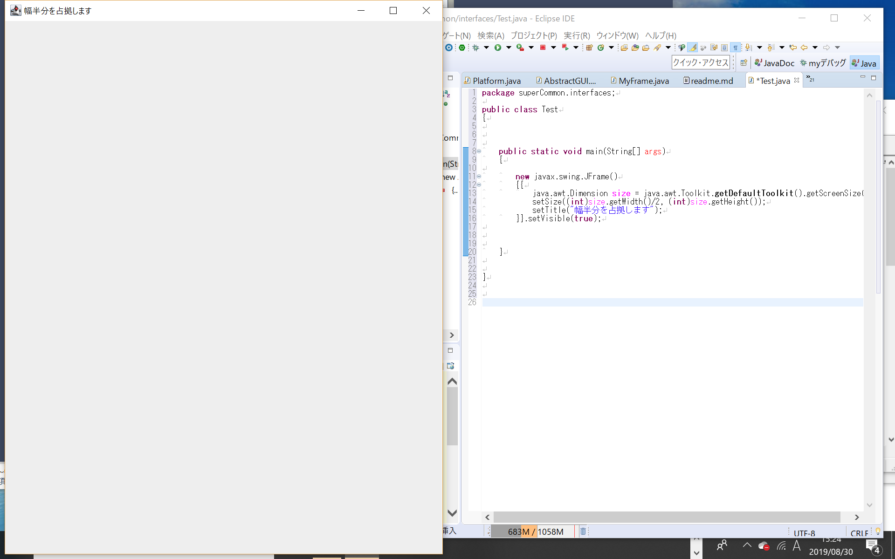

# javaでGUIを作ったときのメモ

## 実際に作っているもの
[抽象GUI](https://github.com/17ec084/grade3-1/blob/master/groupStudy/superCommon/src/superCommon/interfaces/AbstractGUI.java]) を作っています。
[Configインタフェース](https://github.com/17ec084/grade3-1/blob/master/groupStudy/superCommon/src/superCommon/interfaces/Config.java])を実装するクラスは、この抽象GUIを継承して具体化するとよい(別に強制ではない)。

## GUIの仕組み
CUIとGUIはいろいろと明らかに異なるが、その違いを説明できなくてはGUIのプログラムもかけるわけがない。<br>
そして、CUIとGUIの違いを具体的に洗い出すには、「CUIを不思議に思わない人」が「GUIを不思議に思う点」を挙げればよい。
したがって、このメモでは次のような方針でGUIを説明していく。<br><br>
「CUIが動くことを不思議に思わない人」が「GUIが動くことを不思議に思わなくなる」ように説明をしていく。<br>

### CUIを不思議に思わない人がGUIを不思議に思う点
<ol>
<li>明らかにいろいろ設定しなきゃいけないけど、ごちゃごちゃにならないの？</li>
<li>画面やらボタンやらメニューやらってどうやって表示しているの？</li>
<li>ボタンを表示したとしても、押したときの動作ってどうやって決めてるの？</li>
<li>入出力ってどうやってやってるの？</li>
<li>メタい説明ってどうやるの？全部書かなきゃいけないの？(ウィンドウの大きさの設定、大きさが可変かなど。)</li>
<li>処理の途中で閉じるボタンが押されたらどうするの？</li>
</ol>

#### 疑問1 明らかにいろいろ設定しなきゃいけないけど、ごちゃごちゃにならないの？

GUIの仕組みを理解しないと、つまり「どういう理屈でこのコードがここで出てくるか」がわからなければ、せっかくオブジェクト指向プログラミングをしているのにDRY原則を守れなくなる(≒冗長になる)などのことが起こりうる。<br>
コードに出てくる各変数やその型、型の役務や継承関係を知らなければ、例え既存のGUIプログラムを見よう見まねで改造したりつなぎ合わせたりしても、確かにごちゃごちゃで意味不明なプログラムしか書けない。<br>
逆に言えば「明らかにいろいろ」が具体的に何なのか、体系立てて知れば、コードの長さは別として、少なくともごちゃごちゃにはならない努力をすることが可能になる。

#### 疑問3 ボタンを押したときの動作ってどうやって決めてるの？

疑問2よりも先に疑問3を解決しよう。<br>
人間の感覚ではやりたいことがあり、GUIがあり、ボタンがあり、ボタンの動作があり、プログラムがある。<br>つまり感覚的には、次の列を左から右の順番で考えてしまう。<br>
「やりたいこと, GUI, ボタン, ボタンの動作, プログラム」<br>
しかし、プログラムを書く場合、プログラムのほうから見てやる必要があるので、同じ列を右から左の順で考えなければいけない。<br>
だからボタンの表示を考える疑問2よりも先に、ボタンの動作を考える疑問3を先に考えたいのである。<br>
<br>
さて、GUIにはイベントとかリスナとかいうのがある。<br>
結論から言うと、ボタンが押されるとイベントが発生し、リスナがそれを感じ取って処理を行う。<br>
##### イベントとは
イベントとは、「何かされたときに発生するもの」であり、その「何か」の種類はスーパクラスやインタフェースが用意してくれている。<br>
したがって「ボタンが押されたときに発生するイベント」を作るためには、予め用意されたものを実装なり継承なりするだけでよい。<br>
##### リスナとは
リスナは[専用のインタフェース](https://docs.oracle.com/javase/jp/8/docs/api/java/awt/event/ActionListener.html])を実装したクラスで actionPerformedメソッドを具体化するだけで作れる。<br>
それだけでそのクラスはイベントを感知できるようになり、イベントを感じ取るとactionPerformedメソッドが呼び出されるという仕様になっている。

## 実際に書いてみる

### 最も簡単なGUI
極論を言えば、「なんでもいいからとりあえずGUIを作りたい」という要望には次の1行コードで答えることができる。<br>
<code>
class T{{new java.awt.Frame().setVisible(true);}}
</code><br>
このコードをコピーし、T.javaと名付けて保存、コンパイルし、外部から<code>new T();</code>するだけで、図1のような小さくて何もないウィンドウが開く。<br>
(eclipseなどパッケージ宣言を省略できない場合はパッケージ宣言も書く必要がある)<br>
<br>図1 最も簡単なGUI<br>
<br>
<!-- 蛇足:匿名クラスを利用して、何らかの処理の間に次のように追加すると、処理の途中でGUIが起動する。<br>
<code>new java.awt.Frame(){}.setVisible(true);</code> -->


実際には<code>java.awt.Frame</code>クラスを継承し、いろいろ加えることでGUIに機能や表示を追加することができる。<br>

### 今回の主なクラス

但し今回はSwingでGUIを作ることとする。Swingを利用する場合、<code>java.awt.Frame</code>クラスではなくその子クラスである<code>javax.swing.JFrame</code>クラスを継承する必要がある。<br>
したがって、今回主として設計するクラスは次の通りである。<br>
<xmp>
import javax.swing.JFrame;
class ConfigGUIframe extends JFrame{}
</xmp>


### ウィンドウサイズとウィンドウタイトルの設定

ウィンドウサイズは簡単に設定できる。次のようにすればよい。<br>
```
import javax.swing.JFrame;
class ConfigGUIframe extends JFrame
{
        setSize(1000, 50);
        setTitle("15両編成の電車はこれよりもさらに細長い");
}

```
この例で<code>new ConfigGUIframe()</code>すると、図2のように幅1000px、高さ50pxの超横長なウィンドウを生成し、タイトルとして「15両編成の電車はこれよりもさらに細長い」と表示される。<br>
 <br>
図2 サイズとタイトルを設定したGUI<br>
<br>
この設定を行った2つのメソッド<code>setSize(int, int)</code>と<code>setTitle(String)</code>はいずれもJFrameが継承するクラスから継承されたものである。<br>
これらについてのドキュメントを読むと、他にもどんなことができるかが自ずとわかる。
<br>
<br>
さらに環境にあわせて大きさをするなら<code>java.awt.Toolkit.getDefaultToolkit().getScreenSize()</code>を使う。<br>
例えば次のようにすると、(モニタの大きさがどうであれ、モニタに対して)高さは最大で、幅は最大の半分の大きさのウィンドウが生成される。

```
import javax.swing.JFrame;
class ConfigGUIframe extends JFrame
{
		java.awt.Dimension size = java.awt.Toolkit.getDefaultToolkit().getScreenSize();

	    setSize((int)size.getWidth()/2, (int)size.getHeight());
	    setTitle("幅半分を占拠します");
}
```

<br>これを呼び出した結果は図3のようになる。<br>
 <br>


