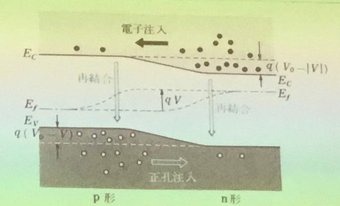

# 情報通信デバイス

## 5月13日

(教科書は、図1･1、2･11、15〜20、24、32、33、3･1、2(f)、3、4、5、6、4･6に触れた。21ページ半導体の体系を木構造で表現したものにも触れた。)

ボルツマン定数kと絶対温度Tの積kTはア: <!-- hole エネルギー --> となる。  

直接再結合は、イ: <!-- hole 伝導帯の電子と価電子帯の正孔とが直接に再結合する過程 --> である。  
間接再結合は、ウ: <!-- hole 深い不純物準位 --> を介して行われるキャリアの再結合をいう。  
ウとは、ドナーやアクセプタ以外にある種の不純物や格子欠損などが原因で、エ: <!-- hole 禁制帯の中央付近に局在準位 --> が生成されたものである。  
半導体の端での不規則性によっておこる再結合を、表面再結合という。  
最先端のCPUでは原子100個分で構造を作っていたりする。その為表面のこととはいえ、無視できない。
  
上の図は、p形、n形の半導体を隣り合わせることで、キャリア注入を行う様子である。  
但し、p領域がオ: <!-- hole 正 --> n領域がオの逆になるようにすること。  
これを間違えると、逆方向に注入が進む。  
負性抵抗は、トンネル効果で説明できる。それが図3･5と図3･6である。  

R=ρL/S

## 5月20日

ビデオ

168ページ
集積回路が現在の...  

169ページ  
集積回路の定義  

170ページ  
半導体集積回路は...回路機能を持たせたものである。  
図5.2  

172ページ  

図5.4  
図5.4について...低下をはかっている。  
