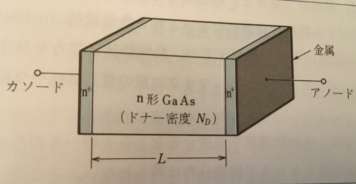
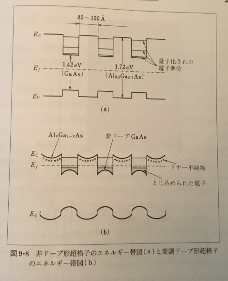

# 情報通信デバイス・テスト対策

## 3問目対策
### 1
表面層抵抗率がR_s(単位ア: <!-- hole Ω／□ --> ) のベース拡散でR［Ω］の抵抗を実現したい。  
幅をW［m］とするとき、長さはどうなるか→イ: <!-- hole R＝W／R_s -->  

### 2
ドナー濃度がdのn型領域と、アクセプタ濃度がaのp型領域で構成されるpn接合にV［V］の逆バイアス電圧をかけたときの接合容量Cを求めよ。  
ここでSiの比誘電率はSi、接合の断面積はSとする。  
→C＝ア: <!-- hole √(q･ε0･Si･N/(2V)) --> である。  
ただしqはイ: <!-- hole 電子電荷1.60×10^-19C --> 、ε0はウ: <!-- hole 真空の誘電率8.85×10^-12F／m -->   
Nはエ: <!-- hole dとaで小さいほう --> である。  

### 3
物体(長さl)に強さI_iの単色光を照射したことを考えよう。  
反射係数をR、ア: <!-- hole 物体の向こう側まで伝わる光の強さ --> をI_i'としたとき、  
透過光強度I_oはイ: <!-- hole (1－R)I_i' --> となるものだから、  
透過率ウ: <!-- hole I_o／I_i --> はエ: <!-- hole (1－R)I_i'／I_i --> である。  
物体内で強度はオ: <!-- hole 指数関数 --> 的に弱まっていくだろうから、これで立式すると、  
I_i'＝カ: <!-- hole (1－R)I_iexp(－αl) --> となる。  
ウ＝エにカを代入すればαが求められる。このαをキ: <!-- hole 吸収係数 --> という。  

### 4
発光の最短波長λcと母材の禁制帯の幅Egの関係
まず、エネルギーはア: <!-- hole 振動数 --> とイ: <!-- hole プランク定数 --> の積である。  
イはウ: <!-- hole 6.626×10^-34Js --> である。  
従って、Eg ＝ ウ エ:<!-- hole 光の速度 --> ／ λc  
但し、Egがジュールでなく電子ボルトなら、  
Eg ＝ ウ エ／(λc オ: <!-- hole 1.60×10^-19 --> )となる。  
ウ エ ／ オ を計算すると、カ: <!-- hole 1.24×10^－6 --> となる。  

## 4問目対策
マイクロ波デバイス  
マイクロ波とは、通常ア: <!-- hole 1Gから3000G --> Hzの電磁波をいう。  
これらの周波数帯で増幅・発振を行うデバイスとしては、イ: <!-- hole 速度変調管、進行波菅、磁電管、後進波管 --> 等が用いられてきた。  
しかし、1970年以降、半導体デバイスに置き換わっていった。  

### ガンダイオード  

ガンダイオードはア: <!-- hole ガン効果素子、電子遷移効果素子(TED) --> ともいう。  
J.B.Gunnが1963年、GaAsやInPにイ: <!-- hole ある値以上の電界を与えたとき発振現象が起こる --> ことをみつけた。  
この現象は電子のウ: <!-- hole 有効質量 --> が大きくなることにより生じるそう。  
絶対温度300Kのとき、GaAsではエ: <!-- hole 3 --> kV／cm、InPではオ: <!-- hole 10 --> kV／cm以降で、電界を強くするとカ: <!-- hole ドリフト速度が遅くなる --> という「キ: <!-- hole 負性微分移動度 --> の領域」に突入する。  
次の画像のような素子に電圧を印加する。  

  

カ: <!-- hole n型領域が全く均一である --> と考えるとき、電界は印加電圧に比例するし、電流Iはほとんどキ: <!-- hole 電子のドリフト電流 --> によるものとなる。  
したがって、高校物理の公式ク: <!-- hole I＝qnvS --> (nは電子密度)より、I∝ケ: <!-- hole ドリフト速度 --> となるから、  
コ: <!-- hole 電流の電圧 --> 特性 はドリフト速度の電界特性と同じ形になる。  
したがってキ領域はサ: <!-- hole 負性抵抗 --> そのものである。  
シ: <!-- hole 正の抵抗は電力を消費する --> が、サではその逆、つまりス: <!-- hole 電力を発生する --> とかいうことが起こる。  
これにより発振、増幅が可能なのだ。  
ガンダイオードの特徴の一つは、低雑音であること。  

### インパットダイオード
#### 前提知識
電子なだれとは、身近な例でいえばア: <!-- hole 雷 --> などでも起こっている現象であり、イ: <!-- hole 強い電場の中で自由電子が気体分子と衝突する --> と、新たな電子が叩き出され、ウ: <!-- hole これが電場で加速され --> てさらにイ・・・を繰り返し、どんどん電子が増える現象である。

#### 仕組み
インパットダイオードの名はIMPact Avalanche and Transist Timeからきている。  
その名の通りア: <!-- hole 電子なだれ --> によってキャリアを発生させると共に、イ: <!-- hole 走行時間効果 --> によりマイクロ波帯でウ: <!-- hole 負性抵抗 --> を得て、増幅・発振させるデバイスである。  
この素子の原型はエ: <!-- hole リードダイオード --> である。  
エは順にオ: <!-- hole 「p＋」「n」「i」「n＋」 --> のようになっている。  
「(p|n)＋」があるものは不純物濃度が10^20ほどで、「p|n」は5×10^16、「i」は10^13ほどである。  
逆バイアスをかけると空乏層はカ: <!-- hole 「n」から「i」 --> に広がり、そこに電界［V／m］が生じる。  
このとき、電圧の大きさはキ: <!-- hole 「p+」「n」接合部の電界が電子なだれの起こるしきい値よりわずかに低くなる --> ようにする。  
これにより、「交流電圧をかければク: <!-- hole キャリアが周期的に発生する --> 」という仕組みが出来上がる。  
そのキャリアの内、正孔は直ちにケ: <!-- hole p＋層に吸収され --> 、電子はコ: <!-- hole 電圧が負(つまり位相π～2π)の間、n領域とi領域を流れる(誘導電流、走行時間効果) -->
クやコの様子は [サ](img/3.png) の通り。サから分かる通り、エはウを持っているといってよいではないか。  
したがって、ガンダイオードと同じように、増幅・発振が確かに可能である。

### 超格子デバイス

超格子はア: <!-- hole 異なる材料を交互に成層 --> して、イ: <!-- hole 本来の結晶格子よりも大きい間隔の周期性 --> を持つ構造を作り出したものをいう。  
片方の材料層のみにドナー不純物を与えると、超格子はウ: <!-- hole 変調ドープ形超格子 --> となる。  

