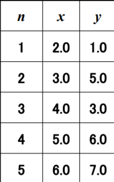
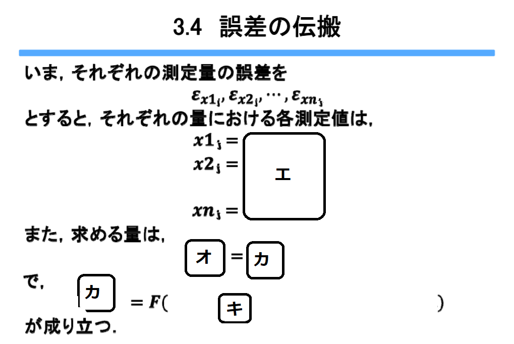

# instrumentationAndControlEngineering(計測制御工学)

## 第3回

### 2変数での最小二乗法 

前回では、測定する量が1種のみの場合について最小二乗法を考えた。  
今回は、測定する量が2種ある場合の最小二乗法を考える。  
n回の測定で、(x_1, y_1), (x_2, y_2), ... , (x_n, y_n)が得られたときのxとyの最も確からしい関係を、  
1次式で近似することを考えよう。式は `Y=ax+b` の形となり、これを ア:<!-- hole 回帰直線 -->という。  
アは イ:<!-- hole データの予測、評価 --> 等に用いることができる。  

i番目のデータの最確値をY_iとすると、  
Y_i＝ウ: <!-- hole a･x_i+b --> である。  
i番目のデータの誤差εy_iは  
εy_i＝エ: <!-- hole y_i-Y_i --> ＝オ: <!-- hole yi-(a･xi+b) --> である。  
ここで、カ: <!-- hole Σ(εy_i)^2 --> を最小にするのに最適なaやbを求めれば、2変数での最小二乗法を行ったことになる。  
カを計算すると [キ](img/leastSquareMethod1.png) である。  
カ＝キを最小にするa,bを求めるには、カ＝キをク: <!-- hole aやbでそれぞれ偏微分した値が0になればよい --> 。  
これは、カ＝キがケ: <!-- hole aやbの下に凸の2次式 --> となっているからである。  
クの方法により2式を得る。この連立方程式を コ: <!-- hole 正規方程式 -->という。  
  
----

問題:次の表のように測定値を得た。  
  
最小二乗法で、アを求めよ。  
  
[答え](img/leastSquareMethod3.png)  

----

### 誤差の伝搬

真値をXi、測定量をxi_j (i(1～n)は変数の個数、j(1～N)は測定回数。)  
とする。  

これを用いて真値がYである量yを間接測定で求めたい。  
この時、Xi～XnとYとの間に `Y=F(X1,X2,...,Xn)` の関係があるとすると、  

ア: <!-- hole 個々の測定量の精度σ_xiは最確値の測定精度σyに影響する -->。  
これを誤差の伝搬という。  

Xiの分散 (σ_xi)^2 は [イ](img/propagationOfError1.png) で表される。  
ここから、未知の量Yの分散 [ウ](img/propagationOfError2.png) を推定する。  

  
→ [エ～キ](img/propagationOfError4.png)  
そして、  
`Y=F(X1,X2,...,Xn)` より、  
[ク](img/propagationOfError5.png) と計算することができ、  
ケ: <!-- hole 誤差の3公理より、ε_xi_jは小さい --> ため、コ: <!-- hole テイラー展開 --> が許され、  
[サ](img/propagationOfError6.png) ということができる。

----

#### サを導くためのコ
略。必ずやりたい。  
まあやったとしても「非公開情報」にするかもね。

----

