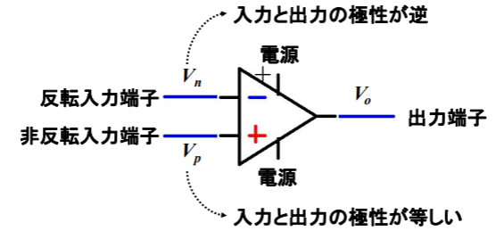
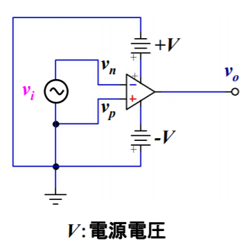
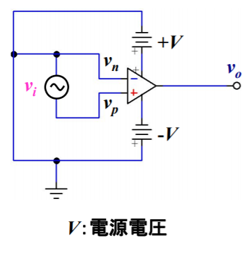
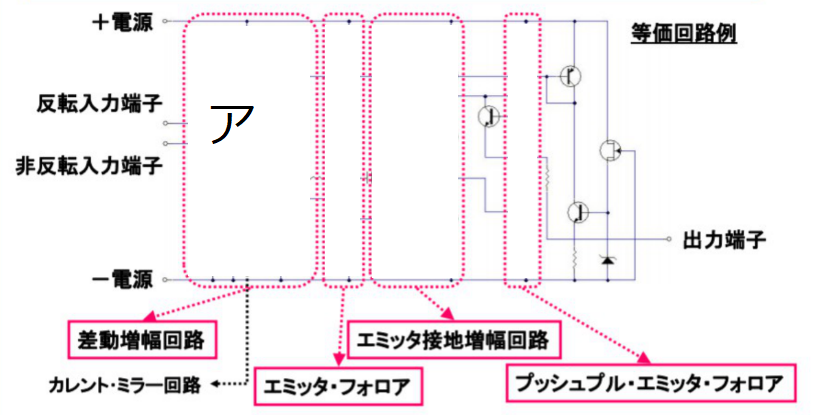
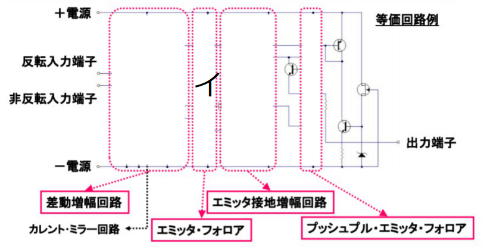
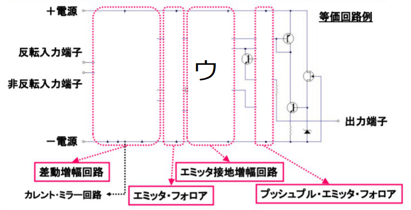
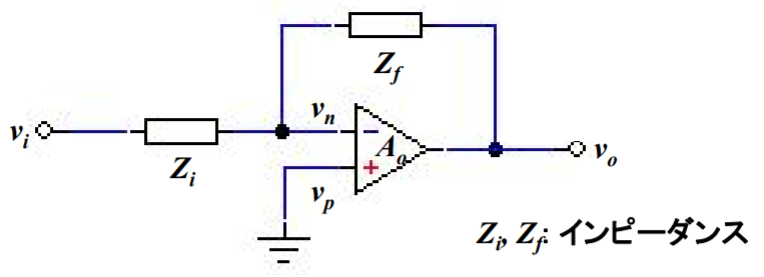

# instrumentationAndControlEngineering(計測制御工学)

## 第3回

### 2変数での最小二乗法 

前回では、測定する量が1種のみの場合について最小二乗法を考えた。  
今回は、測定する量が2種ある場合の最小二乗法を考える。  
n回の測定で、(x_1, y_1), (x_2, y_2), ... , (x_n, y_n)が得られたときのxとyの最も確からしい関係を、  
1次式で近似することを考えよう。式は `Y=ax+b` の形となり、これを ア:<!-- hole 回帰直線 -->という。  
アは イ:<!-- hole データの予測、評価 --> 等に用いることができる。  

i番目のデータの最確値をY_iとすると、  
Y_i＝ウ: <!-- hole a･x_i+b --> である。  
i番目のデータの誤差εy_iは  
εy_i＝エ: <!-- hole y_i-Y_i --> ＝オ: <!-- hole yi-(a･xi+b) --> である。  
ここで、カ: <!-- hole Σ(εy_i)^2 --> を最小にするのに最適なaやbを求めれば、2変数での最小二乗法を行ったことになる。  
カを計算すると [キ](img/leastSquareMethod1.png) である。  
カ＝キを最小にするa,bを求めるには、カ＝キをク: <!-- hole aやbでそれぞれ偏微分した値が0になればよい --> 。  
これは、カ＝キがケ: <!-- hole aやbの下に凸の2次式 --> となっているからである。  
クの方法により2式を得る。この連立方程式を コ: <!-- hole 正規方程式 -->という。  
  
----

問題:次の表のように測定値を得た。  
  
最小二乗法で、アを求めよ。  
  
[答え](img/leastSquareMethod3.png)  

----

### 誤差の伝搬

真値をXi、測定量をxi_j (i(1～n)は変数の個数、j(1～N)は測定回数。)  
とする。  

これを用いて真値がYである量yを間接測定で求めたい。  
この時、Xi～XnとYとの間に `Y=F(X1,X2,...,Xn)` の関係があるとすると、  

ア: <!-- hole 個々の測定量の精度σ_xiは最確値の測定精度σyに影響する -->。  
これを誤差の伝搬という。  

Xiの分散 (σ_xi)^2 は [イ](img/propagationOfError1.png) で表される。  
ここから、未知の量Yの分散 [ウ](img/propagationOfError2.png) を推定する。  

  
→ [エ～キ](img/propagationOfError4.png)  
そして、  
`Y=F(X1,X2,...,Xn)` より、  
[ク](img/propagationOfError5.png) と計算することができ、  
ケ: <!-- hole 誤差の3公理より、ε_xi_jは小さい --> ため、コ: <!-- hole テイラー展開 --> が許され、  
[サ](img/propagationOfError6.png) ということができる。

----

#### サを導くためのコ
略。必ずやりたい。  
まあやったとしても「非公開情報」にするかもね。

----

これにより、y_jの分散(σ_y)^2は、 [シ](img/propagationOfError7.png) とまずいえる。  
ここで、(Σ(k,α_k))^2＝ス: <!-- hole Σ(k,(α_k)^2+2α_kΣ(l≠k,α_l)) --> より、 [セ](img/propagationOfError8.png) となる。  
でも、 [ソ](img/propagationOfError9.png) は タ: <!-- hole 誤差の3公理の2番目の性質「同じ大きさの正負の誤差は同じ確率で生じる」 --> より、チ: <!-- hole 総和をとると0になる --> ため、  
シ＝ [ツ](img/propagationOfError10.png) ＝ [テ](img/propagationOfError11.png) とみなすことができる。  
この関係を [ト](ガウスの誤差伝搬の法則) という。分散シを平方根にすれば標準偏差となるが、プラスマイナス両方あることに注意。  

例1  
真値がXである量xを測定し、真値がYである量yを間接測定したい。  
`Y=aX` とするとき、(σ_y)^2 を (σ_x)^2 で表そう。  
(σ_y)^2 ＝ テ という式が成り立つわけで、今回はn=1として、  
xiはxと考える。  
ナ: <!-- hole ∂F／∂x＝a --> なので、  
(σ_y)^2 ＝ ニ: <!-- hole a^2(σ_x)^2 -->  

## 第4回

次の問題について、考えてみよう。  

分解能 500[puls/round] のエンコーダと減速比1/50のギアの付いたモータに，  
直径0.12[m]のタイヤが取り付けられている． 
これが走行し，パルスカウント値 100000が得られたとすると，  
タイヤの進んだ距離はどのくらいか．
  
分解能 500[puls/round] のエンコーダからパルスカウント値 100000が得られたとすると、  
モータ軸の回転数は ア: <!-- hole 100000/500=200 --> 回転  
減速比1/50なので、モーター ア回転で、車輪は イ: <!-- hole 200×1/50=4 --> 回転する。  
車輪直径は0.12[m]なので、車輪1回転の走行距離は ウ: <!-- hole 0.12π=0.38 --> mとなる。  
したがって、車輪4回転の走行距離は エ: <!-- hole 0.38×4=1.5 -->m となる。  

温度T[℃]とすると、。空気中の音波の伝搬速度はV= オ: <!-- hole 331.5+0.60714T --> [m/s] となる。  
V、測定距離L、時間tの関係は カ: <!-- hole L=Vt/2 --> [m]  

### はじめに

#### 主な測定情報に対応するセンサの例

各種センサデータによって、安心、セキュリティ、災害対応、品質管理などの様々な「見える化」ができる。  
例えばア: <!-- hole 位置情報、距離情報、照度、映像情報、物体検知 --> の取得には光センサが使えるし、  
磁気センサはイ: <!-- hole 方向や電力 --> の取得に使える。  
ウ: <!-- hole 加速度 --> センサはウの他、エ: <!-- hole 方向、振動、衝撃、傾斜 --> を検知することに使える。  

### センサの基礎  

センサは対象となる外界からの信号を、ア: <!-- hole 操作可能な物理量に変換 --> し、これを信号として情報の伝送または信号処理を行い、出力する。  
アするのには、  
イ: <!-- hole 物理 --> 効果(イ現象を利用)  
ウ: <!-- hole 化学 --> 効果(エ: <!-- hole 触媒との反応など --> を利用)  
オ: <!-- hole 生物 --> 効果(カ: <!-- hole 微生物の特性など --> を利用)  
の3つの効果が主に用いられる。  

#### センサの種類

五感との対応(及び非対応)で、センサを分類しよう。  
視覚(目)に訴えるものとして挙げられるのはア: <!-- hole 光 --> センサである。  
測定量はアであり、デバイス例として、イ: <!-- hole フォトダイオード、赤外線センサ --> などが挙げられる。  
聴覚(耳)に訴えるものとしてウ: <!-- hole 音響 --> センサが挙げられる。  
測定量はエ: <!-- hole 音波 --> であり、デバイス例としてオ: <!-- hole マイク、圧電素子 --> などが挙げられる。  
触覚(皮膚)に訴えるものとしてはカ: <!-- hole 振動 --> センサ、キ: <!-- hole 温度 --> センサ、 ク: <!-- hole 力 --> センサであり、これはらケ: <!-- hole 圧力や温度 --> を測定量とする。  
これに対応するデバイスはカに対してコ: <!-- hole 超音波センサ、加速度センサ -->  
キに対してサ: <!-- hole 焦電センサ -->  
クに対してシ: <!-- hole ひずみゲージ -->  
などである。  
味覚(舌)に訴えるものとしてス: <!-- hole 味 --> センサがあり、測定量はセ: <!-- hole 味物質 --> であり、デバイス例はソ: <!-- hole 粒子センサ -->  
嗅覚(鼻)に訴えるものとしてタ: <!-- hole 臭い --> センサがあり、測定量はチ: <!-- hole 匂い物質 --> であり、デバイス例としてツ: <!-- hole 生化学素子 --> というものがある。  
五感には対応しない測定量として、テ: <!-- hole 距離 --> 、ト: <!-- hole 磁気 --> 、ナ: <!-- hole 放射線 --> がある。  
テは超音波センサ、ニ: <!-- hole 光センサ --> 、近接スイッチなど。  
トはヌ: <!-- hole ホール素子、MR素子 --> など。  
ナはネ: <!-- hole ガイガーカウンター --> など。  

#### センサの分類

測定箇所及び目的によってセンサを分類すると、ア: <!-- hole 内界センサ --> とイ: <!-- hole 外界センサ --> に分けられる。  
測定原理によってセンサを分類すると、ウ: <!-- hole 受動センサ --> とエ: <!-- hole 能動センサ --> に分けられる。エは、オ: <!-- hole センサ自身が発信することでその状態を測る --> が、ウはそんなことしない。  
測定方法で分類すると、カ: <!-- hole 接触センサ --> とキ: <!-- hole 非接触センサ --> に分類される。  

### 主なセンサの原理

#### 光センサ

光センサで検出できる情報には、光、照度、位置、距離、物体検知、温度、スイッチ、ガス濃度など、ア: <!-- hole 応用によってさまざま --> である。  

光とは電磁波の一種である。

(光センサの種類については省略)

光センサ(ク型)の原理はイ: <!-- hole 光電効果 --> を利用したものである。イとは、ウ: <!-- hole 物質が光子を吸収して電子を放出する --> 現象である。  
イはさらにエ: <!-- hole 光起電力効果 --> とオ: <!-- hole 光誘電効果 --> に分けられる。  
エはカ: <!-- hole 半導体のPN接合部に光が照射されると、電位差が生じ、電流が流れる --> というものである。応答性、線形性があり、カメラの光量センサ、照度計、光通信に利用される。  
オはキ: <!-- hole 光によって誘電率が変化する --> といったものである。 可視光域で高感度であり、照度計や自動点滅器(標識灯)に利用される。  
光センサはク: <!-- hole 量子 --> 型の他にケ: <!-- hole 熱 -->型 があり、ケ型はク型に比べて低感度低速応答であるが、ケ: <!-- hole 波長に依存しない --> というメリットがある。  
ケ型が利用する効果はコ: <!-- hole 熱起電力効果 --> 、サ: <!-- hole 焦電効果 -->、シ: <!-- hole 熱誘電効果 --> などである。  
赤外線センサをケ型で作った場合、サを利用することになる。サはス: <!-- hole 強誘電体が熱エネルギーを吸収して電気的に不平衡な状態になり、それに応じて電荷が誘起される --> というものである。 非接触で温度測定可能。  
光センサを位置センサに応用したものの例として、セ: <!-- hole ロータリーエンコーダ --> がある。  
光センサ(ソ: <!-- hole フォトダイオードとスイッチング素子 --> )をアレイ状に並べたものに、タ: <!-- hole 固体イメージセンサ --> がある。CCDイメージセンサ、CMOSイメージセンサ。  
PSD(Postion Sensitive Detector) はチ: <!-- hole レーザなどのスポット光の位置--> を検知するセンサである。 赤外線距離センサ、精密位置決めなどに利用される。  
半導体面上にスポット光が入力されると、ツ: <!-- hole スポット光位置からの距離に反比例 --> した電荷が発生するので、そこからスポット光の位置を算出できる。  

#### 磁気センサ

磁気センサで検出できる情報は、磁気、方向、位置、電流、ア: <!-- hole 回転角度、傾斜、近接スイッチ --> など多種多様。  

磁気センサはイ: <!-- hole 磁気エネルギー --> を利用するもので、これは地磁気、モーター、ウ: <!-- hole 脳波 --> など、至る所に存在する。  

エ: <!-- hole 電磁誘導作用 --> を利用したものに、磁気ヘッド、タコジェネレータなどがある。  

オ: <!-- hole 磁電変換作用 --> を利用したものに、磁気トランジスタ、ホール素子、磁気抵抗素子などがある。  

エについては説明を省く。  
オは、カ: <!-- hole ホール効果 --> とキ:<!-- hole 磁気抵抗効果 --> に分けられる。  

カはク: <!-- hole ローレンツ力 --> の作用で電圧が発生するもので、  
キはクによってケ: <!-- hole 電流の向きが傾いて抵抗値が変わる --> もの

ホール効果を説明する図を示すと、  
[コ](img/holeEffect.png)  

となる。  
磁気抵抗効果を説明する図を示すと、  
[サ](img/magnetoresistanceEffect.png)  

#### 超音波センサ

検出できる情報はア: <!-- hole 音響振動の反射と位相 --> である。応用することで、距離やイ: <!-- hole 非接触物体検知 --> が可能。  

#### 加速度センサ

検出できる情報はア: <!-- hole 加速度、重力方向、傾斜、振動、衝撃 --> などである。  

原理としては、ma=Fである。  
ma=イ: <!-- hole k×x(kはばね定数) --> を、aについて解く。  
では、ウ: <!-- hole x --> はどう求められるだろうか。  

エ: <!-- hole 半導体に歪を与えると抵抗が変化するピエゾ(圧電)抵抗効果 --> やオ: <!-- hole 電極間の静電容量を電圧に変換するもの --> がある。  

### その他の主なセンサの原理

#### 温度センサ

ア: <!-- hole 金属の温度変化に伴う抵抗値の変化 --> を利用するもの(イ: <!-- hole 金属測温抵抗体 --> )や、  
アで、金属の代わりに半導体を利用するウ: <!-- hole サーミスタ --> 、  
エ: <!-- hole 温度変化に対する半導体のベースエミッタ間電圧の変化 --> を利用するオ: <!-- hole IC温度センサ -->、  
カ: <!-- hole ゼーベック効果 --> を利用する熱電対などがある。  

#### 圧力センサ

ア: <!-- hole ピエゾ(圧電)抵抗効果 --> を利用した圧電素子／ひずみゲージ  
弾性を持つ薄膜や金属の変形を、静電容量変化などで検出するイ: <!-- hole 弾性体方式 -->　(例: ウ: <!-- hole ブルドン管 -->)  
など  

#### ジャイロセンサ

コリオリ力を利用したものにア:<!-- hole 振動ジャイロ --> やイ: <!-- hole ガスレートジャイロ --> がある。  
光ファイバを通る光がウ: <!-- hole 回転により位相差を生じ干渉する --> ことを利用した光ファイバジャイロもある。  

#### 湿度センサ

ア: <!-- hole 高分子や多孔質セラミック --> などに水分子が吸着し、イ: <!-- hole イオン化することによる電気抵抗の変化 --> を検出  

### センサ信号のディジタル化とネットワーク接続

①センサにより外界の信号を電気信号に変換する。  
②一般にセンサの出力信号は微小なので，ア: <!-- hole オペアンプなどを用いた増幅 --> を行う。  
③イ: <!-- hole センサ出力は主にアナログ電圧信号のため，A/D変換によりディジタルデータに変換する． -->  
④それらの入出力および簡単な信号処理は，PICやマイコンなどで処理することが多い．ウ: <!-- hole ネットワークI/F --> の実装により，データをネットワークに送信できる．  
⑤エ: <!-- hole USB等のI/F --> の実装により，上位処理計算機への接続が可能となる．また，上位アプリケーションのデータから，センサの制御も行う．

### センサ情報の処理と解析

ア: <!-- hole センサが電気信号に変換可能な、対象から得られる直接的な情報 --> を一次情報という。  
イ: <!-- hole センサの出力を解析して得られる間接的な情報 --> を二次情報という。  
生体信号の計測を例にとると、ウ: <!-- hole 温度センサで体表温を測る --> のが一次情報で、エ: <!-- hole その履歴や経時変化から食事や運動などの行動情報を測る --> のが二次情報  

オ: <!-- hole 対象の情報の詳細さ --> を解像度または分解能といい、  
カ: <!-- hole 対象の情報の正確さ --> を精度という。  

キ: <!-- hole センサを設置する対象範囲 --> を規模という。  
ク: <!-- hole 対象の面積(体積)に設置するセンサの個数 --> を密度という。  

### まとめ

ア: <!-- hole M2M --> サービスの実世界I／F＝センサといってよい。  
センサの原理は様々な現象や効果である。  
同じ情報を得られるセンサでも、イ: <!-- hole 原理、測定範囲、特性 --> が異なるため、それらを把握し、ウ: <!-- hole 利用目的に応じて選択 --> する必要がある。  

ア サービスに必要な情報はエ: <!-- hole 二次情報 --> である。  

情報の統合・解析はオ: <!-- hole 情報量、情報の整合性、信頼度 --> 等を考慮せよ。

## 第5回

### レベル変換

センサなどで検出される信号は微分であることが多いため、ア: <!-- hole オペアンプ --> を用いて増幅して利用される。  

#### オペアンプ 

オペアンプとは英語でア: <!-- hole Operational Amplifier --> といい、  
イ: <!-- hole 電圧を増幅 --> する半導体素子 --> である。  

#### オペアンプの記号と電気極性  

  

#### オペアンプの基本動作  

問題:次の回路図のように構成し、viとvoをオシロで観測した様子を示せ。  
(1)  
  
  
(2)
  
  
[答え](img/opampA.png)  

オペアンプで、両端に同じ入力をすると、出力電圧はア: <!-- hole ない --> 。  
これは、オペアンプがイ: <!-- hole 差動増幅 --> だからである。  

#### オペアンプの基本式と理想オペアンプ

オペアンプの基本式は、ア: <!-- hole v0=A0(vp-vn) --> である。  
voは出力電圧  
A0は電圧利得  
vpは非反転端子入力電圧  
vnは反転端子入力電圧  
  
理想オペアンプの性質は  
イ: <!-- hole 電圧利得が無限大\n入力インピーダンスが無限大\n出力インピーダンスがゼロ --> である。  

#### オペアンプの中身  

  

  

  

  

[答え](img/opampContent.png)  

差動増幅器・・・オ: <!-- hole トランジスタの特性が相殺される --> 。  
したがって、カ: <!-- hole 温度変化に強い -->  

エミッタフォロア回路・・・キ: <!-- hole エミッタ接地増幅回路のエミッタ側から出力を取り出す --> 。入力と出力は増幅度ク:　<!-- hole 1 --> だが、  
入力インピーダンスがケ: <!-- hole 高 --> く、出力インピーダンスはコ: <!-- 0に近 --> い。  
別名サ: <!-- hole コレクタ接地回路 -->  

エミッタ接地回路:シ <!-- hole コレクタ抵抗が無限大 --> なので、増幅度は無限大。実際はトランジスタの最大増幅度  

#### オペアンプの基本回路

  

のような回路を考えよう。  
viとvoの関係を求めよう。  
理想オペアンプの性質より、オペアンプの入力インピーダンスが非常に大きいため、入力電圧は  
[イ](img/opampBasicCircuit2.png)  
のようにウ: <!-- hole Ziに流れる電流はほとんどZfへ流れる --> 。従って、オームの法則より  
エ: <!-- hole (vi-vn)=ZiI, (vn-vo)=ZfI --> である。  
オ: <!-- hole それぞれIについて解いたものを比較 --> すると  
vo=-(Zf/Zi)vi  
を得る。
また、オペアンプの基本式を変形すると、  
vn=カ: <!-- hole vp-(vo/Ao) -->  
ここでキ: <!-- hole Ao→∞ --> より  
vn=vpとなり、これをク: <!-- hole バーチャルショート --> という。  
vp=0よりvn=0。これをケ: <!-- hole バーチャルアース --> という。  

#### オペアンプの応用回路  

基本回路におけるZiとZfの種類と組み合わせにより、様々な演算が可能。  
ア: <!-- hole 反転増幅回路、加算回路、積分回路、微分回路、ボルテージフォロア --> など  
その他、対数増幅、電流電圧変換、電圧周波数変換、LPF、サンプルホールドなどの回路すらある。  

##### 反転増幅回路

回路図を描くと、  

[ア](img/hanZo.png)  

##### 加算回路  
回路図: [ア](img/addCircuit.png)  

回路図より、電流の関係は、イ: <!-- hole I=I1+I2+I3 -->  
つまり、vを使って表すと、I=ウ: <!-- hole v1/R1 + v2/R2 + v3/R3 -->  

また、出力電圧は、  
vo=-RfI=-Rfウであり、これを解いてさらに入力数をnに一般化すると、  
[エ](img/addCircuit2.png)  

##### 積分回路  

回路図: [ア](img/integCircuit.png)  
オームの法則より、Riを流れる電流は  
I=vi/R1  
コンデンサに貯まる電荷と電流の関係式イ: <!-- hole Q=∫Idt --> より、  
ウ: <!-- hole C(vn-vo)=-Cvo --> =イとなる。  
ここに、I=vi/R1を代入しながら解くと、  
[エ](img/integCircuit2.png) を得る。  

##### 微分回路

回路図: [ア](img/diffCircuit.png)  
コンデンサに貯まる電荷と電流の関係式Q=∫Idtより、
C(vi-vn)=Cvi=∫Idt  
これをイ: <!-- hole Iについて解き --> 、-Rfをかけると、  
[ウ](img/diffCircuit2.png)  

##### 非反転増幅回路 

回路図: [ア](img/hihanCircuit.png)  
オームの法則より、  
I=イ: <!-- hole (vo-vn)/R2 --> =ウ: <!-- hole vn/R1 -->  
これより  
vo=(1+(R2/R1))vnを得る。  
ウ: <!-- hole vi=vp=vn --> より
[エ](img/hihanCircuit2.png)  

##### ボルテージフォロア

回路図: [ア](img/voltageFollower.png)  

非反転増幅回路で、  
R1=イ: <!-- hole ∞ -->  
R2=ウ: <!-- hole 0 -->  
したがって、  
エ: <!-- hole vo＝vi --> が成り立つ。  

インピーダンス変換や、回路の分離に使われる。  

#### 入出力インピーダンスと電圧

実は、センサの入力インピーダンスをZm、出力インピーダンスをZs、  
入出力電圧をvm、vsとすると、  

ア: <!-- hole vm＝(Zm／(Zs+Zm))vs --> という式が成り立つ。

## 第6回

### AD変換とDA変換  

コンピュータ内はディジタル信号なので、データを取り込むためには  
アナログ信号をディジタル信号に変換する必要がある。  

一方、ア: <!-- コンピュータから機器(モータなど)を制御する --> 場合は、  
ディジタルからアナログへの変換が必要となる。  

#### アナログ信号とディジタル信号

情報の記録・処理・伝送には  
ア: <!-- hole 情報を伝える媒体 --> (これをイ: <!-- hole メディア --> という)  
ウ: <!-- hole 情報を表す値 --> (アの持つエ: <!-- hole 物質量 --> )  
が必要である。  

アナログとディジタルの違いは、オ: <!-- hole 物質量と値 --> を対応付ける方式の違いである。  

アナログはイの持つカ: <!-- hole 連続的 --> なエをカな値に写像する。  
ディジタルはエをキ: <!-- hole 離散化 --> し、 キされた値に写像する。  

ディジタル信号はキされている分、アナログ信号と比べてク: <!-- hole 誤差や劣化が生じにくい --> という伝達面のメリットや、ケ: <!-- hole 処理回路の設計法が確立され、複雑な処理回路やコンピュータ処理が可能 --> といった処理面でのメリットがある。  

問題: クを図を用いて説明せよ  

[答え](img/digital.png)  

但し、現実世界では(量子力学におけるプランク定数と、一般的なディジタルにおける量子化幅を比較すれば明らかに)アナログであるといえるので、  
ケ: <!-- hole インターフェース --> が必要である。  

問題: ディジタル回路でアナログ信号を別のアナログ信号に変換するモデルを示せ  

[答え](img/digital2.png)  

コンピュータで処理する場合、CPUのコ: <!-- hole レジスタ --> の各導線に0Vまたは5Vの電圧が生じ、  
この違いをもとに2進数を表現している。  
「 サ: <!-- hole 各導線の本数 --> bit CPU」という言い方をするが、これはシ: <!-- hole レジスタ --> のサイズである。  

一方、ディジタル信号を伝えるために途中でアナログ信号に変換してまたディジタルに戻すということもある。  
これはシ: <!-- hole 高速伝送、効率的な情報通信 --> を実現させるための工夫である。  

#### アナログ⇔ディジタル変換の概要

ディジタル化するためには、時間間隔、電圧値とも離散化する必要がある。  
前者をア: <!-- hole 標本化 --> 、後者をイ: <!-- hole 量子化 --> という。  

### D／A変換器

D／A変換器にはア: <!-- hole ユニポーラ --> タイプとイ: <!-- hole バイポーラ --> タイプがある。  
前者は＋のみ、ありは－のみであるが、後者は両方。  

N bitのD／A変換器で-M～M Vの電圧をアナログへ変換しよう。  
分解能はウ: <!-- hole 2M÷(2^N) --> となる。  

D／A変換器の種類を2種類挙げると、エ: <!-- hole バイナリ抵抗型とR-2Rラダー抵抗型 --> となる。

#### バイナリ抵抗型

別名をア: <!-- hole 重み付き抵抗 --> 型とも。  
回路図を示すと [イ](img/da1.png) である。  

回路図より
Rf=R/(2^n)  
また、合成抵抗R1は [ウ](img/da2.png)  

したがって、オペアンプの式より
 [エ](img/da2_2.png) 

しかし、ビット数が増えると抵抗の種類も多くなるし、  
<!-- hole 上 --> 位ビットに対応する抵抗が誤差を持つと、出力誤差が大きくなるため、  
高精度には不向き  

#### R-2Rラダー抵抗型

[ア](img/da3.png) という構成をしている。  
Vo-接地間の合成抵抗を求めよう。  
つまり、 [イ](img/da4.png) で水色を求める。  
赤から順番に求めよう。  
赤の合成抵抗はウ: <!-- hole R -->  
オレンジの合成抵抗はエ: <!-- hole R -->  
...  
オ: <!-- hole 再帰 --> するので、カ: <!-- hole 全ての色の合成抵抗がR --> といえる。  

したがって、Sn-1のスイッチだけ考えるとき、  

[キ](img/da5.png) と考えて構わない。  

ク: <!-- hole VRの電流を強制的にIとみなす --> 。

スイッチオフのとき、電流は流れず(I=0)、それ故Vo=0。  
オンの時、電流はスイッチにク: <!-- hole I=VR／4R --> だけ流れ、Vo-接地間の抵抗は2Rだから  
電圧はケ: Vo=<!-- hole VR/2つまり2IR --> となる。 　

Sn-2のスイッチだけを考えるとき、

[コ](img/da6.png) と考えて構わない。  

