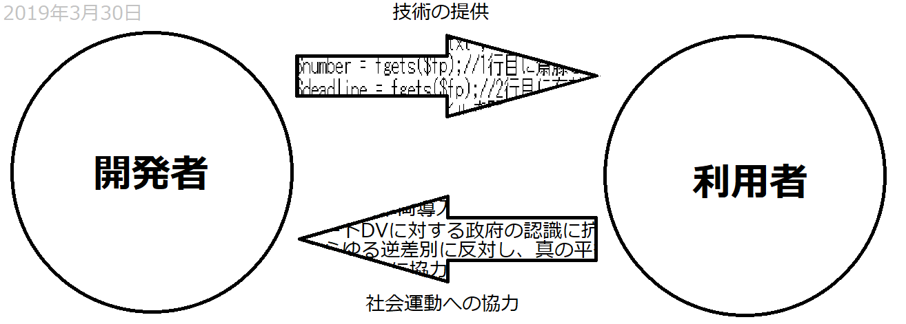
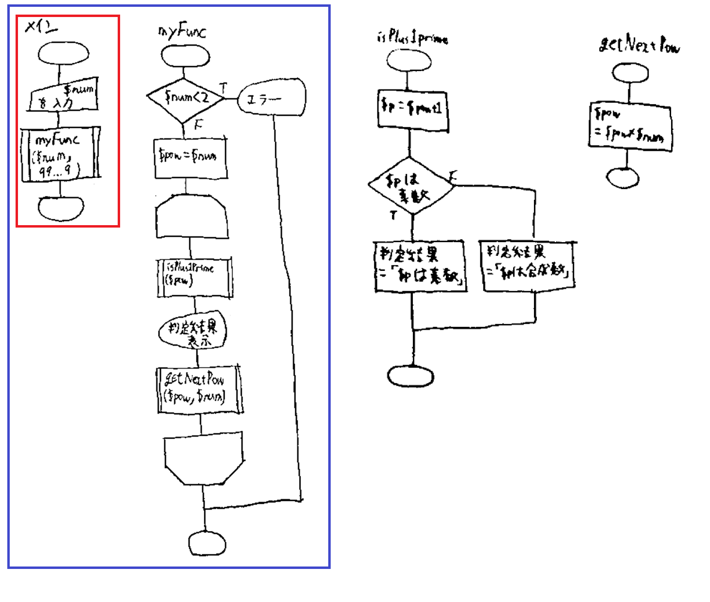
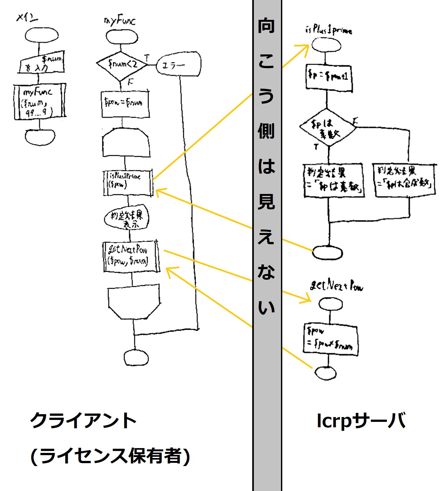

# ライセンスコントラクト(licenseContract)
ライセンスコントラクト制度(LC制度)は、不特定な人々の間で技術的価値と社会的価値の交換を積極化するための仕組みである。  
平成31年3月14日に大阪で開催された任意団体男性会議設立総会で、平田智剛によって提案された。
代表的な手法としては、開発者側が技術やソフトの使用許諾の引換条件として、利用者に社会的な要求をすることが考えられる。言い方を変えれば、LC制度によって開発者は技術提供の対価として「社会運動の成果」を得ることができるようになる。  
図1はLC制度を示すモデル図である。技術的価値を提供する者を「開発者」、社会的価値を提供する者を「利用者」と表現している。この表現は以降も使う。  
  
図1 LC制度のモデル図

## LCを支える技術
LC制度では、開発者より先に利用者が自らの義務を果たすのが妥当である。  
利用者のうち義務を果たした者を「ライセンス保有者」と呼ぶことにする。  
すべてのライセンス保有者に対して技術的価値の提供を確実に行うことは可能だが  
予め技術的価値を享受した利用者が確実にライセンス保有者となることは原理的にあり得ないからである。  

LC制度を成り立たせるために必要な技術を抽象的に述べるなら、以下の通りである。  

- すべてのライセンス保有者に対し、価値のある技術へのアクセスを可能にする技術

- ライセンス保有者でない者に対し、価値のある技術へのアクセスを禁止する技術

- ライセンス保有者でない者に対し、価値のある技術を紹介する技術

以上  

ソフトではなく、コードそのものを提供する場合については、1つ目と2つ目の双方を完全に満たすことは、基本的にほぼ不可能である。提供した(完全な)コードをそのままコピーされてしまえば、ライセンス無関係で動作してしまうからだ。
<!--  [参考サイト](http://www.1kproduct.com/protector_k/contens/softmaker.html) の例を見てほしい。この例のように、オフラインのコピーガード(コピープロテクト)はソフトそのものではなく、デバイスに対して特殊な加工を施すことで実現させるものがほとんどのようである。  -->  
1つ目と2つ目をバランスよく実現させる方法として、本稿ではlcrp通信を提唱する。

## lcrp通信

### lcrp通信の開始(lcrp接続)

lcrp(License Contract Realization Protocol／ライセンスコントラクト実現プロトコル)通信は、クライアントがライセンス保有者である場合のみにアクセスを許可する通信プロトコルである。  
具体的には  

- クライアントがhttpでライセンスキーと要求をサーバへ送信し、そのライセンスキーが正当なものであればサーバがlcrp応答し、正当なものでなければサーバは応答しないかエラーを返却する  

というものである。  

LC制度を開発している者にスキームに関する知識が不足しているため、lcrp通信について当面はhttpで実装する。
### lcrp隠蔽

またアクセス許可後のlcrp通信では、クライアントが送信した関数を、サーバが代わりに実行し、クライアントに戻り値を返却する。また必要な操作も伝える(ポインタ操作、クラス内のフィールドの操作、標準入出力など)

これをモデル図にしたものが図2である。  
この手法により、開発者は一部の関数の内部コードを非公開にすること(lcrp隠蔽すること)ができる。このようなlcrp通信を介さないとアクセスできない関数を「lcrp隠蔽された関数」あるいは「lcrp関数」と呼ぶことにする。
このことにより開発者は、利用者による重度のライセンス違反や深刻な知的財産権侵害を防ぎつつ、利用者にある程度柔軟な改編・応用を許すべくソースを公開することができる。  
 
具体例として、次のコードを考える。このコードはphpで書かれた、get受信した変数num(2以上)のべき乗が、素数+1になるか否かを判定するプログラムである。  
[test.php](test.php)  

```php
<?php
//準備
$num = $_GET['num'];
//準備ここまで

//メインプログラム
    myFunc($num,9999999999999);
    //9999999999999以下のべき数を考える
//メインプログラムここまで

//myFuncの説明
    function myFunc($num,$max)
    /*
    $numのべき数のうち、$max未満のものを求め、
    それらから1を引き算したものが素数になるかを調べ、
    結果をprintする
    */
    {
        if($num<2)
        //2未満お断り
        {
            print "エラー 2以上の整数を指定しなさい";
            return 1;
        }
        $j=1;
        $pow=$num;
        while($pow<$max)
        {
            print isPlus1Prime($pow,$j);
            //$powから1引き算したものが素数かどうか言う
            $j++;
            //$jは、$powが$numの$j乗であることを示すためのもの。
            $pow=getNextPow($pow,$num);
            //次のべき数を求める。つまり$num倍する
        }
    }
//myFuncの説明ここまで

    //isPlus1Primeの説明
        function isPlus1Prime($pow,$j)
        /*
        $powから1引き算したものが素数かどうかprintする。
        また$jは、$powが$numの何乗であるかを示す。print時に使う。
        */
        {
            $p=$pow+1;
            if($p%2==0)
            {
            //素数でないとき
                $str=$p."=(".$j."乗に1を足したもの)は合成数。\n<br>";
                return $str;
            }
            for($i=3; $i*$i<=$p; $i+=2)
            {
                if($p%$i==0)
                {
                //素数でないとき
                    $str=$p."=(".$j."乗に1を足したもの)は合成数。\n<br>";
                    return $str;
                }
            }
            //素数だったとき
            $str="<strong>".$p."=(".$j."乗に1を足したもの)は素数。</strong>\n<br>";
            return $str;
        }
    //isPlus1Primeの説明ここまで

    //getNextPowの説明
        function getNextPow($pow,$num)
        {
            return $pow*$num;
        }
    //getNextPowの説明ここまで
```

このコードをフローチャートにすると、図2のようになる。  
  
図2. コードのフローチャート


このコードでは、関数が入れ子構造になるようにコードが書かれている。  
これはフローチャート上では、メインのフローにおける定義済み処理(myFunc関数)のフロー内に、さらに定義済み処理(isPlus1Prime関数、getNextPow関数)が存在することにより確認できる。myFunc関数から見て、isPlus1Prime関数やgetNextPow関数は入れ子の(1つ)内側にあるといい、メインは入れ子の(1つ)外側にあるという。特に本稿では、この例におけるメインの位置を「第0段階」とし、その入れ子のnつ内側を「第n段階」ということにする。

このような場合、開発者はどの段階の関数をlcrp隠蔽するかの選択によって、「どの程度までソースを保護するか」、「どの程度まで柔軟な応用を利用者に許すか」を決めることができる。  

今回のコードの場合で考えよう。  
第1段階のmyFunc関数をlcrp隠蔽した場合、利用者が見れるソースコードをすべてフローチャートにしたものは、赤で囲んだもののみ、すなわちメインのフローチャートだけになる。myFunc関数のフローチャートもisPlus1Prime関数のフローチャートも見ることはできない。  
この場合、ライセンス違反や知財権の侵害にはつながりにくいが、利用者の自由な改編、応用の余地がほとんどない。  
第2段階のisPlus1Prime関数とgetNextPow関数をlcrp隠蔽した場合、利用者が見れるのは青で囲んだフローチャートのみとなる。  
この場合、細部はみれないものの利用者の工夫の余地は大きい。$numの最小値を変更することやもできるし、表示内容を変えることも出来る。利用者の自由が高い反面、全体のプログラムが抽象的とはいえ丸見えなため、利用者がプログラムを盗作してしまう恐れもでてくる。  
  
isPlus1Prime関数とgetNextPow関数をlcrp隠蔽した場合、利用者が入手するコードファイルは次のようになる。  
[usingLcrp.php](usingLcrp.php)  

```php
<?php
//準備(システム)
include 'lcrp.php';//function_get_return関数をインクルード
//準備(システム)ここまで

$licenseKey="key";//ここにライセンスキーを入力

//準備
$num = $_GET['num'];
//準備ここまで

//メインプログラム
    myFunc($num,9999999999999);
    //9999999999999以下のべき数を考える
//メインプログラムここまで

//myFuncの説明
    function myFunc($num,$max)
    /*
    $numのべき数のうち、$max未満のものを求め、
    それらから1を引き算したものが素数になるかを調べ、
    結果をprintする
    */
    {
        global $licenseKey;
        if($num<2)
        //2未満お断り
        {
            print "エラー 2以上の整数を指定しなさい";
            return 1;
        }
        $j=1;
        $pow=$num;
        while($pow<$max)
        {
            print function_get_return("lcrp://isPlus1Prime(".$pow.",".$j.")",$licenseKey);
            //$powから1引き算したものが素数かどうか言う
            $j++;
            //$jは、$powが$numの$j乗であることを示すためのもの。
            $pow= function_get_return("lcrp://getNextPow(".$pow.",".$num.")",$licenseKey);
            //次のべき数を求める。つまり$num倍する
        }
    }
//myFuncの説明ここまで
```

[usingLcrp.php](usingLcrp.php) の [test.php](test.php) との違いを比較すると、  

1. isPlus1Prime関数やgetNextPow関数の「説明」がない

2. これらの関数を呼び出すためにfunction_get_return関数を呼び出している

3. function_get_return関数を利用可能にするためにlcrp.phpがインクルードされている

となる。  

1と2について述べる。  
1における関数はlcrp隠蔽されており、その関数の「説明」はlcrpサーバ上に保管されている。  
そしてこのlcrpサーバに問い合わせ、戻り値を受け取るべく、2の手続きが行われている。  
3については、lcrp.php上でfunction_get_return関数を「説明」しているためである。  

この通信モデルを図にしたものが図3である。但し黄色の線はlcrp通信を表す。  
  
  
図3.lcrp通信のモデル図  
  
### 通信プロトコルの仕様
lcrp通信(に限らずすべての通信プロトコル)においては、クライアント側とサーバ側の双方がその通信形式に対応している必要がある。  

#### クライアント側(lcrp.php)
クライアント側でlcrp通信を行っているものがfunction_get_return関数であり、lcrp.phpのインクルードにより利用可能となる。  
以下、 [lcrp.php](lcrp.php) の中身について説明する。  

##### (1オリジン)2行目及び3行目  

```php
$productNumber='example0001';
$lcrpServer='rights-for.men/lcrp';
```
  
では、lcrpサーバをhttpで表現したときのパスを決めている。「サーバ側」の見出しでも説明する。  
この情報をもとに、lcrpで表現したパスがhttpに書き換えられる。  
例えば  
`lcrp://関数(引数)`  
というパスは、  
`http://$lcrpServer/$productNumber/index.php?funcName=関数`  
に置き換えられる。  
今回の場合は  
`http://rights-for.men/lcrp/example0001/index.php?funcName=関数`  
である。  
また引数に関しては、post送信とする。  

##### 7行目から24行目

```php
function function_get_return()
{
//準備
$args= func_get_args();
$url=$args[0];
$licenseKey=$args[1];
if(count($args)>2)
{
    $printHeader=$args[2];
}
$printHeader=isset($printHeader);
//$printHeaderは「指定されたか否か」の論理値に変換してしまう
//準備ここまで

/*
function function_get_return($url, $licenseKey [, $printHeader])
{
*/
```
  
はfunction_get_returnの関数頭部であると考えるとよい。  
可変長引数に対応するためやや冗長であるが、実質的には22行目及び23行目だけ見ればよい。  
要は、次のように書きたかったが、言語がその書き方に対応していなかったため代替的に冗長な表現を使うほかなかったのである。
  
```php
function function_get_return($url, $licenseKey [, $printHeader])
{
```
  
このことからわかるように、7行目から77行目において、function_get_return関数の全体的な説明を行っている。  

##### 27行目から77行目

27行目～77行目では、function_get_return関数の中身である。  
第2引数であるライセンスキー($licenseKey)を、サーバへのpost送信に使うグローバル配列$queryにプッシュし、  
lcrp2http関数で、第1引数として渡されていたlcrpのURLをhttpに変換する。  
第3引数$printHeaderが渡されていた場合は、URLと、post送信の内容、そしてgoToLcrpServer関数の戻り値をその場でprintする。  
goToLcrpServer関数は、実際にlcrp通信を行う関数であり、  
サーバから返された文字列を(ほぼそのまま)戻り値とするものである。  
この値は$resultに格納される。  
61行目に `isStatusOK($result)` とあるが、これはサーバから返された文字列に、lcrp通信に成功したことを示す記述があるかどうかの真偽値である。  
(ライセンスキーの認証が通ったかどうかにほぼ等しい)  
通信に成功したなら、66行目でgetRerurnValue関数を呼び出すことで、「所望の関数の戻り値」を得てそれをそのままfunction_get_return関数の戻り値とする。  
「所望の関数」とは、例えば、$urlをlcrp://isPlus1Prime(3,1)とした場合、isPlus1Prime(3,1)がそれである。  

##### 78行目以降

78行目以降は、77行目まででfunction_get_return関数の説明につかったlcrp2http関数やisStatusOK関数、getReturnValue関数などを説明している。

#### サーバ側
ここではlcrpサーバの構築方法を述べる。  

##### サーバの構築

前提として、以下のものが利用可能である必要がある。  

- 公開されたwebサーバ
    - phpが利用可能、以下の関数や変数において使用制限を受けていない
        - lcrp隠蔽されたすべての関数及びそこで利用する関数
        - サーバ側のプログラムが利用する関数や変数
            - isset関数
            - $_POSTスーパーグローバル変数
            - $_GETスーパーグローバル変数
            - print関数
            - time関数
            - glob関数
            - is_file
    - htaccessで「Deny from all」が利用可能
    - 十分な空き容量かある

以上の条件を満たすwebサーバに、lcrpディレクトリを生成する。  
このディレクトリへのパスからプロトコルhttp(s)://を取り除いたものが、 [lcrp.php](lcrp.php) の3行目の $lcrpServer に指定されるべきである。  
次に製品番号(任意でよい)を決め、lcrpディレクトリ直下にその名前のディレクトリを生成する。  
同じ名前を[lcrp.php](lcrp.php) の2行目の $productNumber に指定する。  
今回の例では $productNumber は example0001 とした。  
製品番号のディレクトリの直下に index.php というファイルと funcDef というディレクトリを生成する。  
funcDefの直下に、次のような [.htaccess](lcrp/example0001/funcDef/.htaccess) を生成する。  
[lcrp/example0001/funcDef/.htaccess](lcrp/example0001/funcDef/.htaccess)  
  
`deny from all`
  
直後、必ず異なるネットワークからfuncDefディレクトリにhttp(s)アクセスし、403 forbidden が返ることを確認する。  

その後、funcDefディレクトリに「lcrp関数定義ファイル」を置く。これらはlcrp隠蔽された関数の説明が書かれたphpファイルである。「lcrp関数定義ファイル」の見出しで詳しく説明する。

次に製造番号ディレクトリ直下のindex.phpへ行き、次の説明に従って内容を書き込む。

##### index.phpの内容
サーバ側でlcrp通信を実際に行うのは製品番号ディレクトリ直下のindex.phpである。
index.phpの内容は [こちら](lcrp/example0001/index.php) に示すとおり。  
但し、ライセンスキーの認証を行うauthenticate関数の説明

```php
    function authenticate($key)
    {
    /*
    本当はここでデータベースを参照し、ライセンスキーの照合に役立てるべきであるが、
    今回は正当なライセンスキーを「key」のみとする。
    */
        return $key=='key';
    }
```
や、ライセンスキーからユーザを特定するgetWho関数の説明

```php
    function getWho($key)
    {
    /*
    ライセンスキーから利用者のIDを割り出せる仕組みがあってもよいだろう。
    今回は簡単にするため、「unknown」を返すのみとする
    */
    //また、ユーザ名はhtmlタグを無効にすること
        return "unknown";
    }
```
は、今後アップデートされる必要がある。  
index.phpはクライアントからgetやpostで受け取った情報をもとにライセンス認証を行い、  
認証されればgetにて要求されている「所望の関数」を実行し、その結果をクライアントに渡すということを行っている。  
所望の関数はrun関数が呼び出されることによって実行される。  
run関数は、index.php内で次のように説明されている。  

```php
    function run($funcName, $args)
    {
    /*
    長さ3の配列rtnを返却する。
    0番目はfuncNameの関数を実行した際の戻り値
    1番目はprintなどの操作
    2番目はエラーの有無
    */
        $rtn=[];
        $dirName="funcDef";

        if(findFunc($dirName,$funcName))
        //funcDefディレクトリにあるphpファイルに、
        //$funcNameと一致する名前のものがあった場合
        {
            include $dirName.'/'.$funcName.'.php';
            $rtn=lcrp_main($args);
        }
        else
        {
            $rtn[0]='';
            $rtn[1]='print "未定義の関数"';
            $rtn[2]='error: function "'.$funcName.'" does not exist';
        }

        return $rtn;
        
    }
```

##### lcrp関数定義ファイル

findFunc($dirName,$funcName)関数は、$dirNameで指定された(つまりfuncDef)ディレクトリ内に、「$funcName.php」で指定されるlcrp関数を説明(定義)するphpファイルが存在するかどうかを判断する関数である。  
lcrp関数定義ファイルが存在した場合、そのファイルをインクルードし、lcrp_main($args)の実行により、その関数を実行する。  
このことからlcrp関数定義ファイルについて、以下のことがいえる。  

- lcrp関数定義ファイルはfuncDefディレクトリの直下に存在する。

- lcrp関数定義ファイルの名前は「lcrp関数の名前.php」である。

- lcrp関数定義ファイル内では、定義される関数の名前をlcrp_mainで置き換える必要がある。

- 引数の個数は各lcrp関数で異なり、これは問題であるため、配列にし、一つの引数とみなして渡す。  

加えて、次のような仕様を強制する。  

- 戻り値は必ず3つの要素を持つ配列とする。(以下これを$returnと呼ぶ)

- $return[0]は関数本来の戻り値

- $return[1]はprint、副作用など何らかの指示

- $return[2]はエラーの有無

以上7つのルールにのっとり、 [test.php](test.php) 中の、isPlus1Prime関数とgetNext関数の説明を、それぞれ次のように書き換えた。  

isPlus1Prime関数→ [lcrp/example0001/funcDef/isPlus1Prime.php](lcrp/example0001/funcDef/isPlus1Prime.php)

getNextPow関数→ [lcrp/example0001/funcDef/getNextPow.php](lcrp/example0001/funcDef/getNextPow.php)

但し、どちらのファイルでも関数頭部において、lcrp.phpの「7行目から24行目」と同じ工夫をしている。

## LCを使ったプログラムの例
以下の手順により、ライセンスコントラクトを使ったプログラムが実際にどういったものなのか、体験することができる。

1. このレポジトリ「licenseContract」内における、lcrpディレクトリ、imgディレクトリ、readme.mdを除いたすべてのファイルを、webサーバAにアップロードする。webサーバAは「lcrpクライアント」となる。

2. 「lcrpサーバ」としたいwebサーバBを選び、「サーバの構築」の見出しに示した前提をすべて満たすか確認する。

3. このレポジトリ内のlcrpディレクトリをwebサーバBにアップロードする。

4. webサーバAにアップロードしたlcrp.phpの3行目を、webサーバBにアップロードしたlcrpディレクトリのパスに書き換える(プロトコルや最後の「/」はつけない)

5. webサーバB内のディレクトリ lcrp/example0001/funcDef に、外部ネットワークからアクセスすると403エラーが返ることを確認する

6. サーバAの test.php?num=3 や test.php?num=6 などにブラウザからアクセスし、numのべき数に1くわえたものが素数かどうか判定するプログラムが正常に動くことを確認する。

7. サーバAの usingLcrp.php?num=3 などにブラウザからアクセスし、test.phpと(見かけ上)全く同じプログラムが動作することを確認する

## 今後の課題
- [サーバ側のプログラム](lcrp/example0001/index.php) において、authenticate関数とgetWho関数が未完成
- 「指示」($result[1])の仕様や、それを読み取るためのプログラムが全く用意されていない
- php以外の言語にも対応したい(一人では大変...)
- lcrp通信を、http通信と別物にして、より高速より低容量のものにしたい。

