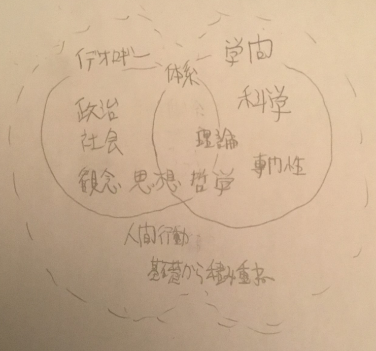

# 第2話

イデオロギーと学問の違い  

## 伝えたいこと  

ハンガリー政府は「ジェンダー学は((science=)(ここでは)学問ではなく)イデオロギーである」として、ジェンダー研究やその修士、博士号の授与を廃止する政令を発布している。  
ではイデオロギーとはなんだろうか、学問とはなんだろうか。

イデオロギーとは何か。学問とは何か。  
学問とイデオロギーを混同するとどんなことがおこるのか。実例をもとに迫る。  
そして最後、学問とイデオロギーが互いを否定しあったとき、生き残るのはどちらなのか、綺麗ごと抜きで考察する。  

「新明解国語辞典」より、  
【イデオロギー】人間の行動を決定する、根本的なものの考え方の体系。(狭義では、それぞれの社会階級に独特な政治思想・社会思想を指す)  
【学問】②基礎から積み重ねられた、体系的な専門知識。(狭義では、科学・哲学などを指す)  

<!-- 別の辞典「明鏡国語辞典」より(よく見たら同じ系列じゃん。没)  
【イデオロギー】歴史的・社会的立場に基づいて形成される、基本的なものの考え方。観念形態。一般に、政治的・社会的なものの考え方。思考の傾向。  
【学問】①体系的な知識や理論を専門的に学ぶこと。また、その知識や理論  -->

この定義をもとに、イデオロギーと学問の違いを図に表したものが図1である。(私の主観も交じってると思う)  
  
図1 イデオロギーと学問の関係図  
この図から分かる通り、狭義のイデオロギーと学問で共通するのは、体系だっていること、理論だっていること、思想や哲学との関わりがあることである。  
これが広義になると人間の行動と関わる知識や、基礎から積み重ねられた知識もイデオロギーおよび学問として認められる。  
逆にイデオロギーにあって学問にない特徴は、「政治、社会に関わる観念または思想であること」であり、  
学問にあってイデオロギーにない特徴は、「科学、専門性」である。  

つまり、イデオロギーが学問に近づくためには科学を取り入れる、あるいは専門性を磨く必要がある。  
言い換えれば、大学などの専門的な研究を行う機関で取り入れられたイデオロギーは、その事実だけで「専門性」が生れ、学問に近づいてしまう。  
専門性を拡大するため、必然的に偏った思想ばかりが生れてしまう。これが、「イデオロギーの学問化に伴う弊害」である。  
そして、これを食い止める唯一の手段が「科学」である。  
イデオロギーを天ぷら油、学問を天ぷらに例えるなら、大学はキッチンに例えられる。  
専門性は温度に例えられ、偏った思想が光、熱として放出される。  
この偏った思想により、時として逆差別という名の火災が起こる。  
水をかけ、消火を行うのが科学の役目である。  

魔法と科学の違い:http://www.sci.kyoto-u.ac.jp/ja/academics/programs/scicom/2015/201602/02.html

## ストーリー

魂魄教授のもとへと足を運ぶ魔理沙と霊夢。  

> 魔理沙「おはよ。」
> 霊夢「おはよう魔理沙」  
> 魔理沙「どうせ暇でしょ？みょんさんの研究室いかない？」  
> 霊夢「え、まじで？」  
> 魔理沙「うん。」  
> 霊夢「ほ、本当に行くの？あの先生怖いよぉ」  
> 魔理沙「別に。怒らせなきゃ大丈夫でしょ。」  
> 霊夢「もう少し大学に慣れてからじゃダメなのかな」  
> 魔理沙「逆に行きづらくなると思うよ」  
> 霊夢「そうなの？」  
> 魔理沙「今はほら、大学全体が新歓モードでしょ。いろんなサークル見て回ってそのついでにいこうよ」  
> 霊夢「うーん、」  
> 魔理沙「ていうか、3年の後期から研究室配属になるわけだけど、具体的に考えてみなよ。  
> 前期と後期の中間の休みなんて有って無いようなものだから、今を逃したら1年の春休みと2年の春休みしかないよ。  
> オープンキャンパスが3年後期までに3回あるからこれを計算に入れても、研究室訪問をするチャンスは実質5回。  
> 研究室は10個以上あるから、1回で2つ以上の研究室を回らなきゃいけない。  
> その位って思うかもしれないけど、研究室の雰囲気(人間性はもちろんのこと、進学重点なのか就職重点なのか、先生はどのくらい学生の面倒を見てくれるか)、研究内容、学生の自主性、担当教授が持ってる就職のコネ、院に行く学生と就職する学生ではどちらが多いのか、OG訪問に応じてくれそうなOGはどのくらいいるのか  
> これをじっくり見ていくとすればそこそこ体力が要る。」  
> 霊夢「う。。」  
> 魔理沙「もちろん長期休みやオープンキャンパスの時ではなくても、メールでアポとって普通の日に研究室訪問するのを受け付けてくれる先生も多そうだけどね。だけど長期休みすら重い足が上がらない私たちには関係ない話しなわけで。」  
> 霊夢「分かった、いこう」

サークルをまず見て回るうちに「フョミニズムサークル」に出会う。ここからイデオロギーと学問の話につなげる。

> ムダキズA「幻想郷の女共は気がついていないだけで男性を差別している！  
> おとぎ話の人魚太郎を見てみろ。王女様が人魚太郎という男にキスをすることで蘇るだと！？  
> ふざけるな！！そんなの強制わいせつじゃないか！！」  
> ムダキズB「そうだそうだ！男を性的消費するな！」  
> ムダキズA「だいたい多数派女の分際で社内恋愛するのはセクハラだ！みんなわかってない！！」  
> ムダキズC「そうだぞ！賛同してくれたら是非このサークルに入ってくれ！」  

> 霊夢「...居心地悪かったね(´;ω;｀)」  
> 魔理沙「よくはなかったね。  
> けどあんなのは”ましな方”だよ。そういう趣味がある人たちが勝手に群れてるだけだし
> だけどみんな苦しそうな表情していたね。気にしなきゃいいこと気にして互いに無駄な傷をつけあうんだもん。  
> 何が楽しいのかな」  
> 霊夢「それは私たちも人のこと言えないんじゃ」  
> 魔理沙「...」  
> 霊夢「魔理沙さっき”ましな方”っていうけど、他にもあるの？」  
> 魔理沙「ある。文系大学なんてもうフョミニズム末期だよ。もっともうちの大学は理系だけど」  
> 霊夢「よかった」  
> 魔理沙「だけど教養科目(特に倫理系統)の教員には注意。教養科目なんて基本的に教授じゃなくて外部講師が教えるものだから教員の入れ替わり激しいよ。  
> だから必然的に”理系的な考え方のできない先生”に当たっちゃう可能性があるわけ。  
> 特に倫理とかになるとどうしても文系的な観点が必要になってくるから、教員の好みで教えることや植え付けてこようとする主義主張が大きく変わって来うる。」
> 霊夢「さっきのサークルみたいな人が教鞭取って教えるなんて嫌だなあ(´;ω;｀)」  
> 魔理沙「まあ、『イデオロギーと学問の区別がつかない子供のおままごとに付き合っている』と思って乗り切るしかないよ。(うｐ主は薬併用中)」  
> 霊夢「いでおろぎー？がくもん？よくわからないや」  
> 魔理沙「簡単に言うとイデオロギーは思想、学問は科学だよ」  
> 霊夢「同じようなことじゃないの？」  
> 魔理沙「全く違う。フィクションとノンフィクションくらい違うんじゃないかって私は思ってる」  
> 霊夢「その例えだと『お話』という点では同じだね」  
> 魔理沙「そうだね。でも大学は『お話』をする場所じゃなくて『ノンフィクション』を研究する場所。だから『フィクション』は要らないっていうのが本来の姿と思う  
> ちなみにハンガリーでは『ジェンダー学』の研究や、修士号や博士号の授与が廃止されてるよ  
> そしてその時のハンガリー政府のコメントが『ジェンダー学は科学ではなくてイデオロギー』というもの。」  
> 霊夢「ジェンダー学勉強したかったノルウェーの子たち可哀想...」  
> 魔理沙「趣味で勝手にやればいいじゃん。ジェンダー『論』としてさ。そもそも女子(幻想郷では男子)だけ自分の愚痴さえ言ってれば修士やら博士やらいけるってのがおかしいよね。男子(幻想郷では女子)だって言いたいことないわけではないでしょ。今までがおかしかったんだよ。」  
> 霊夢「それは確かに...  
> でも、どうしてイデオロギーと学問の違いがそんなに大事なの？」  
> 魔理沙「いじめや憎しみの温床だからじゃないかな。これは私の持論だけど。  
> そもそも辞書で『イデオロギー』や『学問』を調べるとこんな風になる。」  
> 霊夢「狭義での意味が違うね」  
> 魔理沙「うん。わかりやすく図にしてみたよ。一部うｐ主の主観が入ってるけど」  
> この図から分かる通り、狭義のイデオロギーと学問で共通するのは、体系だっていること、理論だっていること、思想や哲学との関わりがあることである。  
> これが広義になると人間の行動と関わる知識や、基礎から積み重ねられた知識もイデオロギーおよび学問として認められる。  
> イデオロギーにあって学問にない特徴は、「政治、社会に関わる観念または思想であること」であり、  
> 学問にあってイデオロギーにない特徴は、「科学、専門性」である。  
> 霊夢「なるほど。逆に言えばイデオロギーが学問になるためには、科学や専門性ってわけだね」  
> 魔理沙「うん。言い換えれば、大学などの専門的な研究を行う機関で取り入れられたイデオロギーは、その事実によって『専門性』が生れ、学問に近づいてしまうね。  
> そして専門性を拡大するため、必然的に偏った思想ばかりが生れる。」  
> 霊夢「専門性が高いって、言い換えれば偏ってるってことだもんね。」  
> 魔理沙「うん。これが『イデオロギーの学問化に伴う弊害』だと思ってる。」  
> 霊夢「弊害ってほどのことじゃ...」  
> 魔理沙「実際問題としてジェンダー研究が盛んな国では逆差別が横行しているよね。  
> 例えば日本という国では『雇用時に性別で差別するな』って書いてる法律の但し書きに『女性を増やすのなら例外的にOK』って書かれてるよ。  
> 確かにメインで働く『総合職』とか『管理職』の女性比率は深刻に低いんだけど、とりあえずの食い扶持を確保できる『一般職』(公務員除く)における男性比率はそれよりもずっと低い。 
> 自殺率やホームレスは女性よりも男性が多いんだけど、これとも関係性がありそうな気がしてやまない。  
> 他にも挙げればキリがないよ。
> つい最近『この大学でも例外ではない！女性差別にあふれてるんだ！』って入学式で騒いでたおばさんで有名な『東京大学』とか言うところでも、  
> 女子の合格者数を増やすために女子の得意な入試科目の配点を高くしたり、女子だけに家賃を負担したり、まあ色々やってる。」  
> 霊夢「残酷だね。いくら女性のために我慢して男性差別を受け入れても、いつまでも女性差別女性差別って、一方的に言われ続けるんだね。」  
> 魔理沙「うん。どんなに女性に有利になっても、その為にどんなにたくさんの犠牲がでても、結果として女性が増えてくれるまでの間ずうっと、女性差別云々言われ続けるんじゃないかな。」  
> 霊夢「食べるために豚殺したのに、食べずにゴミ箱に捨てて、その上で『お腹すいた！もっと豚を殺せ』って言ってるようなものだね」  
> 魔理沙「まさにそれ。思いっきり実害出してるんだし、『弊害』って言って過言ではないでしょ」  
> 霊夢「確かに(´;ω;｀)」  
> 魔理沙「これだけ後押ししてるんだし、後は日本の女性たちも向上心を見せないといけないよね。  
> 霊夢「日本で女性叩きはタブーだｙ」  
> 魔理沙「逆差別なんてどうせ『結果』が出るまで続くんだから、女性が自分の足元も見ないで差別差別騒いでいる間、本当に苦しみ続けるのは男性だよ。」  
> 霊夢「確かに...」  
> 魔理沙「その悲鳴すら『タブー』扱いして口をふさぐのが日本の女性。これはもはや人権侵害通り越してSMプレイの域に達してるんじゃないかな」  
> 霊夢「SMプレイ...」  
> 霊夢「ねえ魔理沙、この酷い状況何とかならないの？」  
> 魔理沙「わからない。だけど何とかしようと思ったときにやるべきことはただ一つだよね。」  
> 霊夢「何？」  
> 魔理沙「学問とイデオロギーの境界が曖昧になったことを根本的な原因と仮定するなら、学問とイデオロギーを切り離してしまえばいい」  
> 霊夢「境界...紫...」  
> 魔理沙「イデオロギーが学問に成りすます方法さっき説明したよね」  
> 霊夢「専門性と科学」  
> 魔理沙「うん。専門性に関しては、一度できたものは崩しようがないよね。っていう事は？」  
> 霊夢「科学？」  
> 魔理沙「うん。」  
> 魔理沙「人里では科学が魔法を徹底的に否定し消滅へと追いやったように、科学はイデオロギーをも同じように破滅へと追いやってくれるんじゃないかな」  
> 霊夢(でも魔理沙って魔法使いだよね)  
> 魔理沙「魔法と(特にジェンダー系の)イデオロギーの共通点は、どちらも『一部の人だけのもの』※1ということ。一部の人だけのものだからある程度『曖昧で主観的』なことの入り込む余地がある。  
> だけど科学はそうじゃない。『誰にでも同じように開かれている』※1(再現性)し、そうなると当然『客観性最優先』となるわけ。  
> ジェンダー論がどれほどにまで拡大しようとも、万人に共通する科学には敵いっこないはずだよ。」  
> 霊夢「本当に？」  
> 魔理沙「...」  
> 霊夢「おい！」  
> 魔理沙「そう信じさせて。じゃないと病んじゃう」  
> 霊夢「無根拠かい」  
> 魔理沙「無根拠ではないよ。『科学が魔法と比べられたときの勝ち目』はその客観性にあるってのは分かるでしょ？  
> 魔法が『A＝B』といって、科学が『A＝C≠B』といって真っ向から対立してしまったとき、霊夢ならどうする？」  
> 霊夢「確かめることができればいいんだけどな、うーん...」  
> 魔理沙「うん。確かめればいいじゃん。A＝Bは一部の人だけにとっての真実かもしれないけど、そういう人たちをも含めてすべての人が「確かめる」ことをすれば、  
> 『A＝C』という真実が浮かび上がる。これが『客観性』の強みだよ」  
> 霊夢「なるほど。本質的に魔法は科学と比較されてしまうと『真実』として認めてもらえないから、科学は百戦百勝だったんだね」  
> 魔理沙「そういうこと。同じことがイデオロギーに対しても言えるんじゃないかと私は信じてる。」  

> 霊夢「でも、イデオロギーが科学と融合してたとしたら難しいよね」  
> 魔理沙「それ以上にこちらが科学的になるしかないでしょ」  
> 霊夢「あ、うん」  
> 魔理沙「それじゃ、みょんさんとこいこうよ」  
> 霊夢「待って～」
